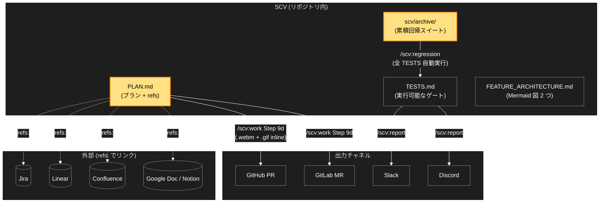

<div align="center">


<h1>SCV</h1>

<p><b>Standard · Cowork · Verify</b></p>

<p><b>A Claude Code plugin for teams.<br>
Every change ships with a plan and tests. The tests run forever — even after you've forgotten about them.</b></p>

<p>
Drop materials → Claude refines them with you → implementation runs the tests → tests stay in your regression suite. Your next change is automatically checked against everything you've ever shipped.
</p>

<p>
<b>SCV is a <i>process-first</i> plugin with an optional codegen variant (<code>/scv:codegen</code>, v0.11.0+).</b> It makes the team work from the same plan and the same tests. Speed comes as a side effect.
</p>


<p>
<a href="https://github.com/wookiya1364/scv-claude-code/releases/latest"></a>


</p>

<p>
<a href="#quick-start">Quick Start</a> ·
<a href="#5-minute-walkthrough">5-min walkthrough</a> ·
<a href="#the-loop">The Loop</a> ·
<a href="#slash-commands">Commands</a> ·
<a href="#workspace-guard">Guard</a> ·
<a href="#why-scv">Why SCV?</a> ·
<a href="#architecture--integrations">Architecture</a> ·
<a href="#philosophy-standard--cowork--verify">Philosophy</a> ·
<a href="https://github.com/wookiya1364/scv-claude-code/releases">Releases</a>
</p>

</div>

---

> **言語**: [English](./README.md) · [한국어](./README.ko.md) · 日本語

> **SCV は *プロセス中心* プラグインです — オプションの codegen 変形 (`/scv:codegen`, v0.11.0+) を含みます。** チームが同じ plan と同じテストで仕事をするための道具です。スピードは副次効果として付いてきます。

## クイックスタート <a id="quick-start"></a>

> **覚えるべきコマンドは `/scv:help` ひとつだけ。**
> プロジェクトの状態を診断し、次に何をすべきか教えてくれます。覚えるフラグなし、先に読むドキュメントなし — プラグインがステップごとに案内します。

```bash
# Claude Code セッション内で:

# 1. インストール
/plugin marketplace add https://github.com/wookiya1364/scv-claude-code
/plugin install scv@scv-claude-code

# 2. ここから先は /scv:help が引き継ぎます。
#    初回実行時に hydrate も一度確認して自動で進めます。
/scv:help
```

これだけです。**覚えるコマンドは `/scv:help` 一つ** — プロジェクトを診断し、次に使うコマンドへ案内します。開始行を選んでください:

| 状況 | コマンド |
|---|---|
| 次に何をすべきか分からない | `/scv:help` |
| アイデアだけあって資料はまだない | `/scv:help "払い戻しボタンを追加したい"` (v0.9.0+) |
| 過去の archive を探したい | `/scv:help "先四半期の決済関連 archive を見せて"` (v0.10.0+) |

> **プラットフォーム事前準備 (1 回)**:
> - **macOS**: `brew install bash` を 1 回実行 — SCV スクリプトは bash 4+ 機能 (`declare -A`) を使用。インストール後、スクリプトは自動的に `/opt/homebrew/bin/bash` に escalate し、システムの bash 3.2 はそのまま。
> - **Linux / WSL**: bash 4+ がデフォルト — 何もする必要なし。
> - **Windows native (PowerShell/cmd)**: 未対応。WSL または Git Bash を使用。
> - **全プラットフォーム共通**: `curl`, `git`, `jq`, `gh` (または `glab`) 推奨。`/scv:help` が最初の行で不足している依存関係を知らせます。

---

## 5 分ウォークスルー <a id="5-minute-walkthrough"></a>

**シナリオ**: "決済ページに払い戻しボタンを追加"

| 分 | ステップ | 結果 |
|---|---|---|
| 1 | `scv/raw/` に資料投入 | 議事録 + 仕様書 PDF (Jira URL 含む) |
| 2 | `/scv:promote` | URL 検出 · slug + title 質問 · `PLAN.md + TESTS.md + FEATURE_ARCHITECTURE.md` を生成 |
| 3 | `/scv:work <slug>` | 実装 · Playwright e2e · `.webm` キャプチャ |
| 4 | 自動 PR | PR が開く · GIF プレビュー · Mermaid 図 · Jira リンクがすべて自動添付 |
| 5 | レビュー → マージ → archive | レビュアーが GIF で 5 秒確認 · マージで archive · `/scv:regression` スイートに合流 |

**どのステップで詰まっても** `/scv:help` — プロジェクトの現在の状態を見て、次に何をすべきか教えてくれます。

---

## ループ <a id="the-loop"></a>

資料投入 → プラン + テストへ精製 → 実装 → archive。すべての archive のテストは**累積する回帰テスト**へ合流し、未来のあらゆる変更に対して自動で回ります。

```mermaid
%%{init: {'theme':'base', 'themeVariables': {'primaryColor':'#1e1e1e','primaryTextColor':'#fff','primaryBorderColor':'#888','lineColor':'#fff','secondaryColor':'#2d2d2d','tertiaryColor':'#1e1e1e','background':'#0d1117','edgeLabelBackground':'#1e1e1e'}}}%%
flowchart LR
  Raw["scv/raw/<br>(議事録、仕様書、<br>スクリーンショット)"]
  Promote["scv/promote/&lt;slug&gt;/<br>PLAN.md + TESTS.md<br>+ FEATURE_ARCHITECTURE.md"]
  Work["実装<br>+ TESTS 実行"]
  Archive["scv/archive/<br>(累積された N 個のプラン)"]
  Regression["/scv:regression<br>(archived TESTS すべて実行)"]

  Raw -->|"/scv:promote<br>(対話)"| Promote
  Promote -->|"/scv:work &lt;slug&gt;"| Work
  Work -->|"テスト合格<br>+ ユーザー承認"| Archive
  Archive -->|"各 archive が<br>回帰スイートに合流"| Regression
  Regression -.->|"次の変更の<br>セーフティネット"| Promote

  classDef key fill:#FFE082,stroke:#F57C00,stroke-width:2px,color:#000
  class Promote,Regression key
```



**なぜこのループが重要か**. 6 か月後、誰かが知らない古い機能を壊しても、その機能の archive されたテストが自動で検出します。チームが SCV と長く使うほど、セーフティネットが厚くなります。

### archive がテスト以外に残すもの (v0.23.0+)

計画はどの道を行くかを書きます。`/scv:work` はより良い道を見つけたらそちらへ進んでよい — なので 6 か月後に知りたいのは計画が何と言ったかではなく、実際にはどこへ進み、なぜそうしたかです。

archive 時にそれを `scv/DECISIONS.md` へ残します。

```markdown
## [2026-08-12 10:49] sspark — 返金フロー archived

- verdict: archived
- why: この計画が何を決め、実装して何が分かったか
- path delta: キューをやめて直接呼び出しにした — キューが必要だったのは
  リトライだけで、API はすでに冪等だった
- refs: scv/archive/20260812-sspark-refund-flow/PLAN.md
```

`path delta` は放っておけばセッションと共に消える一行です。計画どおりなら一語で終わります — `as planned`。

### `/scv:work` が実装時に守ること (v0.23.0+)

計画の `Guardrails` が別を指示しない限り、4 つが既定で適用されます。

- 既存コードをまず探して再利用します。すでに一つのやり方がある処理に二つ目を作りません。
- 現在の要求を完全に満たす最も単純な実装を選びます。誰も指定していない未来のために作りません。
- 関心事ひとつにつきコンポーネントひとつ、読み手が名前を付けられる境界を保ちます。
- 元に戻すのが高くつく決定 (データモデル・モジュール境界・公開契約) は長期視点で決めます。後で置き換える前提の間に合わせは作りません。

説明も短い方を先に出します。追えない計画は承認できず、追えない報告は判断材料になりません。質問・計画・進捗報告は平易な説明から始め、求められたら深く入ります。

---

## スラッシュコマンド <a id="slash-commands"></a>

**覚える必要はありません** — `/scv:help` が各ステップで適切なコマンドを案内します。参考用の表:

| コマンド | やること |
|---|---|
| **`/scv:help`** | 次に何をすべきか教えてくれます。<br/>引数あり時はアイデア対話モード または archive 検索 (回顧的質問)。<br/>例はクイックスタートの表参照。 |
| `/scv:status` | raw 資料 · アクティブな promote · epic 進捗 |
| `/scv:promote` | `scv/raw/` → plan フォルダ (`scv/promote/<slug>/`) — PLAN + TESTS + Mermaid 図 |
| `/scv:work <slug>` | 実装 · テスト実行 · 通過時に archive · e2e 動画添付の PR を自動作成 |
| `/scv:codegen <slug>` | **TDD-first 変形** (v0.11.0+, *experimental*).<br/>TESTS がコードのドライバ。case 単位の Red→Green (budget 3)。<br/>PLAN.md `scope:` / `invariants:` をガードとして使用。<br/>archive/PR は `/scv:work` に委譲。 |
| `/scv:deck [<md>]` | **Markdown → 企画書 HTML.** 既定: ビルド不要の自己完結**ドキュメント**(上から下へ読み、PDF 印刷); **スライドプレゼン**を頼めば DeckUI デッキに。<br/>決定論的変換: 見出し→セクション, GFM テーブル, ` ```mermaid ` 図(CDN, オフライン時はコードテキストへ自動フォールバック), KPI タイル, As-Is/To-Be, 品質 lint — 元の Markdown が一緒に付く。<br/>全体像(アーキテクチャ)を context-first で構成、捏造しない。Node+pnpm 必要(このコマンドのみ; ドキュメント経路はスリム ~7MB のみ)。 |
| `/scv:update` | **プラグイン self-update ガイド** (v0.11.2+).<br/>インストール済み vs 最新バージョン表示。<br/>`/plugin marketplace update scv-claude-code` + `/reload-plugins` への案内。<br/>read-only。 |
| `/scv:regression` | archive された全 TESTS を回帰として実行 |
| `/scv:routine [<name>\|--list]` | **メンテナンスルーティン** (v0.22.0+)。ルーティン 1 つ = `scv/routines/<name>.md` の markdown 1 ファイル — task + guardrails + exit criteria の契約 (step list ではない)。`--list` は NAME/CADENCE/REPORT 表、`--lint <file>` はルーティンファイル検査。SCV は決してスケジュールしない: `/loop 1d /scv:routine dead-code`、cron、CI スケジュール等のホスト機能でユーザーが登録。 |
| `/scv:report` | フェーズ結果を Slack / Discord に通知 |
| `/scv:sync` | **2 ステップ sync** (v0.11.3+).<br/>(1) プラグイン template → ワークフロー文書 (`merge_policy`; 廃止された標準ドキュメント 7 種は 1 回だけ削除, v0.22.0+)。<br/>(2) コード ↔ active promote slug の drift 検出 (`scope:` git diff + TESTS run)。<br/>archive は immutable。 |
| `/scv:set-models` | モデルポリシーを選択 — `recommended` / `all-opus` / `all-sonnet` / `all-haiku` / `session-default` — し、全 SCV コマンドの frontmatter に適用。選択は `.env` の `SCV_MODEL_POLICY` に保存され、template 更新後に `/scv:sync` が再適用。(v0.12.0+) |
| `/scv:install-deps` | 不足 CLI 自動検出 + インストール案内 (`gh` / `glab` / `jq` / `ffmpeg`) |
| `/scv:workspace` | **マルチレポ(nested workspace)** — 対話型セットアップ: アンブレラに子として参加 / アンブレラ(root)作成 / 分離。長いフラグ不要。 |
| `/scv:handoff` | **マルチレポ** — 他レポの対応開発が必要だと宣言 → アンブレラ scv repo に handoff(+ 決定 + 会話)を記録(push は毎回同意、チーム通知は任意)。 |

---

## ワークスペースガード (v0.25.0+) <a id="workspace-guard"></a>

プラグインが登録するフックのうち、*ブロックする*ものは 1 つだけです —
`hooks/hooks.json` が `vendor/scv-core/core/template/hooks/guard.sh` に繋いだ
`PreToolUse` ガードです。後述の journal フックと違い、これは書き込みを拒否
できます。出会う前に知っておく価値があります。拒否するのはちょうど 2 つです。

- **手で作られた plan ファイル。** `scv/promote/<slug>/` 配下の `PLAN.md`、
  `TESTS.md`、`FEATURE_ARCHITECTURE.md` は SCV アクションの外では*作成*
  できません。すでにあるファイルの編集は常に許可されます — `<TODO>` を埋め、
  `status:` を進めるのは通常のステップだからです。
- **セッション内で SCV アクションが 1 度も走っていない状態での `scv/` 外への
  書き込み。** 外から見ると、計画された作業の変更とそうでない変更は同じ形を
  しています。ガードは SCV が関与したという signal を 1 つだけ求めます。

**何がブロックを解くか。** SCV コマンドを実行すると、そのセッションに対する
*レシート(receipt)* が発行されます。コマンドが始まったと報告するのはホストで
あり、モデルはホストイベントを捏造できません — レシートを鍵にする理由が
これです。読み取り専用の `/scv:status` で十分です。レシート 1 つは 1 プロジェクト
の 1 セッションだけを覆います。別のチェックアウトで得たレシートはここを解錠
しません。

**外部書き込みの規則に限り、レシートに関係なく常に許可**: `*.md`、`.gitignore`、
`.gitattributes`、`LICENSE`、そしてこのプラグインがホスト設定としてガードに渡す
`.claude/settings.json` と `.claude/settings.local.json`。`.env` は意図的に
この一覧に*入れていません*。この免除は plan ファイルの規則には届きません —
新規作成の `scv/promote/<slug>/PLAN.md` は `.md` でも拒否されます。

**無効化の方法**: Claude Code を動かすプロセスの環境に `SCV_GUARD=off` を設定
します(`SCV_GUARD_RULE_B=off` は plan ファイルの規則を残し、外部書き込みの
規則だけを外します)。この値はプロセス環境からのみ読み、プロジェクト内の
ファイルからは決して読みません — エージェントが書けるファイルなら、
エージェントは自分自身を例外にできてしまうからです。

**ガードが引き下がるとき。** ガードは、判断そのものが不可能な二つの場合に
**fail open** します — payload が空のとき、そしてその機械に JSON リーダーが
無いとき。どちらも stderr に 1 行出して、その呼び出しを許可します。明示的に
ルールへ一致したときだけ拒否します。レシート置き場はこれに含まれません:
書き込めなければレシートは一つも生まれず、免除対象でない書き込みは許可では
なくすべて拒否されます。SCV を導入していないプロジェクトでは完全に不活性です:
ツール呼び出しのディレクトリから上へ辿って `scv/` を探し、無ければ即座に
許可します。

契約:
[`vendor/scv-core/core/contracts/guard.md`](vendor/scv-core/core/contracts/guard.md)。

ガードが答える問いは「このセッションで SCV アクションが走ったか」であって、
「この書き込みは計画された作業に属するか」ではありません。2 つ目はマージ時の
問いです。Core はその用途の CI ゲートを同梱していますが
(`vendor/scv-core/core/scripts/check-provenance.sh` — archive された plan なしに
コードを変更した PR を失敗させます)、hydrate はプロジェクトにワークフローを
インストールしません。繋ぐかどうかは利用者の判断です。

---

## マルチレポ (nested workspace) <a id="multi-repo"></a>

SCV はデフォルトで単一レポです。システムが複数のレポ(例: FE / BE / AI エージェント)にまたがる場合、単独レポの挙動はそのままに、1 つの **アンブレラ(umbrella)** scv repo の下にネストできます。

- **着脱可能なオーバーレイ。** モード(単一 / 子 / アンブレラ)は毎コマンド、ローカルファイルから再計算されます。ワークスペースリンクの無いレポは通常の SCV と *byte-identical* に動作し、リンクを消すと分離します — 双方向の migration なし。
- **コマンド 1 つでセットアップ。** `/scv:workspace` — アンブレラに子として参加 / アンブレラ作成 / 分離。長いフラグ不要。
- **宣言で、git を通じて調整。** 子レポで `/scv:handoff` が「この別のレポの対応開発が必要」(決定 + 理由)をアンブレラ repo に記録します。相手レポが pull すると `/scv:status` / `/scv:help` が届いた handoff を表示します。`/scv:promote`(handoff から `PLAN.md` + `TESTS.md` を生成)→ `/scv:codegen` で採用。
- **ライフサイクル + 通知。** handoff はアンブレラが追跡するステータス(open → claimed → done)を持ちます。push 成功時に Slack/Discord チャンネルへ best-effort 通知が可能。

cross-repo の依存は **明示的に宣言** します — diff から推論しません。「FE 変更 → BE テストが CI で red」のような機械的な伝播はここでは範囲外で、共有契約(OpenAPI/AsyncAPI + 契約テスト)が必要です。

**セットアップ:** アンブレラ repo で `/scv:workspace` → *アンブレラ作成*、各子レポで `/scv:workspace` → *参加*。

**モノレポ(1 つの repo に複数の `scv/`)。** 上のクロスレポ・アンブレラとは別: 1 つの repo がモジュール別 `scv/`(例 `FE/scv`, `BE/scv`)+ 任意の root `scv/` を持つ場合、各コマンドはコンテキストから使う `scv/` を解決(モジュールディレクトリで実行)、または先頭引数で明示指定します — `/scv:status FE`, `/scv:work FE <slug>`, `/scv:deck FE`。単一 `scv` の repo は影響なし(byte-identical)。

---

## なぜ SCV? <a id="why-scv"></a>

AI がチームのコードを書き始めると、3 つのことが噛み合わなくなります。

| 問題 | SCV の答え |
|---|---|
| AI の diff、結局自分で動かして確かめる羽目に。 | `/scv:work` が e2e + GIF プレビューを PR に自動添付。 |
| 同じ変更が チケット · PR · コメント の 3 か所でずれる。 | PLAN.md が単一 source。チケットは `refs:` でリンクのみ。 |
| 古い archive が誰も検索しない墓場になる。 | `supersedes:` と `/scv:regression` で archive を*生かす*。 |
| 1 名メンテナ / 将来リスク。 | bash + markdown のみ — NPM / MCP サーバー / 外部サービスなし。fork コスト低い、LLM/IDE 変化が core に与える影響最小。 |

## SCV が合うとき

- Claude Code がチームの main IDE。

- 変更単位が通常小さい — single feature / refactor / fix。
  - 多月にわたる深い-spec-driven メガ-initiative ではない。

- 累積する回帰セーフティネットの価値を*深い事前 spec dialog* より高く評価。

- 1 名運用者が SCV の bash + markdown core を回せる。
  - NPM / MCP サーバー / 外部サービスなし。

**組み合わせ可能**: `PLAN.md` / `TESTS.md` / `archive/` は plain markdown — commit 可能なテキスト。

BMAD/GSD で spec → code フェーズを進めて、SCV の archive がその下で回帰セーフティネットを累積。

その際の制約が一つあります。[ワークスペースガード](#workspace-guard)はセッション内の SCV コマンドに紐づかない書き込みを拒否しますが、他ツールの書き込みは計画のない編集と区別できません。SCV コマンドを一度実行すれば解決します — 読み取り専用の `/scv:status` で十分で、以降のセッションは通常どおり進みます。

**より大きな変更の場合**: multi-feature 変更を *複数 slug* に分割し、同じ `epic:` (PLAN.md frontmatter) 下にグループ化。`scv/PROMOTE.md` §8d の epic + multi-slug パターン参照。

### `/scv:codegen` が合うとき (TDD-first 変形、v0.11.0+ · *experimental*)

`/scv:work` は PLAN からコードを書きます。`/scv:codegen` は逆 — **TESTS がコードを driver**、case 単位の Red→Green (case ごとに budget 3)。次に合います:

- TESTS が行動を *精密に* 定義 — placeholder ではなく具体的な acceptance criteria。
- 変更が **backend / API / data** 領域 (UI heavy な変更は TDD では掴みづらい)。
- 各コミットが *計画された step* ではなく *TESTS case* と 1:1 でマップされるのを望む。

archive/PR は `/scv:work` に委譲するので archive 構造は同一。TESTS が曖昧なら `/scv:work` のまま — codegen はその場合 LLM が意図を *推測して* 埋める (cowork 違反)。

`/scv:help` は slug の `TESTS.md` に具体的な acceptance がある時にのみ `/scv:codegen` を提案 — デフォルトのフローには影響なし。


## アーキテクチャと外部統合 <a id="architecture--integrations"></a>

v0.20.0 から、共通ワークフローの動作はチェックサムで検証し、バージョンを
固定した [`scv-core`](https://github.com/wookiya1364/scv-core) リリースから
取得します。このリポジトリは Claude Code アダプターとして slash command、
ツール/モデルのメタデータ、インストール・更新 UX のみを所有します。コマンド
実行時に core をダウンロードすることはありません。自動 PR が vendored pin
を更新し、全テスト通過後に既存の `develop → stage → main` フローで昇格します。
詳細は [`docs/design/shared-core-wrapper.md`](docs/design/shared-core-wrapper.md)
を参照してください。

Wrapper と Core は独立してリリースします。この Claude アダプター release
は `0.27.0` で、これが担いでいる Core pin は
`vendor/scv-core/VERSION` と `core.lock` に記録されます。Core sync が更新するのは、そのチェックサム付き
pin と生成 projection のみで、wrapper の `VERSION`、plugin manifest、
marketplace version は変更しません。

**Journal フック (v0.22.0+, 登録は wrapper 所有).** Core は自由会話まで
ジャーナル(`scv/journal/<YYYYMMDD>-<author>.md`、既定で gitignore)へ
キャプチャする non-blocking フックテンプレート 2 種を提供し、登録はこの
アダプターの `hooks/hooks.json` が担います:

- `UserPromptSubmit` → `vendor/scv-core/core/template/hooks/on-user-prompt.sh`
  (stdin JSON `prompt` フィールド → journal append)
- `Stop` → `vendor/scv-core/core/template/hooks/on-stop.sh`
  (stdin JSON `transcript_path` → assistant 要約 append)

両コマンドとも `SCV_CORE_ROOT`(materialized core)を export し、プロジェクト
ルートを cwd に実行されます。`scv/` の無いプロジェクトでは exit `0` +
無記録。journal への書き込みはすべて Core の `journal-append.sh` を経由し、
redaction フィルター (password/token/secret/api-key 値、`Bearer` トークン、
`AKIA…` キー → `[REDACTED]`) がディスク書き込み前に実行されます —
`scv/journal/` への直接書き込み禁止、blocking フック登録禁止。契約:
scv-core `docs/wrapper-integration.md` §6 "Hook seam"。

同じ `hooks/hooks.json` は、唯一の*ブロックする*フックも登録します —
`PreToolUse` の[ワークスペースガード](#workspace-guard) (v0.25.0+)。Core は
スクリプトを host-neutral のまま提供し、どのホストイベントをどのモードに
対応させるかは wrapper がエントリごとに `SCV_GUARD_MODE`(`mint` /
`gate-write` / `gate-bash`)で渡して決めます。だからスクリプトはホスト名を
一切含みません。

PLAN.md が単一の source of truth。外部ツール (Jira / Linear / Confluence / Google Doc) は `refs:` で*リンク*のみ — 複製しない。出力 (PR / MR / Slack / Discord) は同じ source から自動生成。



**重要な性質**

- 単一の source of truth — PLAN.md は一度だけ書く · PR / regression / Slack すべてここから読む。
- 外部ツールは外部に — `refs:` でチケットへリンク · 本文の複製なし · チケット更新時もリンクは有効。
- vendor-agnostic バックエンド — `scripts/lib/pr-platform.sh` 経由で `gh` / `glab` first-class · Bitbucket / Gitea 追加 = 新アダプター。
- 多言語デフォルト — PR / Mermaid / commit すべて `SCV_LANG` に従う (English · 한국어 · 日本語)。

## 哲学: Standard · Cowork · Verify <a id="philosophy-standard--cowork--verify"></a>

AI 協業チーム開発の 3 つの失敗モード — SCV が拒否するもの。

**S — Standard (標準).** 標準とはスナップショット文書ではなくワークフローそのもの。Core Template 2.0.0 から hydrate はワークフローファイルのみを seed します — モデルがコードベースから導出できる事実は事前に文書化しません。

残す価値のある決定は、古びるスナップショット文書ではなく `scv/DECISIONS.md` へ — append-only、著者帰属、コミットされます。

**C — Cowork (協業).** `/scv:promote` は対話であって生成ではありません。

Claude が `scv/raw/` を読み構造を提案、ユーザーが個別に承認。

PLAN.md に入るのはユーザーが言ったこと — LLM が推測したものではありません。

**V — Verify (検証).** TESTS.md は実行可能なものであって願望ではありません。

archived plan のテストは次の変更の回帰として回ります。

失敗は regression / obsolete / flaky にトリアージ — 黙ってスキップされません。

> プラグインの名前はプラグインの契約。

<details>
<summary><b>リファレンス — プロジェクトディレクトリ / 外部 Refs / 通知設定</b></summary>

### プロジェクトディレクトリ (hydrate 後)

```
my-project/
├── CLAUDE.md           # (任意 · ユーザー所有 — SCV は触らない)
├── scv/                # SCV が所有する領域
│   ├── SCV.md          # SCV ワークフローのインデックス
│   ├── PROMOTE.md REPORTING.md
│   ├── DECISIONS.md TODO.md
│   ├── conversations/  # 計画になった /scv:help の対話 (コミットされる)
│   ├── journal/        # フックが記録する全プロンプト — 既定で gitignore
│   ├── routines/       # 1 ファイル完結のメンテナンスルーティン (/scv:routine)
│   ├── readpath.json   # raw 変更スナップショット (自動管理)
│   ├── promote/        # アクティブな計画 (YYYYMMDD-author-slug フォルダ)
│   ├── archive/        # 完了した計画 (/scv:work が移動)
│   └── raw/            # 自由投入スペース
├── .env.example.scv    # SCV 専用 Notifier 変数テンプレート
└── .gitignore          # SCV ルール append; 既存保持
```

**Non-destructive**: ルート `CLAUDE.md` / `.env.example` はそのまま保持。SCV は `scv/` のみ作成、`.env.example.scv` を別途追加 + 既存 `.gitignore` に append。

**2 種類の記録、2 種類の方針 (v0.23.0+)**。`scv/conversations/` には計画になった `/scv:help` の対話が入り、コミットされます — 計画の根拠は計画と一緒にあるべきだからです。`scv/journal/` は違います。フックが**すべて**のプロンプトを記録します、何にもならなかったものまで。それをリポジトリに入れてよいかは誰が読めるかに依存するため、hydrate は `scv/journal/` を gitignore し、選択を委ねます。共有するなら `.gitignore` からその行を削除してください — ただし何が蓄積されたかを先に確認してください、redaction はヒューリスティックです。一度コミットすると ignore を戻しても追跡は外れません (`git rm --cached` が必要で、過去のコミットには内容が残ります)。

**標準ドキュメント 7 種は廃止 (Core Template 2.0.0, breaking)**。hydrate は adoption-only: `INTAKE.md`、`DOMAIN.md`、`ARCHITECTURE.md`、`DESIGN.md`、`AGENTS.md`、`TESTING.md`、`RALPH_PROMPT.md` は seed も sync もされません。既存プロジェクトでは明示的な `/scv:sync` 1 回がこの 7 ファイルを削除します (削除前にユーザー作成の内容を `scv/DECISIONS.md` へ移すことを先に提案; 復旧経路は git 履歴)。その後ユーザーが再作成したファイルはユーザー所有 — sync が再削除することはありません。

### 外部 Refs (Jira / Linear / PR / ドキュメント) — 自動検出

PLAN.md frontmatter の vendor-agnostic な `refs:` 配列。`/scv:promote` が以下の source の URL を自動検出:

- `scv/raw/` 内ファイル (議事録にチケット URL を含める)
- `/scv:promote "...URL..."` 呼び出し引数
- dialog 回答中の URL (自動 parse)

`.env` に `JIRA_BASE_URL` / `LINEAR_BASE_URL` / `CONFLUENCE_BASE_URL` を設定すると PLAN.md は `id: PAY-1234` のみ保存 (URL 表示時に推論)。未設定なら full URL 保存。`template/.env.example.scv` 参照。

### 通知ツール設定 (.env) — 任意

```bash
cp .env.example.scv .env
$EDITOR .env
```

Slack:
```bash
NOTIFIER_PROVIDER=slack
SLACK_BOT_TOKEN=xoxb-...
SLACK_CHANNEL_ID=C0XXXXX0
SLACK_CHANNEL_ID_PHASE_COMPLETE=C0XXXXX1
SLACK_CHANNEL_ID_E2E_FAILURE=C0XXXXX2
```

Discord: `NOTIFIER_PROVIDER=discord` + `DISCORD_BOT_TOKEN` + `DISCORD_CHANNEL_ID_*`。

既存 `.env` がある場合: `cat .env.example.scv >> .env`。`.env` は絶対に git にコミット禁止。

### `demo/` (リポジトリ専用 — プラグイン本体とは別)

`demo/` ディレクトリは README の GIF (`scv-demo.gif`、`the-loop.gif`、`architecture.gif`) を生成する Remotion コンポジションを含みます。独自の `pnpm` workspace として動き、プラグインの動作とは無関係です — 利用者が触る必要はありません。

</details>

## さらに詳しく

- 各コマンドの詳細: `/scv:<command> --help`
- プロジェクト固有の案内: `/scv:help`

## コントリビューション

- PR の前に `tests/run-dry.sh` を通す
- `VERSION` は SemVer に従う
- リリース: **[docs/RELEASING.md](docs/RELEASING.md)** — `scripts/set-wrapper-version.sh`
  でバージョンを上げ、`gh workflow run promote.yml`。昇格とタグを手作業で行いません。


---

**License**: [MIT](./LICENSE) © 2026 wookiya1364
