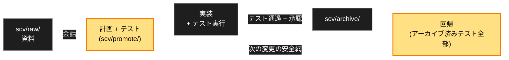

<div align="center">


<h1>SCV</h1>

<p><b>Standard · Cowork · Verify</b></p>

<p><b>チームのための Claude Code プラグイン。<br>
すべての変更は計画とテストとともに出荷され — テストは永遠に回り続けます。</b></p>

<p>
<a href="https://github.com/wookiya1364/scv-claude-code/releases/latest"></a>


</p>


</div>

---

> **Languages**: [English](./README.md) · [한국어](./README.ko.md) · 日本語

## SCV とは

変更の話をする → SCV が実行可能なテストつきの計画へ磨き上げる → 実装する →
証跡を PR に添付する → 計画をアーカイブする。アーカイブされたテストはすべて
回帰スイートに蓄積され、以後のあらゆる変更を検査します。半年後、誰も覚えて
いないテストが故障を捕まえます。

## インストール

```bash
/plugin marketplace add https://github.com/wookiya1364/scv-claude-code
/plugin install scv@scv-claude-code
```

- **macOS**: `brew install bash` を一度 (SCV スクリプトは bash 4+ が必要; システム bash はそのまま)。
- **Linux / WSL**: 何も不要。**Windows ネイティブ**: 非対応 — WSL か Git Bash を。
- 推奨 CLI: `git`, `curl`, `jq`, `gh` (または `glab`)。足りなければ SCV が知らせます。

## 使い方

**普通に話しかけるだけ。** 覚えるコマンドはありません — SCV が会話に自ら加わります:

```text
あなた: 決済画面に払い戻しボタンを付けたい。
SCV:    (会話モードに入り、目標 / 範囲 / 受け入れ基準を質問し、
         十分になったら計画とテストの下書きを提案)
```

作りたいことを話せば計画に磨き上げ、次に何をすべきか聞けばプロジェクトを
診断し、「去年の払い戻しはどう処理した?」と聞けばアーカイブを検索します。
`/scv:help` は同じことを明示的に行う入口で、`scv/scv_settings.json` の
`SCV_ALWAYS_ON=off` でコマンド専用の動作に戻せます。

会話の裏では、ひとつのループがすべてを回しています:



## 得られるもの

| チームの問題 | SCV の答え |
|---|---|
| AI の diff を信じる前に自分で動かして確かめている | PR には e2e 動画/GIF が添付済みで届く — 証跡はファイル名ではなく実際のテスト実行記録に従う |
| 同じ変更がチケット · PR · チャットで違って書かれている | `PLAN.md` が単一の原本; チケットは `refs:` リンク、PR とレポートはそこから生成 |
| 決定がセッションとともに消える | `scv/DECISIONS.md` — 追記専用、計画承認 / アーカイブ / 廃止の時点で自動記録 |
| 古い機能が音もなく壊れる | アーカイブされた全計画のテストがひとつの回帰スイートとして再実行 |

## 設定

ファイルはひとつ: `scv/scv_settings.json` — 全キーが既定値・説明 (`_doc`)
つきで自動生成されるので、開けば何が設定できるか全部見えます。秘密 (トークン、
チャンネル ID) は git-ignore される別ファイルへ。`.env` は読みも書きもしません。

| キー | 既定 | 役割 |
|---|---|---|
| `SCV_ALWAYS_ON` | `on` | 自由会話にも SCV が加わる; `off` = コマンド専用 |
| `SCV_PLAIN_LANGUAGE` | `on` | やさしい言葉優先の答えの形 (+毎ターンのリマインド); `off` で停止 |
| `SCV_LANG` | 自動 | 出力言語: `english` · `korean` · `japanese` |
| `NOTIFIER_PROVIDER` | オフ | チームレポート先: `slack` か `discord` |

スクリプト経由で書けば、秘密は正しいファイルへ自動で振り分けられます:

```bash
CORE="$HOME/.claude/plugins/cache/scv-claude-code/scv/<version>/vendor/scv-core/core"
bash "$CORE/scripts/settings-set.sh" NOTIFIER_PROVIDER=slack
bash "$CORE/scripts/settings-set.sh" SLACK_BOT_TOKEN=xoxb-...   # → secret ファイル
```

## コマンド一覧

この表は覚えなくて構いません — 会話が自動でルーティングします。明示的に使うなら:

| コマンド | 役割 |
|---|---|
| `/scv:help` | プロジェクト診断 · アイデアの具体化 · アーカイブ検索 |
| `/scv:status` | 進行中のもの: raw の変化、アクティブな計画、epic、handoff |
| `/scv:promote` | 資料 → 計画フォルダ (`PLAN.md` + `TESTS.md` + 図) |
| `/scv:work <slug>` | 実装 · テスト · アーカイブ · 証跡つき PR |
| `/scv:codegen <slug>` | TDD-first 変種: テストがコードを導く、Red → Green |
| `/scv:regression` | アーカイブされた全計画のテストをひとつのスイートで実行 |
| `/scv:deck [<md>]` | Markdown → 自己完結の企画書ドキュメント (またはスライド) |
| `/scv:report` | フェーズ結果を Slack/Discord へ証跡つきで報告 |
| `/scv:sync` | SCV テンプレート更新 + コード↔計画のドリフト検知 |
| `/scv:routine [<name>]` | 1 ファイルのメンテナンスルーチンを実行 |
| `/scv:workspace` · `/scv:handoff` | マルチレポ: アンブレラ構成 · 他リポジトリ作業の宣言 |
| `/scv:update` · `/scv:set-models` · `/scv:install-deps` | プラグイン更新案内 · モデルポリシー · CLI 依存 |

## ガードレール

ワークフローを正直に保つ二層:

- **セッション内**: `PreToolUse` ガードが、手作りの計画ファイルと `scv/` 外への
  書き込みを拒否します — セッションで SCV アクションが一度でも動くまで
  (`/scv:status` で十分)。内部エラー時は開く側へ、SCV 未導入プロジェクトでは
  不活性。停止: プロセス環境変数 `SCV_GUARD=off`。
- **マージ時**: CI ゲートが、アーカイブ済み計画のないコード変更 PR を拒否し
  (`[no-plan: <理由>]` で例外宣言)、手書きで書き換えられたベンダーコアを拒否
  します (`[manual-vendor: <理由>]`)。

契約: [`vendor/scv-core/core/contracts/guard.md`](vendor/scv-core/core/contracts/guard.md)。

## マルチレポ

既定は単一リポジトリ。FE/BE/サービスに分かれたシステムはアンブレラひとつの
下に束ねられます: `/scv:workspace` で作成/参加し、`/scv:handoff` で「あの
リポジトリの対応作業が必要」を相手が見る場所に宣言します。リンクを外せば
移行なしで単独動作に戻ります。モジュール別 `scv/` を持つモノレポは先頭引数で
モジュール指定: `/scv:status FE`。

## 哲学 — Standard · Cowork · Verify

- **Standard**: 標準はワークフローであってスナップショット文書ではない。決定は古びる文書ではなく追記専用ログに残る。
- **Cowork**: 計画は対話から生まれ、節ごとに承認される — モデルの推測ではなく、あなたが言ったこと。
- **Verify**: テストは実行可能で、アーカイブされたテストは永遠に回る。失敗は明示的に分類する — 黙って飛ばすことはない。

<details>
<summary><b>参考 — 導入後のプロジェクト構造</b></summary>

```
my-project/
├── CLAUDE.md              # あなたのもの — SCV は触れない
├── scv/                   # SCV の持ち物はすべてこの下
│   ├── SCV.md PROMOTE.md REPORTING.md
│   ├── DECISIONS.md       # 追記専用の決定ログ
│   ├── conversations/     # 計画になった対話 (コミットされる)
│   ├── journal/           # 全プロンプト、フックが記録 (既定 gitignore)
│   ├── promote/  archive/  raw/  routines/
│   ├── scv_settings.json         # 設定 (自動生成、コミットされる)
│   └── scv_settings.secret.json  # トークン (自動生成、git-ignore)
└── .gitignore             # SCV 規則が append される
```

導入は非破壊的です: 既存のルートファイルはそのまま、SCV が加えるのは `scv/`
ディレクトリひとつと `.gitignore` 数行だけ。このリポジトリの `demo/` は
README の GIF 制作用で、プラグイン利用者には不要です。

</details>

## アーキテクチャ

共有動作は、チェックサム・バージョン固定された
[scv-core](https://github.com/wookiya1364/scv-core) リリースをプラグイン内に
ベンダリングしたものから来ます — 実行時に何も取得しません。このリポジトリは
Claude Code アダプター: スラッシュコマンド、フック登録、インストール/更新 UX。
フックの stdout が毎ターン常時介入ルーティングとやさしい言葉リマインドを届け、
ジャーナルフックは書き込み前のリダクションを経て会話を記録します。

## コントリビューション

PR 前に `tests/run-dry.sh`。ブランチフローは `develop → stage → main`;
リリースは `gh workflow run promote.yml` — [docs/RELEASING.md](docs/RELEASING.md)
参照。履歴は [releases](https://github.com/wookiya1364/scv-claude-code/releases) に。

---

**License**: [MIT](./LICENSE) © 2026 wookiya1364
