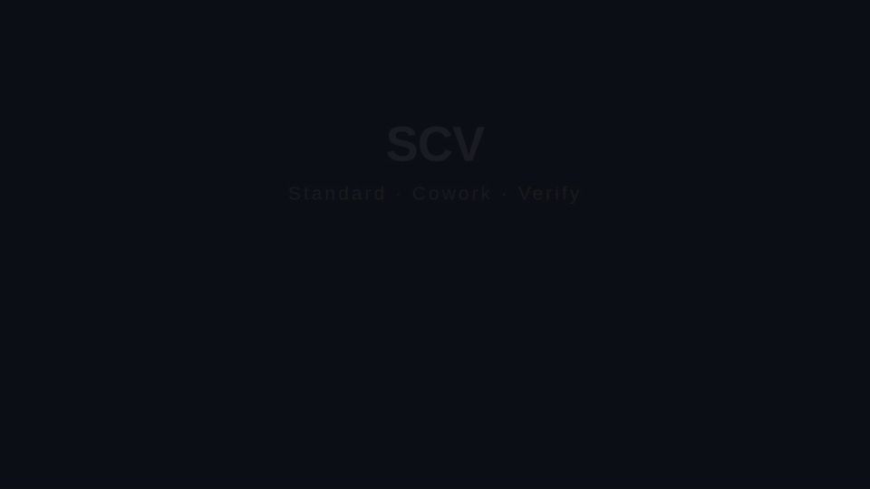
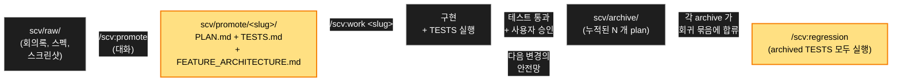
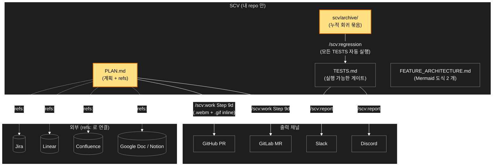

<div align="center">


<h1>SCV</h1>

<p><b>Standard · Cowork · Verify</b></p>

<p><b>A Claude Code plugin for teams.<br>
Every change ships with a plan and tests. The tests run forever — even after you've forgotten about them.</b></p>

<p>
Drop materials → Claude refines them with you → implementation runs the tests → tests stay in your regression suite. Your next change is automatically checked against everything you've ever shipped.
</p>

<p>
<b>SCV is a <i>process-first</i> plugin with an optional codegen variant (<code>/scv:codegen</code>, v0.11.0+).</b> It makes the team work from the same plan and the same tests. Speed comes as a side effect.
</p>



<p>
<a href="https://github.com/wookiya1364/scv-claude-code/releases/latest"></a>


</p>

<p>
<a href="#quick-start">Quick Start</a> ·
<a href="#5-minute-walkthrough">5-min walkthrough</a> ·
<a href="#the-loop">The Loop</a> ·
<a href="#slash-commands">Commands</a> ·
<a href="#workspace-guard">Guard</a> ·
<a href="#why-scv">Why SCV?</a> ·
<a href="#architecture--integrations">Architecture</a> ·
<a href="#philosophy-standard--cowork--verify">Philosophy</a> ·
<a href="https://github.com/wookiya1364/scv-claude-code/releases">Releases</a>
</p>

</div>

---

> **언어**: [English](./README.md) · 한국어 · [日本語](./README.ja.md)

> **SCV 는 *프로세스 중심* 플러그인입니다 — 옵션 codegen 변형 (`/scv:codegen`, v0.11.0+) 포함.** 팀이 같은 plan 과 같은 테스트로 일하게 만드는 도구입니다. 속도는 부수 효과로 따라옵니다.

## 빠른 시작 <a id="quick-start"></a>

> **외울 명령어는 `/scv:help` 하나뿐입니다.**
> 프로젝트 상태를 진단하고 다음에 뭘 해야 할지 알려줍니다. 플래그 외울 필요 없고, 먼저 읽을 문서도 없습니다 — 플러그인이 단계마다 알려줍니다.

```bash
# Claude Code 세션에서:

# 1. 설치
/plugin marketplace add https://github.com/wookiya1364/scv-claude-code
/plugin install scv@scv-claude-code

# 2. /scv:help 가 여기서부터 안내합니다.
#    첫 실행 시 hydrate 도 한 번 묻고 자동 진행합니다.
/scv:help
```

이게 다입니다. **외울 명령은 `/scv:help` 하나** — 프로젝트를 진단하고 다음에 쓸 명령으로 안내합니다. 시작 줄을 고르세요:

| 상황 | 명령 |
|---|---|
| 다음에 뭐 해야 할지 모르겠다 | `/scv:help` |
| 아이디어만 있고 자료는 아직 없다 | `/scv:help "환불 버튼 추가하고 싶어"` (v0.9.0+) |
| 과거 archive 를 찾고 싶다 | `/scv:help "지난 분기 결제 archive 보여줘"` (v0.10.0+) |

> **플랫폼 사전 준비 (1회)**:
> - **macOS**: `brew install bash` 1회 실행 — SCV 스크립트는 bash 4+ 기능 (`declare -A`) 사용. 설치 후 스크립트가 자동으로 `/opt/homebrew/bin/bash` 로 escalate, 시스템 bash 3.2 는 건드리지 않음.
> - **Linux / WSL**: bash 4+ 가 기본 — 할 일 없음.
> - **Windows native (PowerShell/cmd)**: 미지원. WSL 또는 Git Bash 사용.
> - **모든 플랫폼 공통**: `curl`, `git`, `jq`, `gh` (또는 `glab`) 권장. `/scv:help` 가 첫 줄에서 누락된 의존성을 알려줍니다.

---

## 5 분 워크스루 <a id="5-minute-walkthrough"></a>

**시나리오**: "결제 페이지에 환불 버튼 추가"

| 분 | 단계 | 결과 |
|---|---|---|
| 1 | `scv/raw/` 에 자료 투입 | 회의록 + 스펙 PDF (Jira URL 포함) |
| 2 | `/scv:promote` | URL 인식 · slug + title 질문 · `PLAN.md + TESTS.md + FEATURE_ARCHITECTURE.md` 생성 |
| 3 | `/scv:work <slug>` | 구현 · Playwright e2e · `.webm` 캡처 |
| 4 | 자동 PR | PR 열림 · GIF 미리보기 · Mermaid 도식 · Jira 링크 모두 자동 첨부 |
| 5 | 리뷰 → 머지 → archive | 리뷰어가 GIF 로 5 초 확인 · 머지 시 archive · `/scv:regression` suite 합류 |

**어느 단계든 막히면** `/scv:help` — 프로젝트의 현재 상태를 보고 다음에 뭐 할지 알려줍니다.

---

## 흐름 한눈에 <a id="the-loop"></a>

자료 투입 → 계획 + 테스트로 정제 → 구현 → archive. 모든 archive 의 테스트는 **누적되는 회귀 테스트** 로 합류해 미래의 모든 변경에 대해 자동으로 돕니다.



**왜 이 흐름이 중요한가**. 6 개월 뒤 누군가 모르고 옛 기능을 깨뜨려도, 그 기능의 archive 된 테스트가 자동으로 발견합니다. 팀이 SCV 와 오래 일할수록 안전망이 두터워집니다.

### archive 가 테스트 말고 남기는 것 (v0.23.0+)

계획은 어느 길로 갈지 적습니다. `/scv:work` 는 더 나은 길을 찾으면 그리로 가도 됩니다 — 그래서 6 개월 뒤에 궁금한 건 계획이 뭐라고 했는지가 아니라, 실제로는 어디로 갔고 왜 그랬는지입니다.

이제 archive 할 때 그걸 `scv/DECISIONS.md` 에 남깁니다.

```markdown
## [2026-08-12 10:49] sspark — 환불 흐름 archived

- verdict: archived
- why: 이 계획이 무엇을 정했고, 구현하면서 무엇을 알게 됐는지
- path delta: 큐 대신 직접 호출로 바꿨다 — 큐가 필요했던 건 재시도뿐인데
  API 가 이미 멱등이었다
- refs: scv/archive/20260812-sspark-refund-flow/PLAN.md
```

`path delta` 는 그냥 두면 세션과 함께 사라지는 줄입니다. 계획대로 갔으면 한 단어로 끝납니다 — `as planned`.

### `/scv:work` 가 구현할 때 지키는 것 (v0.23.0+)

계획의 `Guardrails` 가 다르게 말하지 않는 한, 네 가지가 기본으로 적용됩니다.

- 기존 코드를 먼저 찾아 재활용합니다. 이미 한 방식이 있는 일에 두 번째 방식을 만들지 않습니다.
- 현재 요구를 완전히 충족하는 가장 단순한 구현을 고릅니다. 아무도 말하지 않은 미래를 위해 짓지 않습니다.
- 관심사 하나당 컴포넌트 하나, 독자가 이름 붙일 수 있는 경계를 유지합니다.
- 되돌리기 비싼 결정(데이터 모델·모듈 경계·공개 계약)은 장기 관점으로 정합니다. 나중에 교체할 임시방편은 만들지 않습니다.

설명도 짧은 쪽을 먼저 냅니다. 따라갈 수 없는 계획은 승인할 수 없고, 따라갈 수 없는 보고는 판단 근거가 되지 못합니다. 그래서 질문·계획·진행 보고는 쉬운 설명으로 시작하고, 더 물어보시면 그때 파고듭니다.

---

## 슬래시 커맨드 <a id="slash-commands"></a>

**외울 필요 없습니다** — `/scv:help` 가 매 단계마다 알맞은 명령을 안내합니다. 아래는 참고용 표:

| 커맨드 | 하는 일 |
|---|---|
| **`/scv:help`** | 다음에 뭘 해야 할지 안내. 인자 있으면 분기 — 아이디어는 대화 모드, 회고 질문은 archive 검색. 예시는 빠른 시작 표. |
| `/scv:status` | raw 자료 · 진행 중인 promote · epic 진척도 |
| `/scv:promote` | `scv/raw/` → plan 폴더 (`scv/promote/<slug>/`) — PLAN + TESTS + Mermaid 도식 |
| `/scv:work <slug>` | 구현 · 테스트 실행 · 통과 시 archive · e2e 비디오 첨부한 PR 생성 |
| `/scv:codegen <slug>` | **TDD-first 변형** (v0.11.0+, *experimental*).<br/>TESTS 가 코드를 driver. case 단위 Red→Green (budget 3).<br/>PLAN.md `scope:` / `invariants:` 를 가드로 사용.<br/>archive/PR 은 `/scv:work` 에 위임. |
| `/scv:deck [<md>]` | **마크다운 → 기획서 HTML.** 기본: 빌드 없는 자체완결 **문서**(위→아래로 읽고 PDF 인쇄); **슬라이드 프레젠테이션**을 요청하면 DeckUI 덱으로.<br/>결정론적 변환: 제목→섹션, GFM 표, ` ```mermaid ` 다이어그램(CDN, 오프라인 시 코드 텍스트 자동 폴백), KPI 타일, As-Is/To-Be, 품질 린트 — 원문 마크다운이 함께 담김.<br/>큰 그림(아키텍처)을 context-first 로 구성, 지어내지 않음. Node+pnpm 필요(이 명령만; 문서 경로는 슬림 ~7MB 만 설치). |
| `/scv:update` | **플러그인 self-update 안내** — 설치된 vs 최신 버전 표시, `/plugin marketplace update scv-claude-code` + `/reload-plugins` 안내. read-only. (v0.11.2+) |
| `/scv:regression` | archive 된 모든 TESTS 를 회귀로 실행 |
| `/scv:routine [<name>\|--list]` | **유지보수 루틴** (v0.22.0+). 루틴 1개 = `scv/routines/<name>.md` 마크다운 1개 — task + guardrails + exit criteria 계약 (step list 아님). `--list` 는 NAME/CADENCE/REPORT 표, `--lint <file>` 은 루틴 파일 검사. SCV 는 절대 스케줄링하지 않음: `/loop 1d /scv:routine dead-code`, cron, CI 스케줄 등 호스트 기능으로 직접 등록. |
| `/scv:report` | 단계 결과를 Slack / Discord 에 보고 |
| `/scv:sync` | **2-step sync** (v0.11.3+).<br/>(1) 플러그인 template → 워크플로 문서 (`merge_policy`; 폐기된 표준 문서 7종은 1회 삭제, v0.22.0+).<br/>(2) 코드 ↔ active promote slug 의 drift 검출 (`scope:` git diff + TESTS run).<br/>archive 는 immutable. |
| `/scv:set-models` | 모델 정책 선택 — `recommended` / `all-opus` / `all-sonnet` / `all-haiku` / `session-default` — 후 모든 SCV 커맨드 frontmatter 에 적용. 선택은 `.env` 의 `SCV_MODEL_POLICY` 로 저장되어, template 갱신 뒤 `/scv:sync` 가 다시 적용. (v0.12.0+) |
| `/scv:install-deps` | 누락 CLI 자동 감지 + 설치 안내 (`gh` / `glab` / `jq` / `ffmpeg`) |
| `/scv:workspace` | **멀티레포(nested workspace)** — 대화형 셋업: 우산에 자식으로 합류 / 우산(root) 생성 / 분리. 긴 플래그 불필요. |
| `/scv:handoff` | **멀티레포** — 다른 레포의 대응개발 필요를 선언 → 우산 scv repo 에 handoff(+ 결정 + 대화) 기록 (push 는 매번 동의, 팀 알림 선택). |

---

## 작업 공간 가드 (v0.25.0+) <a id="workspace-guard"></a>

플러그인이 등록하는 훅 중 *차단하는* 것은 하나뿐입니다 — `hooks/hooks.json` 이
`vendor/scv-core/core/template/hooks/guard.sh` 에 연결한 `PreToolUse` 가드입니다.
아래의 journal 훅과 달리 이 훅은 쓰기를 거부할 수 있으니, 마주치기 전에 알아두는
편이 좋습니다. 거부하는 것은 정확히 두 가지입니다.

- **손으로 만든 plan 파일.** `scv/promote/<slug>/` 아래의 `PLAN.md`, `TESTS.md`,
  `FEATURE_ARCHITECTURE.md` 는 SCV 액션 밖에서 *생성* 할 수 없습니다. 이미 있는
  파일을 편집하는 건 언제나 허용됩니다 — `<TODO>` 를 채우고 `status:` 를 넘기는
  건 정상 단계니까요.
- **세션에서 SCV 액션이 한 번도 실행되지 않은 상태의 `scv/` 바깥 쓰기.** 바깥에서
  보면 계획된 작업의 변경과 그렇지 않은 변경은 똑같이 생겼습니다. 가드는 SCV 가
  관여했다는 신호 하나를 요구합니다.

**무엇이 차단을 푸는가.** SCV 커맨드를 실행하면 그 세션에 대한 *영수증(receipt)* 이
발행됩니다. 커맨드가 시작됐다고 알려주는 쪽은 호스트이고, 모델은 호스트 이벤트를
위조할 수 없습니다 — 영수증을 기준으로 삼는 이유가 그것입니다. 읽기 전용인
`/scv:status` 로 충분합니다. 영수증 하나는 한 프로젝트의 한 세션만 덮습니다. 다른
체크아웃에서 받은 영수증은 여기를 풀어주지 않습니다.

**바깥 쓰기 규칙에 한해, 영수증과 무관하게 항상 허용**: `*.md`, `.gitignore`,
`.gitattributes`, `LICENSE`, 그리고 이 플러그인이 호스트 설정으로 가드에 넘기는
`.claude/settings.json` 과 `.claude/settings.local.json`. `.env` 는 의도적으로 이
목록에 *없습니다*. 이 예외는 plan 파일 규칙까지 가지 않습니다 — 새로 만드는
`scv/promote/<slug>/PLAN.md` 는 `.md` 라도 거부됩니다.

**끄는 방법**: Claude Code 를 실행하는 프로세스의 환경에 `SCV_GUARD=off` 를
설정합니다 (`SCV_GUARD_RULE_B=off` 는 plan 파일 규칙만 남기고 바깥 쓰기 규칙을
끕니다). 이 값은 오직 프로세스 환경에서만 읽고, 프로젝트 안의 파일에서는 절대
읽지 않습니다 — 에이전트가 쓸 수 있는 파일이면 에이전트가 스스로를 예외로
만들 수 있으니까요.

**가드가 비켜서는 때.** 가드는 아예 판단이 불가능한 두 경우에 **fail open** 합니다 —
payload 가 비었을 때, 그리고 그 기계에 JSON 리더가 없을 때. 둘 다 stderr 에 한 줄
찍고 그대로 허용합니다. 명시적으로 규칙에 걸릴 때만 거부합니다. 영수증 저장소는
여기 포함되지 않습니다: 쓸 수 없으면 영수증이 아예 생기지 않고, 면제 대상이 아닌
쓰기는 허용이 아니라 전부 거부됩니다. SCV 를 도입하지 않은
프로젝트에서는 아예 무동작입니다: 툴 호출이 일어난 디렉토리에서 위로 올라가며
`scv/` 를 찾고, 없으면 즉시 허용합니다.

계약:
[`vendor/scv-core/core/contracts/guard.md`](vendor/scv-core/core/contracts/guard.md).

### effort governor 가 이 호스트에서 매핑되는 방식 (Core 0.29.0+)

SCV 는 구현 전에 계획의 실행 밴드를 판정합니다(`effort-class.sh`, 백테스트 통과
3규칙; `.env` 의 `SCV_EFFORT_MODE=auto|ask|off`, 기본 `auto`). 세션 effort 설정은
건드리지 않습니다 — 거버너가 조절하는 것은 실행 방식입니다. 이 호스트의
밴드×단계 격자:

| 단계 | standard | heavy | orchestration |
|---|---|---|---|
| 기계 (스캔·덱 생성) | low | low | low |
| 경량 종합 (보고) | medium | medium | medium |
| 구현 | high | xhigh | xhigh |
| 검증 | high 단일 | max 적대 1패스 | 다중 에이전트 팬아웃 |

`standard` 계획은 다중 에이전트 워크플로를 띄우지 않습니다 — 팬아웃이 비용의
지배항입니다. 승급은 위로만(같은 단계 적색 2회 또는 반박 반복 → 한 밴드 위, 한 줄
통지, 재승인 없음). 계획 frontmatter 의
`effort_class: standard|heavy|orchestration` 선언이나 대화 중 한마디로 언제든
판정을 뒤집을 수 있습니다.


가드가 답하는 질문은 "이 세션에서 SCV 액션이 실행됐는가" 이지, "이 쓰기가 계획된
작업에 속하는가" 가 아닙니다. 두 번째 질문은 머지 시점의 것입니다. Core 는 그
용도의 CI 게이트를 제공하지만
(`vendor/scv-core/core/scripts/check-provenance.sh` — 아카이브된 plan 없이 코드를
바꾼 PR 을 실패시킵니다), hydrate 는 프로젝트에 워크플로를 설치하지 않습니다.
연결할지는 사용자의 선택입니다.

---

## 멀티레포 (nested workspace) <a id="multi-repo"></a>

SCV 는 기본이 단일 레포입니다. 시스템이 여러 레포(예: FE / BE / AI 에이전트)로 나뉠 때, 단독 레포 동작은 그대로 둔 채 하나의 **우산(umbrella)** scv repo 아래 nest 할 수 있습니다.

- **탈부착 오버레이.** 모드(단일 / 자식 / 우산)는 매 명령마다 로컬 파일로 재계산됩니다. 워크스페이스 링크가 없는 레포는 일반 SCV 와 *byte-identical* 로 동작하고, 링크를 지우면 분리됩니다 — 양방향 migration 없음.
- **명령 하나로 셋업.** `/scv:workspace` — 우산에 자식으로 합류 / 우산 생성 / 분리. 긴 플래그 불필요.
- **선언으로, git 을 통해 조정.** 자식 레포에서 `/scv:handoff` 가 "이 다른 레포의 대응개발이 필요하다"(결정 + 이유)를 우산 repo 에 기록합니다. 상대 레포가 pull 하면 `/scv:status` / `/scv:help` 가 들어온 handoff 를 표면화합니다. `/scv:promote`(handoff 로부터 `PLAN.md` + `TESTS.md` 스캐폴드) → `/scv:codegen` 으로 채택.
- **lifecycle + 알림.** handoff 는 우산이 추적하는 상태(open → claimed → done)를 가집니다. push 성공 시 Slack/Discord 채널로 best-effort 알림 가능.

cross-repo 의존은 **명시적으로 선언**합니다 — diff 로 추론하지 않습니다. "FE 변경 → BE 테스트가 CI 에서 red" 같은 기계적 전파는 여기 범위 밖이며, 공유 계약(OpenAPI/AsyncAPI + 계약 테스트)이 필요합니다.

**셋업:** 우산 repo 에서 `/scv:workspace` → *우산 만들기*, 각 자식 레포에서 `/scv:workspace` → *합류*.

**모노레포(한 repo 에 여러 `scv/`).** 위 크로스레포 우산과는 별개: 한 repo 가 모듈별 `scv/`(예 `FE/scv`, `BE/scv`) + 선택적 root `scv/` 를 가질 때, 각 명령은 컨텍스트로 사용할 `scv/` 를 해석(모듈 디렉토리에서 실행)하거나 선두 인자로 명시 지목합니다 — `/scv:status FE`, `/scv:work FE <slug>`, `/scv:deck FE`. 단일 `scv` repo 는 영향 없음(byte-identical).

---

## 왜 SCV? <a id="why-scv"></a>

AI 가 팀 코드를 짜기 시작하면 세 가지가 어긋납니다.

| 문제 | SCV 의 답 |
|---|---|
| AI diff, 결국 직접 돌려보게 됩니다. | `/scv:work` 가 e2e + GIF 미리보기를 PR 에 자동 첨부. |
| 같은 변경이 티켓 · PR · 주석 3 군데에서 어긋납니다. | PLAN.md 가 단일 source. 티켓은 `refs:` 링크. |
| 옛 archive 가 검색 안 되는 묘지가 됩니다. | `supersedes:` 와 `/scv:regression` 으로 *살아있는* 기록. |
| 1 인 메인테이너 / 미래 위험. | bash + markdown 만 — NPM / MCP server / 외부 서비스 없음. fork 비용 낮음, LLM/IDE 변화에 core 영향 최소. |

## SCV 가 맞을 때

- Claude Code 가 팀의 main IDE.

- 변경 단위가 보통 작음 — single feature / refactor / fix.
  - 다개월 깊은-spec-driven mega-initiative 가 아님.

- 누적되는 회귀 안전망의 가치를 *깊은 사전 spec dialog* 보다 높게 봄.

- 1 인 운영자가 SCV 의 bash + markdown core 를 돌릴 수 있음.
  - NPM / MCP server / 외부 service 없음.

**조합 가능**: `PLAN.md` / `TESTS.md` / `archive/` 는 plain markdown — commit 가능한 텍스트.

BMAD/GSD 로 spec → code 단계 진행하고, SCV 의 archive 가 그 밑에서 회귀 안전망 누적.

이때 한 가지 제약이 있습니다. [작업 공간 가드](#workspace-guard)는 세션 안에서 SCV 명령과 엮이지 않는 쓰기를 거부하는데, 다른 도구의 쓰기는 계획 없는 편집과 구분되지 않습니다. SCV 명령을 한 번만 실행하면 됩니다 — 읽기 전용인 `/scv:status` 로 충분하고, 이후 세션은 평소대로 진행됩니다.

**더 큰 변경의 경우**: multi-feature 변경을 *여러 slug* 으로 분할하고 동일한 `epic:` (PLAN.md frontmatter) 아래 묶음.

`scv/PROMOTE.md` §8d 의 epic + multi-slug 패턴 참조.

### `/scv:codegen` 이 맞을 때 (TDD-first 변형, v0.11.0+ · *experimental*)

`/scv:work` 는 PLAN 으로 코드를 씁니다. `/scv:codegen` 은 반대 — **TESTS 가 코드를 driver**, case 단위 Red→Green (case 당 budget 3). 다음에 맞습니다:

- TESTS 가 행동을 *정밀하게* 정의 — placeholder 가 아니라 구체적 acceptance criteria.
- 변경이 **backend / API / data** 영역 (UI heavy 변경은 TDD 로 잡기 어색).
- 각 커밋이 *계획된 step* 이 아니라 *TESTS case* 와 1:1 로 매핑되길 원함.

archive/PR 은 `/scv:work` 에 위임하므로 archive 구조는 동일. TESTS 가 모호하면 `/scv:work` 유지 — codegen 은 그 경우 LLM 이 의도를 *추측해* 채움 (cowork 위반).

`/scv:help` 는 slug 의 `TESTS.md` 에 구체적 acceptance 가 있을 때만 `/scv:codegen` 을 제안 — 기본 흐름엔 영향 없음.


## 아키텍처 & 외부 통합 <a id="architecture--integrations"></a>

v0.20.0부터 공통 워크플로 동작은 체크섬으로 검증하고 버전을 고정한
[`scv-core`](https://github.com/wookiya1364/scv-core) 릴리스에서 가져옵니다.
이 저장소는 Claude Code 어댑터로서 slash command, 도구/모델 메타데이터,
설치·업데이트 UX만 소유합니다. 명령 실행 중에는 core를 다운로드하지
않습니다. 자동 PR이 vendored pin을 갱신하고 전체 테스트를 통과한 뒤 기존
`develop → stage → main` 흐름으로 승격합니다. 자세한 구조는
[`docs/design/shared-core-wrapper.md`](docs/design/shared-core-wrapper.md)를
참고하세요.

Wrapper와 Core는 서로 독립적으로 릴리스합니다. 이 Claude 어댑터 release는
`0.34.1`이고, 이 릴리스가 물고 있는 Core pin은 `vendor/scv-core/VERSION`과
`core.lock`에 기록됩니다. Core sync는 그 체크섬 pin과 생성 projection만 갱신하며 wrapper
`VERSION`, plugin manifest, marketplace version은 변경하지 않습니다.

**Journal 훅 (v0.22.0+, 등록은 wrapper 소유).** Core 는 자유대화까지
저널(`scv/journal/<YYYYMMDD>-<author>.md`, 기본 gitignore)로 캡처하는 non-blocking 훅
템플릿 2종을 제공하고, 등록은 이 어댑터의 `hooks/hooks.json` 이 담당합니다:

- `UserPromptSubmit` → `vendor/scv-core/core/template/hooks/on-user-prompt.sh`
  (stdin JSON `prompt` 필드 → journal append)
- `Stop` → `vendor/scv-core/core/template/hooks/on-stop.sh`
  (stdin JSON `transcript_path` → assistant 요약 append)

두 커맨드 모두 `SCV_CORE_ROOT`(materialized core)를 export 하고 프로젝트
루트를 cwd 로 실행됩니다. `scv/` 가 없는 프로젝트에서는 exit `0` + 무기록.
모든 journal 쓰기는 Core 의 `journal-append.sh` 를 경유하며, redaction 필터
(password/token/secret/api-key 값, `Bearer` 토큰, `AKIA…` 키 → `[REDACTED]`)
가 디스크 기록 전에 실행됩니다 — `scv/journal/` 직접 쓰기 금지, blocking 훅
등록 금지. 계약: scv-core `docs/wrapper-integration.md` §6 "Hook seam".

같은 `hooks/hooks.json` 이 유일하게 *차단하는* 훅도 등록합니다 — `PreToolUse`
[작업 공간 가드](#workspace-guard) (v0.25.0+). Core 는 이 스크립트를 host-neutral
로 제공하고, 어떤 호스트 이벤트를 어떤 모드에 연결할지는 wrapper 가 항목마다
`SCV_GUARD_MODE`(`mint` / `gate-write` / `gate-bash`)로 넘겨 정합니다. 그래서
스크립트는 호스트 이름을 담지 않습니다.

PLAN.md 가 단일 source of truth. 외부 도구 (Jira / Linear / Confluence / Google Doc) 는 `refs:` 로 *링크* 만 — 복사 안 함. 출력 (PR / MR / Slack / Discord) 은 같은 source 에서 자동 생성.



**핵심 속성**

- 단일 source of truth — PLAN.md 한 번만 작성 · PR / regression / Slack 모두 여기서 읽음.
- 외부 도구는 외부에 둠 — `refs:` 로 티켓 링크 · 본문 복사 안 함 · 티켓 갱신돼도 링크는 유효.
- vendor-agnostic 백엔드 — `scripts/lib/pr-platform.sh` 통해 `gh` / `glab` first-class · Bitbucket / Gitea 추가 = 새 어댑터.
- 다국어 default — PR / Mermaid / commit 모두 `SCV_LANG` 따라감 (English · 한국어 · 日本語).

## 철학: Standard · Cowork · Verify <a id="philosophy-standard--cowork--verify"></a>

AI 협업 팀 개발의 세 가지 실패 모드 — SCV 가 거부하는 것.

**S — Standard (표준).** 표준은 스냅샷 문서가 아니라 워크플로 자체. Core Template 2.0.0 부터 hydrate 는 워크플로 파일만 시드합니다 — 모델이 코드베이스에서 유도할 수 있는 사실은 미리 문서화하지 않습니다.

남길 가치가 있는 결정은 낡아가는 스냅샷 문서가 아니라 `scv/DECISIONS.md` 로 갑니다 — append-only, 작성자 귀속, 커밋됩니다.

**C — Cowork (협업).** `/scv:promote` 는 대화이지 생성이 아닙니다.

Claude 가 `scv/raw/` 를 읽고 구조를 제안, 사용자가 건건이 승인.

PLAN.md 에 들어가는 건 사용자가 말한 것 — LLM 이 추측한 게 아닙니다.

**V — Verify (검증).** TESTS.md 는 실행 가능한 것이지 희망 사항이 아닙니다.

모든 archived plan 의 테스트가 다음 변경의 회귀로 돕니다.

실패는 regression / obsolete / flaky 로 triage — 조용히 skip 안 됨.

> 플러그인 이름은 플러그인의 계약.

<details>
<summary><b>레퍼런스 — 프로젝트 디렉토리 / 외부 Refs / 협업툴 설정</b></summary>

### 프로젝트 디렉토리 (초기화 후)

```
my-project/
├── CLAUDE.md           # (선택, 사용자 소유 — SCV 가 건드리지 않음)
├── scv/                # SCV 가 소유하는 영역
│   ├── SCV.md          # SCV 워크플로 인덱스
│   ├── PROMOTE.md REPORTING.md
│   ├── DECISIONS.md TODO.md
│   ├── conversations/  # 계획이 된 /scv:help 대화 (커밋됨)
│   ├── journal/        # 훅이 받아쓰는 모든 프롬프트 — 기본 gitignore
│   ├── routines/       # 파일 1개짜리 유지보수 루틴 (/scv:routine)
│   ├── readpath.json   # raw 변경 스냅샷 (자동 관리)
│   ├── promote/        # 활성 계획 (YYYYMMDD-author-slug 폴더)
│   ├── archive/        # 완료 계획 (/scv:work 가 이동)
│   └── raw/            # 자유 투입 공간
├── .env.example.scv    # SCV 전용 Notifier 변수 템플릿
└── .gitignore          # SCV 규칙 append; 기존 보존
```

**Non-destructive**: 루트 `CLAUDE.md` / `.env.example` 그대로 보존. SCV 는 `scv/` 만 만들고, `.env.example.scv` 별도 추가 + 기존 `.gitignore` 에 append.

**두 가지 기록, 두 가지 정책 (v0.23.0+)**. `scv/conversations/` 에는 계획이 된 `/scv:help` 대화가 담기고 커밋됩니다 — 계획의 근거는 계획과 함께 있어야 하니까요. `scv/journal/` 은 다릅니다. 훅이 **모든** 프롬프트를 받아씁니다, 아무것도 되지 않은 것까지요. 그게 저장소에 들어가도 되는지는 누가 읽을 수 있느냐에 달렸으므로, hydrate 는 `scv/journal/` 을 gitignore 하고 선택을 남깁니다. 공유하려면 `.gitignore` 에서 그 줄을 지우세요 — 다만 지금까지 뭐가 쌓였는지 먼저 보세요, redaction 은 휴리스틱입니다. 한 번 커밋한 뒤에는 ignore 규칙을 되돌려도 추적이 끊기지 않습니다 (`git rm --cached` 가 필요하고, 과거 커밋에는 내용이 남습니다).

**표준 문서 7종 폐기 (Core Template 2.0.0, breaking)**. hydrate 는 adoption-only: `INTAKE.md`, `DOMAIN.md`, `ARCHITECTURE.md`, `DESIGN.md`, `AGENTS.md`, `TESTING.md`, `RALPH_PROMPT.md` 는 더 이상 시드/동기화되지 않습니다. 기존 프로젝트에서는 명시적 `/scv:sync` 1회가 이 7개 파일을 삭제합니다 (삭제 전에 사용자가 직접 쓴 내용을 `scv/DECISIONS.md` 로 옮길지 먼저 제안; 복구 경로는 git 이력). 이후 사용자가 다시 만든 파일은 사용자 소유 — sync 가 재삭제하지 않습니다.

### 외부 Refs (Jira / Linear / PR / 문서) — 자동 인식

PLAN.md frontmatter 의 vendor-agnostic `refs:` 배열. `/scv:promote` 가 다음 source 의 URL 자동 인식:

- `scv/raw/` 안 파일 (회의록에 티켓 URL 적어두기)
- `/scv:promote "...URL..."` 호출 인자
- dialog 답변 안의 URL (자동 파싱)

`.env` 에 `JIRA_BASE_URL` / `LINEAR_BASE_URL` / `CONFLUENCE_BASE_URL` 박으면 PLAN.md 가 `id: PAY-1234` 만 저장 (URL 표시 시점에 추론). 미설정 시 full URL 저장. `template/.env.example.scv` 참조.

### 협업툴 설정 (.env) — 선택 사항

```bash
cp .env.example.scv .env
$EDITOR .env
```

Slack:
```bash
NOTIFIER_PROVIDER=slack
SLACK_BOT_TOKEN=xoxb-...
SLACK_CHANNEL_ID=C0XXXXX0
SLACK_CHANNEL_ID_PHASE_COMPLETE=C0XXXXX1
SLACK_CHANNEL_ID_E2E_FAILURE=C0XXXXX2
```

Discord: `NOTIFIER_PROVIDER=discord` + `DISCORD_BOT_TOKEN` + `DISCORD_CHANNEL_ID_*`.

기존 `.env` 있다면: `cat .env.example.scv >> .env`. `.env` 는 절대 git commit 금지.

### `demo/` (저장소 전용 — 플러그인 본체와 별개)

`demo/` 디렉토리는 README 의 GIF (`scv-demo.gif`, `the-loop.gif`, `architecture.gif`) 를 만드는 Remotion 컴포지션을 담고 있습니다. 자체 `pnpm` workspace 로 동작하며 플러그인 동작과 무관합니다 — 사용자는 신경 쓸 필요 없습니다.

</details>

## 더 알아보기

- 각 커맨드 상세: `/scv:<command> --help`
- 현재 프로젝트 맞춤 안내: `/scv:help`

## 기여

- PR 전에 `tests/run-dry.sh` 통과 확인
- `VERSION` bump 은 SemVer 따름
- 릴리스: **[docs/RELEASING.md](docs/RELEASING.md)** — `scripts/set-wrapper-version.sh`
  로 버전을 올리고 `gh workflow run promote.yml`. 승격과 태그를 손으로 하지 않습니다.


---

**License**: [MIT](./LICENSE) © 2026 wookiya1364
