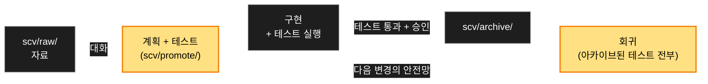

<div align="center">


<h1>SCV</h1>

<p><b>Standard · Cowork · Verify</b></p>

<p><b>팀을 위한 Claude Code 플러그인.<br>
모든 변경은 계획과 테스트와 함께 나가고 — 테스트는 영원히 돕니다.</b></p>

<p>
<a href="https://github.com/wookiya1364/scv-claude-code/releases/latest"></a>


</p>


</div>

---

> **Languages**: [English](./README.md) · 한국어 · [日本語](./README.ja.md)

## SCV가 뭔가요

변경 얘기를 꺼내면 → SCV가 실행 가능한 테스트가 딸린 계획으로 다듬고 →
구현하고 → 증적을 PR에 붙이고 → 계획을 아카이브합니다. 아카이브된 테스트는
전부 회귀 스위트에 쌓여 이후 모든 변경을 검사합니다. 6개월 뒤, 아무도
기억 못 하는 테스트가 고장을 잡아냅니다.

## 설치

```bash
/plugin marketplace add https://github.com/wookiya1364/scv-claude-code
/plugin install scv@scv-claude-code
```

- **macOS**: `brew install bash` 한 번 (SCV 스크립트는 bash 4+ 필요; 시스템 bash는 그대로).
- **Linux / WSL**: 할 것 없음. **Windows 네이티브**: 미지원 — WSL 또는 Git Bash.
- 권장 CLI: `git`, `curl`, `jq`, `gh` (또는 `glab`). 없으면 SCV가 알려줍니다.

## 쓰는 법

**그냥 말 걸면 됩니다.** 외울 명령이 없습니다 — SCV가 대화에 스스로 끼어듭니다:

```text
나:   결제 화면에 환불 버튼 넣고 싶어.
SCV:  (대화 모드 진입 — 목표 / 범위 / 인수 기준을 묻고,
       충분해지면 계획과 테스트 초안을 제안)
```

만들고 싶은 걸 말하면 계획으로 다듬어 주고, 다음에 뭘 할지 물으면 프로젝트를
진단하고, "작년에 환불 어떻게 처리했었지?"라고 물으면 아카이브를 검색합니다.
`/scv:help`는 같은 일을 명시적으로 하는 입구이고, `scv/scv_settings.json`의
`SCV_ALWAYS_ON=off`가 명령 전용 동작으로 되돌립니다.

대화 뒤에서는 루프 하나가 모든 것을 돌립니다:



## 얻는 것

| 팀의 문제 | SCV의 답 |
|---|---|
| AI 디프를 믿기 전에 직접 돌려봐야 한다 | PR에 e2e 영상/GIF가 이미 붙어서 온다 — 증적은 파일 이름이 아니라 실제 테스트 실행 기록을 따른다 |
| 같은 변경이 티켓 · PR · 채팅에서 다르게 적혀 있다 | `PLAN.md`가 단일 원본; 티켓은 `refs:` 링크, PR과 보고는 여기서 생성 |
| 결정이 세션과 함께 사라진다 | `scv/DECISIONS.md` — 추가 전용, 계획 승인 / 아카이브 / 폐기 시점에 자동 기록 |
| 옛 기능이 소리 없이 깨진다 | 아카이브된 모든 계획의 테스트가 하나의 회귀 스위트로 재실행 |

## 설정

파일 하나: `scv/scv_settings.json` — 모든 키가 기본값·설명(`_doc`)과 함께
자동 생성되므로, 열어보면 뭘 설정할 수 있는지 다 보입니다. 비밀(토큰, 채널
ID)은 git 무시되는 별도 파일로 갑니다. `.env`는 읽지도 쓰지도 않습니다.

| 키 | 기본 | 하는 일 |
|---|---|---|
| `SCV_ALWAYS_ON` | `on` | 일반 대화에도 SCV가 끼어듦; `off` = 명령 전용 |
| `SCV_PLAIN_LANGUAGE` | `on` | 쉬운말 우선 답 모양(+매 턴 알림); `off`로 끔 |
| `SCV_LANG` | 자동 | 출력 언어: `english` · `korean` · `japanese` |
| `NOTIFIER_PROVIDER` | 꺼짐 | 팀 보고 채널: `slack` 또는 `discord` |

스크립트로 쓰면 비밀이 알맞은 파일로 저절로 갈라집니다:

```bash
CORE="$HOME/.claude/plugins/cache/scv-claude-code/scv/<version>/vendor/scv-core/core"
bash "$CORE/scripts/settings-set.sh" NOTIFIER_PROVIDER=slack
bash "$CORE/scripts/settings-set.sh" SLACK_BOT_TOKEN=xoxb-...   # → 비밀 파일
```

## 명령 참조

이 표는 몰라도 됩니다 — 대화가 알아서 라우팅합니다. 명시적으로 쓰고 싶을 때:

| 명령 | 하는 일 |
|---|---|
| `/scv:help` | 프로젝트 진단 · 아이디어 다듬기 · 아카이브 검색 |
| `/scv:status` | 진행 중인 것: raw 변화, 활성 계획, 에픽, handoff |
| `/scv:promote` | 자료 → 계획 폴더 (`PLAN.md` + `TESTS.md` + 다이어그램) |
| `/scv:work <slug>` | 구현 · 테스트 · 아카이브 · 증적 붙은 PR |
| `/scv:codegen <slug>` | TDD-first 변형: 테스트가 코드를 이끈다, Red → Green |
| `/scv:regression` | 아카이브된 모든 계획의 테스트를 하나의 스위트로 실행 |
| `/scv:deck [<md>]` | 마크다운 → 자체 완결 기획서 문서 (또는 슬라이드) |
| `/scv:report` | 페이즈 결과를 Slack/Discord에 증적과 함께 보고 |
| `/scv:sync` | SCV 템플릿 갱신 + 코드↔계획 드리프트 감지 |
| `/scv:routine [<name>]` | 파일 하나짜리 유지보수 루틴 실행 |
| `/scv:workspace` · `/scv:handoff` | 멀티레포: 우산 구성 · 타 저장소 작업 선언 |
| `/scv:update` · `/scv:set-models` · `/scv:install-deps` | 플러그인 업데이트 안내 · 모델 정책 · CLI 의존성 |

## 가드레일

워크플로를 정직하게 지키는 두 겹:

- **세션 안**: `PreToolUse` 가드가 손으로 만든 계획 파일과 `scv/` 밖 쓰기를
  거부합니다 — 세션에서 SCV 액션이 한 번이라도 돌기 전까지 (`/scv:status`면
  충분). 내부 오류에는 열리는 쪽으로, SCV 미도입 프로젝트에서는 무반응.
  끄기: 프로세스 환경변수 `SCV_GUARD=off`.
- **머지 시점**: CI 게이트가 아카이브된 계획 없는 코드 변경 PR을 거부하고
  (`[no-plan: <이유>]`로 예외 선언), 손으로 다시 쓴 벤더 코어를 거부합니다
  (`[manual-vendor: <이유>]`).

계약: [`vendor/scv-core/core/contracts/guard.md`](vendor/scv-core/core/contracts/guard.md).

## 멀티레포

기본은 단일 저장소. FE/BE/서비스로 갈라진 시스템은 우산 하나 아래 묶을 수
있습니다: `/scv:workspace`로 만들거나 합류하고, `/scv:handoff`로 "저 저장소의
대응 작업이 필요하다"를 상대가 보게 될 곳에 선언합니다. 연결을 끊으면 이주
없이 단독 동작으로 돌아갑니다. 모듈별 `scv/`를 둔 모노레포는 선행 인자로
모듈을 지정합니다: `/scv:status FE`.

## 철학 — Standard · Cowork · Verify

- **Standard**: 표준은 워크플로이지 스냅샷 문서가 아니다. 결정은 낡아가는 문서가 아니라 추가 전용 로그에 남는다.
- **Cowork**: 계획은 대화에서 나오고 절마다 승인받는다 — 모델의 짐작이 아니라 당신이 말한 것.
- **Verify**: 테스트는 실행 가능하고, 아카이브된 테스트는 영원히 돈다. 실패는 명시적으로 분류한다 — 조용히 건너뛰는 일은 없다.

<details>
<summary><b>참고 — 도입 후 프로젝트 구조</b></summary>

```
my-project/
├── CLAUDE.md              # 당신 것 — SCV는 건드리지 않음
├── scv/                   # SCV 소유는 전부 이 아래
│   ├── SCV.md PROMOTE.md REPORTING.md
│   ├── DECISIONS.md       # 추가 전용 결정 로그
│   ├── conversations/     # 계획이 된 대화 (커밋됨)
│   ├── journal/           # 모든 프롬프트, 훅이 기록 (기본 gitignore)
│   ├── promote/  archive/  raw/  routines/
│   ├── scv_settings.json         # 설정 (자동 생성, 커밋됨)
│   └── scv_settings.secret.json  # 토큰 (자동 생성, git 무시)
└── .gitignore             # SCV 규칙이 append됨
```

도입은 비파괴적입니다: 기존 루트 파일은 그대로, SCV가 더하는 건 `scv/` 폴더
하나와 `.gitignore` 몇 줄뿐. 이 저장소의 `demo/`는 README GIF 제작용으로,
플러그인 사용자는 필요 없습니다.

</details>

## 아키텍처

공유 동작은 체크섬·버전 고정된
[scv-core](https://github.com/wookiya1364/scv-core) 릴리스를 플러그인 안에
벤더링한 것에서 옵니다 — 런타임에 아무것도 내려받지 않습니다. 이 저장소는
Claude Code 어댑터: 슬래시 명령, 훅 등록, 설치/업데이트 UX. 훅 stdout이 매 턴
항상 끼어들기 라우팅과 쉬운말 알림을 전달하고, 저널 훅은 기록 전에 레댁션을
거쳐 대화를 남깁니다.

## 기여

PR 전에 `tests/run-dry.sh`. 브랜치 흐름 `develop → stage → main`; 릴리스는
`gh workflow run promote.yml` — [docs/RELEASING.md](docs/RELEASING.md) 참조.
변경 이력은 [releases](https://github.com/wookiya1364/scv-claude-code/releases)에.

---

**License**: [MIT](./LICENSE) © 2026 wookiya1364
