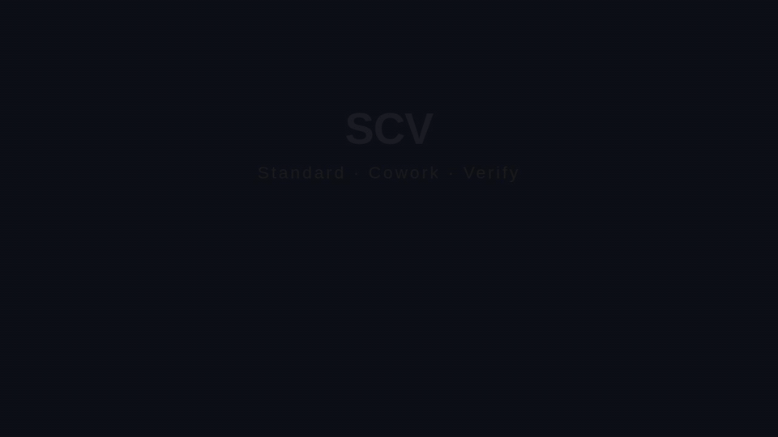
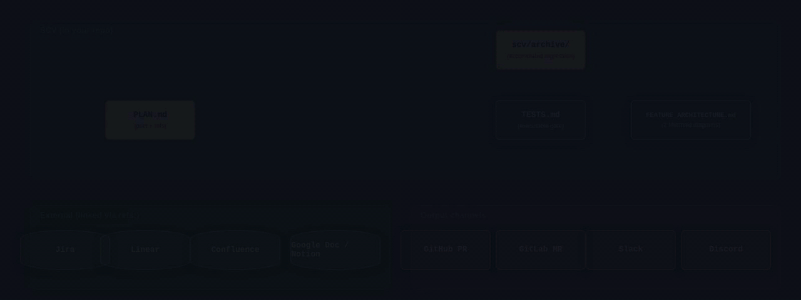
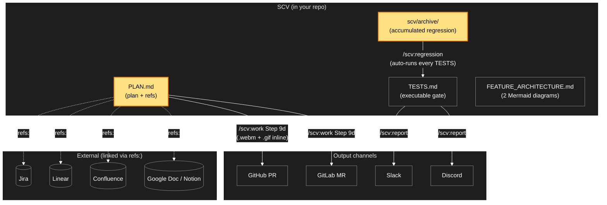
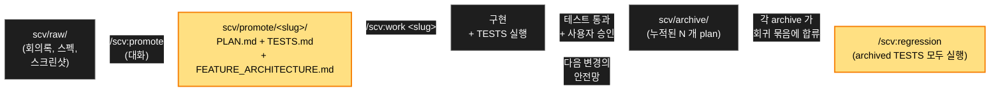
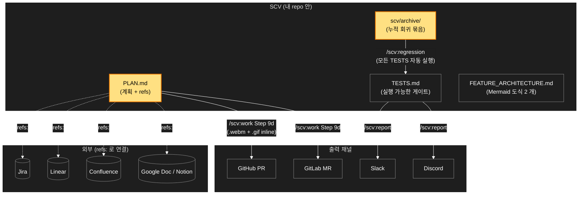
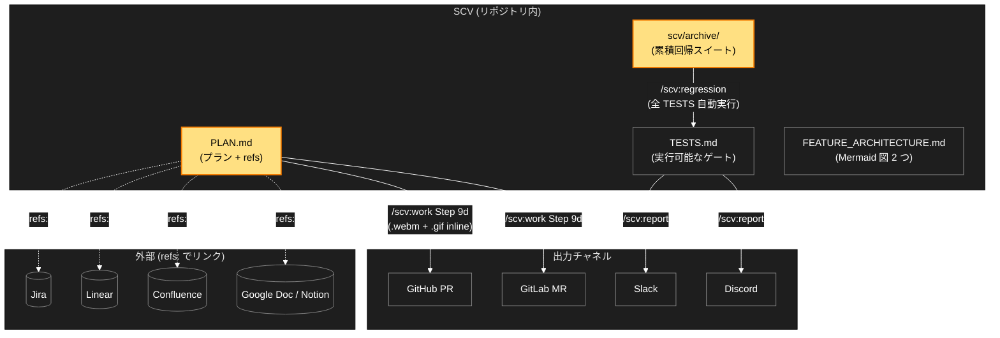

<div align="center">


<h1>SCV</h1>

<p><b>Standard · Cowork · Verify</b></p>

<p><b>A Claude Code plugin for teams.<br>
Every change ships with a plan and tests. The tests run forever — even after you've forgotten about them.</b></p>

<p>
Drop materials → Claude refines them with you → implementation runs the tests → tests stay in your regression suite. Your next change is automatically checked against everything you've ever shipped.
</p>



<p>
<a href="https://github.com/wookiya1364/scv-claude-code/releases/latest"></a>


</p>

<p>
<a href="#why-scv">Why SCV?</a> ·
<a href="#the-loop">The Loop</a> ·
<a href="#5-minute-walkthrough">5-min walkthrough</a> ·
<a href="#quick-start--four-steps">Quick Start</a> ·
<a href="#architecture--integrations">Architecture</a> ·
<a href="#philosophy-standard--cowork--verify">Philosophy</a> ·
<a href="CHANGELOG.md">Changelog</a>
</p>

</div>

---

> **Team collaboration plugin for Claude Code.**

Click a language below to expand. **English** is open by default.

<details open>
<summary><b>English</b></summary>

## Quick Start

> **The only command you need to remember is `/scv:help`.**
> It diagnoses your project's state and tells you what to do next. No flags to memorize, no docs to read first — the plugin walks you through every step.

```bash
# In any Claude Code session:

# 1. Install
/plugin marketplace add https://github.com/wookiya1364/scv-claude-code
/plugin install scv@scv-claude-code

# 2. Hydrate this project (one-time, per directory)
bash $CLAUDE_PLUGIN_ROOT/scripts/hydrate.sh init .

# 3. /scv:help takes over from here.
/scv:help
```

That's it. From now on, **any time you're stuck or unsure, run `/scv:help`** — it'll detect your project's current state (raw materials waiting? active plan? tests failing? PR-ready?) and recommend the next action. **You don't need to read the rest of this README to use SCV.**

> **Have an idea but no materials yet?** (v0.9.0+) Just run `/scv:help "I want to add a refund button"` — Claude will refine the idea with you turn by turn, save every step locally, and offer to draft `PLAN.md + TESTS.md` when ready.

## Why SCV?

When AI starts writing your team's code, three painful things happen. Here's what SCV does about each:

| The painful thing | What SCV does |
|---|---|
| **"Did the AI actually make this work, or just make it *look* right?"** Reviewing an AI-generated 100-line diff, you end up running tests yourself before you can even start reading the logic. | `/scv:work` runs your Playwright e2e tests and attaches a 5-second GIF preview to the PR. Reviewers see the feature actually working, then read the diff with focus on logic — not "does it run". |
| **The same change is described in 3 places** — Linear/Jira ticket, PR description, code comment — and they all drift. Six months later, no one knows which version is the truth. | PLAN.md is the *one* source of truth. It links to your ticket via `refs:` (no copy-paste), and its TESTS run on every future change. There's nothing to keep in sync. |
| **Old PRs pile up, and no one knows which still matter.** Q1 archived 50 plans. Are they still relevant? Did any get replaced by a refactor? Without a graph, the archive becomes a graveyard you can't search. | Each plan can declare `supersedes: [old-slug]`. `/scv:regression` automatically skips replaced plans. The archive becomes a *living* record — new team members `grep` it to learn how the codebase got built. |

---

## The Loop

Drop material → refine into a plan + tests → implement → archive. Every archived plan's tests join the **accumulating regression suite** that runs against every future change.

```mermaid
%%{init: {'theme':'base', 'themeVariables': {'primaryColor':'#1e1e1e','primaryTextColor':'#fff','primaryBorderColor':'#888','lineColor':'#fff','secondaryColor':'#2d2d2d','tertiaryColor':'#1e1e1e','background':'#0d1117','edgeLabelBackground':'#1e1e1e'}}}%%
flowchart LR
  Raw["scv/raw/<br>(meeting notes,<br>specs, screenshots)"]
  Promote["scv/promote/&lt;slug&gt;/<br>PLAN.md + TESTS.md<br>+ FEATURE_ARCHITECTURE.md"]
  Work["implement<br>+ run TESTS"]
  Archive["scv/archive/<br>(N plans accumulated)"]
  Regression["/scv:regression<br>(runs every archived TESTS)"]

  Raw -->|"/scv:promote<br>(dialog)"| Promote
  Promote -->|"/scv:work &lt;slug&gt;"| Work
  Work -->|"tests pass<br>+ user approval"| Archive
  Archive -->|"each archive<br>joins the suite"| Regression
  Regression -.->|"safety net for<br>the next change"| Promote

  classDef key fill:#FFE082,stroke:#F57C00,stroke-width:2px,color:#000
  class Promote,Regression key
```

<p align="center">
  
</p>



**Why the loop matters.** Six months later, someone breaks an old feature they never knew about — and the test from that feature's archived plan catches it automatically. The longer your team works with SCV, the thicker your safety net grows.

---

## 5-Minute Walkthrough

**Scenario**: "Add a refund button to the checkout page"

| Min | Step | What happens |
|---|---|---|
| 1 | Drop materials into `scv/raw/` | meeting notes + spec PDF (Jira URL inside) |
| 2 | `/scv:promote` | Claude detects the URL, asks for slug + title → creates `PLAN.md + TESTS.md + FEATURE_ARCHITECTURE.md` (Mermaid diagrams) |
| 3 | `/scv:work <slug>` | Implements + Playwright e2e + `.webm` capture |
| 4 | Auto PR | PR opens with a GIF preview, the Mermaid diagrams, and a Jira link — all attached automatically |
| 5 | Review → merge → archive | Reviewer confirms via GIF in 5 sec; on merge plan archives, joins `/scv:regression` suite |

Every change becomes a plan + tests, accumulates into a self-running regression suite, and stays linked to your existing tools (Linear / Jira / Confluence) without duplication.

## Slash Commands

> **You'll discover these through `/scv:help`'s recommendations as you go — you don't have to memorize them.** This table is for reference.

| Command | What it does |
|---|---|
| **`/scv:help`** | **Tells you what to do next.** Diagnoses your project's state and recommends the next action. **Run this whenever you're unsure.** |
| `/scv:status` | Inspect raw materials, active promotes, epic progress |
| `/scv:promote` | Refine `scv/raw/` materials into a plan folder (`scv/promote/<slug>/`) — interactive, creates PLAN + TESTS + Mermaid architecture diagrams |
| `/scv:work <slug>` | Implement the plan, run tests, archive when passing, open a PR with the e2e video auto-attached |
| `/scv:regression` | Run all accumulated archived TESTS as a regression suite |
| `/scv:report` | Post a phase result to Slack or Discord |
| `/scv:sync` | Apply plugin updates to standard docs |
| `/scv:install-deps` | Detect & install missing CLIs (`gh` / `glab` / `jq` / `ffmpeg`) — OS-aware |

No flags to memorize. Claude asks for inputs when needed.

## Architecture & Integrations

PLAN.md is the single source of truth. External tools (Jira / Linear / Confluence / Google Doc) are linked via `refs:` — never copied. Outputs (PR / MR / Slack / Discord) are auto-generated from the same source.

<p align="center">
  
</p>



**Key properties.**

- **Single source of truth.** PLAN.md is written once. PR description, regression filter, Slack report — all read from it.
- **External tools stay external.** `refs: [{type: jira, id: PAY-1234}]` links don't copy ticket bodies. When the ticket changes, the link still resolves.
- **Vendor-agnostic backends.** PR/MR creation goes through `lib/pr-platform.sh`; GitHub (`gh`) and GitLab (`glab`) are first-class. Adding Bitbucket / Gitea is a new adapter, not a rewrite.
- **Multi-language by default.** PR title, body labels (`## Summary` / `## 요약` / `## 概要`), Mermaid node labels, commit messages — all follow the resolved language (English / 한국어 / 日本語) from your settings. (default).

## Philosophy: Standard · Cowork · Verify

The three letters are not features — they are **the three failure modes of AI-assisted team development that SCV refuses**.

**S — Standard.** *"Documentation is something the team should already have, not a chore SCV imposes."* So standard docs (DOMAIN, ARCHITECTURE, DESIGN, TESTING, …) seed at `status: N/A` and stay that way until you decide to lift one. Adoption is zero-friction. **N/A is a steady state, not a backlog.**

**C — Cowork.** *"AI should refine your raw thinking with you, not replace it."* So `/scv:promote` is a **dialog**, not a generation. Claude reads `scv/raw/` (any format — notes, PDFs, screenshots, recordings), proposes a structure, and the user approves per-candidate. What lands in PLAN.md is what the user said, not what the LLM guessed.

**V — Verify.** *"Tests don't just gate the current change — they protect every future change."* So TESTS.md is **executable**, not aspirational. Every archived plan's tests run as regression on the next change. Failures triage into regression / obsolete / flaky — never silently skipped.

> The plugin's name is the plugin's contract.

<details>
<summary><b>Reference — project layout, external refs, notifier setup</b></summary>

### Your Project Layout (after hydrate)

```
my-project/
├── CLAUDE.md           # (optional, user-owned — SCV never touches it)
├── scv/                # SCV owns everything under here
│   ├── CLAUDE.md       # SCV workflow index
│   ├── INTAKE.md PROMOTE.md DOMAIN.md ARCHITECTURE.md DESIGN.md
│   ├── AGENTS.md TESTING.md REPORTING.md RALPH_PROMPT.md
│   ├── readpath.json   # raw change snapshot (auto-managed)
│   ├── promote/        # Active plans (YYYYMMDD-author-slug folders)
│   ├── archive/        # Completed plans (moved by /scv:work)
│   └── raw/            # Free-input space
├── .env.example.scv    # SCV's notifier env template (your existing .env.example is untouched)
└── .gitignore          # SCV rules appended; existing .gitignore preserved
```

**Non-destructive**: existing root `CLAUDE.md` / `.env.example` stay intact. SCV creates `scv/` + separate `.env.example.scv` + appends to existing `.gitignore`.

**Standard docs are optional**. Adoption mode (default) seeds 7 of 9 docs as `status: N/A` and stays that way until you lift one. N/A is a steady state, not a backlog.

### External Refs (Jira / Linear / PR / Docs) — Auto-Detection

PLAN.md frontmatter has a vendor-agnostic `refs:` array. `/scv:promote` auto-detects URLs from:

- `scv/raw/` files (drop a meeting note with the ticket URL inside)
- `/scv:promote "...URL..."` invocation argument
- Dialog answers (paste URLs while answering — auto-parsed)

In `.env`, set `JIRA_BASE_URL` / `LINEAR_BASE_URL` / `CONFLUENCE_BASE_URL` so PLAN.md stores just `id: PAY-1234` (URL inferred at display). Without these, full URLs stored. See `template/.env.example.scv`.

### Notifier Setup (.env) — Optional

```bash
cp .env.example.scv .env
$EDITOR .env
```

Slack:
```bash
NOTIFIER_PROVIDER=slack
SLACK_BOT_TOKEN=xoxb-...
SLACK_CHANNEL_ID=C0XXXXX0
SLACK_CHANNEL_ID_PHASE_COMPLETE=C0XXXXX1
SLACK_CHANNEL_ID_E2E_FAILURE=C0XXXXX2
```

Discord: `NOTIFIER_PROVIDER=discord` + `DISCORD_BOT_TOKEN` + `DISCORD_CHANNEL_ID_*`.

If you already have `.env`: `cat .env.example.scv >> .env`. Never commit `.env`.

</details>

## Learn More

- Each command's detail: `/scv:<command> --help`
- Project-specific guide: `/scv:help`
- Changelog: [CHANGELOG.md](./CHANGELOG.md)

## Contributing

- Run `tests/run-dry.sh` before PRs
- Log user-facing changes in `CHANGELOG.md`
- Follow SemVer for `VERSION` bumps

</details>

<details>
<summary><b>한국어</b></summary>

## 빠른 시작

> **외울 명령어는 `/scv:help` 하나뿐입니다.**
> 프로젝트 상태를 진단하고 다음에 뭘 해야 할지 알려줍니다. 플래그 외울 필요 없고, 먼저 읽을 문서도 없습니다 — 플러그인이 단계마다 알려줍니다.

```bash
# Claude Code 세션에서:

# 1. 설치
/plugin marketplace add https://github.com/wookiya1364/scv-claude-code
/plugin install scv@scv-claude-code

# 2. 이 프로젝트에 hydrate (디렉토리당 한 번)
bash $CLAUDE_PLUGIN_ROOT/scripts/hydrate.sh init .

# 3. /scv:help 가 여기서부터 안내합니다.
/scv:help
```

이게 다입니다. 이후 **막히거나 뭐 해야 할지 모르겠을 땐 `/scv:help`** — 현재 상태 (raw 자료가 쌓였나? 진행 중인 plan 이 있나? 테스트가 깨졌나? PR 보낼 차례인가?) 를 자동으로 파악하고 다음 행동을 안내합니다. **이 README 의 나머지를 안 읽어도 SCV 를 사용할 수 있습니다.**

> **아이디어는 있는데 자료가 없다면?** (v0.9.0+) 그냥 `/scv:help "환불 버튼 추가하고 싶어"` — Claude 가 한 turn 씩 같이 정제하고, 매 단계를 로컬에 저장하고, 충분해지면 `PLAN.md + TESTS.md` 작성을 제안합니다.

## 왜 SCV?

AI 가 팀 코드를 짜기 시작하면, 세 가지 골치 아픈 일이 생깁니다. SCV 가 그걸 어떻게 풀어주는가:

| 골치 아픈 일 | SCV 의 처리 |
|---|---|
| **"AI 가 진짜 동작하게 만든 건지, 아니면 그럴듯해 *보이게만* 만든 건지?"** AI 가 짠 100 줄 diff 를 리뷰하려면 결국 본인이 직접 테스트 돌려본 다음에야 로직을 보게 됩니다. | `/scv:work` 가 Playwright e2e 를 돌리고 5 초짜리 GIF 미리보기를 PR 에 자동 첨부. 리뷰어가 *기능이 실제로 동작하는 모습* 을 먼저 보고, 그 다음에 diff 를 — "동작은 하는가?" 가 아니라 *로직* 에 집중해서 — 읽습니다. |
| **같은 변경을 3 군데에 따로 적게 됩니다** — Linear/Jira 티켓, PR description, 코드 주석 — 그리고 셋 다 시간 지나면 어긋납니다. 6 개월 뒤엔 어느 게 진짜인지 아무도 모릅니다. | PLAN.md 가 *유일한* source of truth. 티켓은 `refs:` 로 *링크* (복붙 안 함), TESTS 는 미래 변경마다 자동 실행. 동기화할 게 없습니다. |
| **옛 PR 이 쌓이는데 어느 게 아직 유효한지 아무도 모릅니다.** Q1 에 50 개 plan 이 archive 됐는데, 아직 유효한가? 어느 게 리팩터링으로 대체됐나? 의존 그래프가 없으면 archive 는 검색도 안 되는 묘지가 됩니다. | 각 plan 이 `supersedes: [옛-slug]` 를 선언할 수 있어요. `/scv:regression` 이 대체된 plan 은 자동 skip. archive 는 *살아있는* 기록 — 새 팀원이 `grep` 으로 "이 코드가 어떻게 만들어졌나" 를 추적합니다. |

---

## 흐름 한눈에

자료 투입 → 계획 + 테스트로 정제 → 구현 → archive. 모든 archive 의 테스트는 **누적되는 회귀 테스트** 로 합류해 미래의 모든 변경에 대해 자동으로 돕니다.



**왜 이 흐름이 중요한가**. 6 개월 뒤 누군가 모르고 옛 기능을 깨뜨려도, 그 기능의 archive 된 테스트가 자동으로 발견합니다. 팀이 SCV 와 오래 일할수록 안전망이 두터워집니다.

---

## 5 분 워크스루

**시나리오**: "결제 페이지에 환불 버튼 추가"

| 분 | 단계 | 결과 |
|---|---|---|
| 1 | `scv/raw/` 에 자료 투입 | 회의록 + 스펙 PDF (Jira URL 포함) |
| 2 | `/scv:promote` | Claude 가 URL 인식, slug + title 묻고 → `PLAN.md + TESTS.md + FEATURE_ARCHITECTURE.md` (Mermaid 도식) 생성 |
| 3 | `/scv:work <slug>` | 구현 + Playwright e2e + `.webm` 캡처 |
| 4 | 자동 PR | PR 열림 — GIF 미리보기, Mermaid 도식, Jira 링크 모두 자동 첨부 |
| 5 | 리뷰 → 머지 → archive | 리뷰어가 GIF 로 5 초 안에 확인; 머지 시 archive, `/scv:regression` suite 에 합류 |

모든 변경이 plan + tests 가 되어 자동 회귀 suite 으로 누적되고, 기존 도구 (Linear / Jira / Confluence) 와는 중복 없이 링크됩니다.

## 슬래시 커맨드

> **외울 필요 없습니다 — `/scv:help` 의 안내를 따라가면서 자연스럽게 알게 됩니다.** 이 표는 참고용입니다.

| 커맨드 | 하는 일 |
|---|---|
| **`/scv:help`** | **다음에 뭘 해야 할지 알려줍니다.** 프로젝트 상태를 진단하고 추천 행동을 안내. **모르겠을 땐 항상 이걸 먼저.** |
| `/scv:status` | raw 자료 · 진행 중인 promote · epic 진척도 자세히 |
| `/scv:promote` | `scv/raw/` 자료를 plan 폴더 (`scv/promote/<slug>/`) 로 정제 — 대화 형식, PLAN + TESTS + Mermaid 아키텍처 도식 생성 |
| `/scv:work <slug>` | plan 구현 + 테스트 실행 + 통과 시 archive + PR 자동 생성 (e2e 비디오 자동 첨부) |
| `/scv:regression` | archive 된 모든 TESTS 를 누적 회귀로 실행 |
| `/scv:report` | 단계 결과를 Slack / Discord 에 보고 |
| `/scv:sync` | 플러그인 업데이트를 표준 문서에 반영 |
| `/scv:install-deps` | 누락 CLI 자동 감지 + 설치 안내 (`gh` / `glab` / `jq` / `ffmpeg`) — OS 자동 인지 |

외울 플래그 없습니다. Claude 가 필요할 때마다 입력을 묻고 진행합니다.


## 아키텍처 & 외부 통합

PLAN.md 가 단일 source of truth. 외부 도구 (Jira / Linear / Confluence / Google Doc) 는 `refs:` 로 *링크* 만 — 복사 안 함. 출력 (PR / MR / Slack / Discord) 은 같은 source 에서 자동 생성.



**핵심 속성**.

- **단일 source of truth**. PLAN.md 는 한 번만 작성. PR description / regression filter / Slack 보고 — 모두 여기서 읽음.
- **외부 도구는 외부에 둠**. `refs: [{type: jira, id: PAY-1234}]` 링크는 티켓 본문 복사 안 함. 티켓이 갱신돼도 링크는 여전히 유효.
- **vendor-agnostic 백엔드**. PR/MR 생성은 `lib/pr-platform.sh` 거침. GitHub (`gh`) + GitLab (`glab`) first-class. Bitbucket / Gitea 추가는 새 어댑터, rewrite 아님.
- **다국어 default**. PR 제목, body 라벨 (`## Summary` / `## 요약` / `## 概要`), Mermaid 노드 라벨, commit 메시지 — 모두 settings 에서 결정된 언어 (English / 한국어 / 日本語) 따라감. (default).

## 철학: Standard · Cowork · Verify

세 글자는 *기능* 이 아니라 — **AI 협업 팀 개발의 세 가지 실패 모드**, SCV 가 거부하는 그것.

**S — Standard (표준)**. *"문서는 팀이 이미 가지고 있어야 할 것이지, SCV 가 강요하는 잡일이 아니다."* 그래서 표준 문서 (DOMAIN, ARCHITECTURE, DESIGN, TESTING, …) 는 `status: N/A` 로 시드되고 사용자가 lift 결정할 때까지 그대로. 채택 마찰 0. **N/A 는 backlog 가 아니라 정상 상태.**

**C — Cowork (협업)**. *"AI 는 사용자 raw 사고를 함께 정제해야지, 대체하는 게 아니다."* 그래서 `/scv:promote` 는 **대화** — 생성이 아님. Claude 가 `scv/raw/` 를 읽고 (형식 무관 — 메모, PDF, 스크린샷, 녹화), 구조를 제안, 사용자가 건건이 승인. PLAN.md 에 들어가는 건 *사용자가 말한 것*, *LLM 이 추측한 것* 이 아님.

**V — Verify (검증)**. *"테스트는 현재 변경의 게이트만이 아니다 — 모든 미래 변경을 보호한다."* 그래서 TESTS.md 는 **실행 가능한 것** — 희망 사항이 아님. 모든 archived plan 의 테스트는 다음 변경의 회귀로 돔. 실패는 regression / obsolete / flaky 로 triage — 조용히 skip 안 됨.

> 플러그인 이름은 플러그인의 계약.

<details>
<summary><b>레퍼런스 — 프로젝트 디렉토리 / 외부 Refs / 협업툴 설정</b></summary>

### 프로젝트 디렉토리 (초기화 후)

```
my-project/
├── CLAUDE.md           # (선택, 사용자 소유 — SCV 가 건드리지 않음)
├── scv/                # SCV 가 소유하는 영역
│   ├── CLAUDE.md       # SCV 워크플로 인덱스
│   ├── INTAKE.md PROMOTE.md DOMAIN.md ARCHITECTURE.md DESIGN.md
│   ├── AGENTS.md TESTING.md REPORTING.md RALPH_PROMPT.md
│   ├── readpath.json   # raw 변경 스냅샷 (자동 관리)
│   ├── promote/        # 활성 계획 (YYYYMMDD-author-slug 폴더)
│   ├── archive/        # 완료 계획 (/scv:work 가 이동)
│   └── raw/            # 자유 투입 공간
├── .env.example.scv    # SCV 전용 Notifier 변수 템플릿
└── .gitignore          # SCV 규칙 append; 기존 보존
```

**Non-destructive**: 루트 `CLAUDE.md` / `.env.example` 그대로 보존. SCV 는 `scv/` 만 만들고, `.env.example.scv` 별도 추가 + 기존 `.gitignore` 에 append.

**표준 문서는 옵션**. adoption 모드 (default) 가 9 문서 중 7 개를 `status: N/A` 로 시드하고 lift 결정할 때까지 그대로. N/A 는 backlog 가 아니라 정상 상태.

### 외부 Refs (Jira / Linear / PR / 문서) — 자동 인식

PLAN.md frontmatter 의 vendor-agnostic `refs:` 배열. `/scv:promote` 가 다음 source 의 URL 자동 인식:

- `scv/raw/` 안 파일 (회의록에 티켓 URL 적어두기)
- `/scv:promote "...URL..."` 호출 인자
- dialog 답변 안의 URL (자동 파싱)

`.env` 에 `JIRA_BASE_URL` / `LINEAR_BASE_URL` / `CONFLUENCE_BASE_URL` 박으면 PLAN.md 가 `id: PAY-1234` 만 저장 (URL 표시 시점에 추론). 미설정 시 full URL 저장. `template/.env.example.scv` 참조.

### 협업툴 설정 (.env) — 선택 사항

```bash
cp .env.example.scv .env
$EDITOR .env
```

Slack:
```bash
NOTIFIER_PROVIDER=slack
SLACK_BOT_TOKEN=xoxb-...
SLACK_CHANNEL_ID=C0XXXXX0
SLACK_CHANNEL_ID_PHASE_COMPLETE=C0XXXXX1
SLACK_CHANNEL_ID_E2E_FAILURE=C0XXXXX2
```

Discord: `NOTIFIER_PROVIDER=discord` + `DISCORD_BOT_TOKEN` + `DISCORD_CHANNEL_ID_*`.

기존 `.env` 있다면: `cat .env.example.scv >> .env`. `.env` 는 절대 git commit 금지.

</details>

## 더 알아보기

- 각 커맨드 상세: `/scv:<command> --help`
- 현재 프로젝트 맞춤 안내: `/scv:help`
- 변경 이력: [CHANGELOG.md](./CHANGELOG.md)

## 기여

- PR 전에 `tests/run-dry.sh` 통과 확인
- 사용자 영향 변경은 `CHANGELOG.md` 에 기록
- `VERSION` bump 은 SemVer 따름

</details>

<details>
<summary><b>日本語</b></summary>

## クイックスタート

> **覚えるべきコマンドは `/scv:help` ひとつだけ。**
> プロジェクトの状態を診断し、次に何をすべきか教えてくれます。覚えるフラグなし、先に読むドキュメントなし — プラグインがステップごとに案内します。

```bash
# Claude Code セッション内で:

# 1. インストール
/plugin marketplace add https://github.com/wookiya1364/scv-claude-code
/plugin install scv@scv-claude-code

# 2. このプロジェクトに hydrate (ディレクトリごとに 1 回)
bash $CLAUDE_PLUGIN_ROOT/scripts/hydrate.sh init .

# 3. ここから先は /scv:help が引き継ぎます。
/scv:help
```

これだけです。以後 **詰まったり迷ったときは `/scv:help`** — 現在の状態 (raw 資料が溜まっているか? 進行中のプランがあるか? テストが落ちているか? PR を出す段階か?) を自動で把握し、次のアクションを推奨します。**この README の残りを読まなくても SCV は使えます。**

> **アイデアはあるが資料はまだない?** (v0.9.0+) `/scv:help "払い戻しボタンを追加したい"` と入力するだけ — Claude が一つずつ精製しながら各ステップをローカルに保存し、十分になったら `PLAN.md + TESTS.md` の作成を提案します。

## なぜ SCV?

AI がチームのコードを書き始めると、3 つの厄介なことが起こります。SCV はそれぞれにこう対処します:

| 厄介なこと | SCV の対処 |
|---|---|
| **「AI が本当に動くものを作ったのか、それとも*それっぽく見える*ものを作っただけか?」** AI が書いた 100 行の diff をレビューしようとすると、結局自分でテストを回してから論理を読み始めることになります。 | `/scv:work` が Playwright e2e を実行し 5 秒の GIF プレビューを PR に自動添付。レビュアーは*機能が実際に動く様子*を先に見て、その後 diff を — 「動くのか?」ではなく*ロジック*に集中して — 読みます。 |
| **同じ変更を 3 か所に書くことになります** — Linear/Jira チケット、PR description、コードコメント — そして全部時間とともにずれます。半年後には誰もどれが真実か分かりません。 | PLAN.md が*唯一の* source of truth。チケットは `refs:` で*リンク* (コピペなし)、TESTS は未来の変更ごとに自動実行。同期するものがありません。 |
| **古い PR が積み上がるが、どれがまだ有効か誰も知りません。** Q1 で 50 個の plan が archive されました。まだ有効? どれかリファクタで置き換わった? 依存グラフがなければ archive は検索もできない墓場になります。 | 各 plan が `supersedes: [古い-slug]` を宣言できます。`/scv:regression` が置き換えられた plan を自動 skip。archive は*生きた*記録 — 新メンバーが `grep` でコードベースの歴史を追跡できます。 |

---

## ループ

資料投入 → プラン + テストへ精製 → 実装 → archive。すべての archive のテストは**累積する回帰テスト**へ合流し、未来のあらゆる変更に対して自動で回ります。

```mermaid
%%{init: {'theme':'base', 'themeVariables': {'primaryColor':'#1e1e1e','primaryTextColor':'#fff','primaryBorderColor':'#888','lineColor':'#fff','secondaryColor':'#2d2d2d','tertiaryColor':'#1e1e1e','background':'#0d1117','edgeLabelBackground':'#1e1e1e'}}}%%
flowchart LR
  Raw["scv/raw/<br>(議事録、仕様書、<br>スクリーンショット)"]
  Promote["scv/promote/&lt;slug&gt;/<br>PLAN.md + TESTS.md<br>+ FEATURE_ARCHITECTURE.md"]
  Work["実装<br>+ TESTS 実行"]
  Archive["scv/archive/<br>(累積された N 個のプラン)"]
  Regression["/scv:regression<br>(archived TESTS すべて実行)"]

  Raw -->|"/scv:promote<br>(対話)"| Promote
  Promote -->|"/scv:work &lt;slug&gt;"| Work
  Work -->|"テスト合格<br>+ ユーザー承認"| Archive
  Archive -->|"各 archive が<br>回帰スイートに合流"| Regression
  Regression -.->|"次の変更の<br>セーフティネット"| Promote

  classDef key fill:#FFE082,stroke:#F57C00,stroke-width:2px,color:#000
  class Promote,Regression key
```



**なぜこのループが重要か**. 6 か月後、誰かが知らない古い機能を壊しても、その機能の archive されたテストが自動で検出します。チームが SCV と長く使うほど、セーフティネットが厚くなります。

---

## 5 分ウォークスルー

**シナリオ**: "決済ページに払い戻しボタンを追加"

| 分 | ステップ | 結果 |
|---|---|---|
| 1 | `scv/raw/` に資料投入 | 議事録 + 仕様書 PDF (Jira URL 含む) |
| 2 | `/scv:promote` | Claude が URL 検出、slug + title を尋ねて → `PLAN.md + TESTS.md + FEATURE_ARCHITECTURE.md` (Mermaid 図) を生成 |
| 3 | `/scv:work <slug>` | 実装 + Playwright e2e + `.webm` キャプチャ |
| 4 | 自動 PR | PR が開く — GIF プレビュー、Mermaid 図、Jira リンクがすべて自動添付 |
| 5 | レビュー → マージ → archive | レビュアーが GIF で 5 秒で確認、マージ時 archive、`/scv:regression` スイートに合流 |

すべての変更が plan + tests になり自動回帰スイートに累積、既存ツール (Linear / Jira / Confluence) とは複製なしでリンク。

## スラッシュコマンド

> **覚える必要はありません — `/scv:help` の案内に従っていけば自然に身につきます。** この表は参考用です。

| コマンド | やること |
|---|---|
| **`/scv:help`** | **次に何をすべきか教えてくれます。** プロジェクト状態を診断し推奨アクションを提示。**迷ったらいつでもこれを最初に。** |
| `/scv:status` | raw 資料 · アクティブな promote · epic 進捗を詳しく |
| `/scv:promote` | `scv/raw/` 資料を plan フォルダ (`scv/promote/<slug>/`) へ精製 — 対話形式、PLAN + TESTS + Mermaid アーキテクチャ図を生成 |
| `/scv:work <slug>` | plan を実装 + テスト実行 + 通過時に archive + PR 自動作成 (e2e 動画自動添付) |
| `/scv:regression` | archive されたすべての TESTS を累積回帰として実行 |
| `/scv:report` | フェーズ結果を Slack / Discord に通知 |
| `/scv:sync` | プラグイン更新を標準ドキュメントに反映 |
| `/scv:install-deps` | 不足 CLI 自動検出 + インストール案内 (`gh` / `glab` / `jq` / `ffmpeg`) — OS 自動判定 |

覚えるフラグはありません。Claude が必要なときに入力を尋ねます。


## アーキテクチャと外部統合

PLAN.md が単一の source of truth。外部ツール (Jira / Linear / Confluence / Google Doc) は `refs:` で*リンク*のみ — 複製しない。出力 (PR / MR / Slack / Discord) は同じ source から自動生成。



**重要な性質**.

- **単一の source of truth**. PLAN.md は一度だけ書く。PR description / regression filter / Slack 報告 — すべてここから読む。
- **外部ツールは外部に**. `refs: [{type: jira, id: PAY-1234}]` リンクはチケット本文を複製しない。チケットが更新されてもリンクは有効。
- **vendor-agnostic バックエンド**. PR/MR 作成は `lib/pr-platform.sh` 経由。GitHub (`gh`) + GitLab (`glab`) first-class。Bitbucket / Gitea 追加は新アダプター、書き直しではない。
- **多言語デフォルト**. PR タイトル、body ラベル (`## Summary` / `## 요약` / `## 概要`)、Mermaid ノードラベル、commit メッセージ — すべて settings から決定された言語 (English / 한국어 / 日本語) に従う。

## 哲学: Standard · Cowork · Verify

3 文字は*機能*ではなく — **AI 協業チーム開発の 3 つの失敗モード**、SCV が拒否するもの。

**S — Standard (標準)**. *"ドキュメントはチームが既に持っているべきもの、SCV が押し付ける雑用ではない。"* だから標準ドキュメント (DOMAIN, ARCHITECTURE, DESIGN, TESTING, …) は `status: N/A` でシード、ユーザーが lift を決めるまでそのまま。導入摩擦ゼロ。**N/A は backlog ではなく定常状態。**

**C — Cowork (協業)**. *"AI はユーザーの raw 思考を共に精製すべきで、置き換えるべきではない。"* だから `/scv:promote` は**対話** — 生成ではない。Claude が `scv/raw/` を読み (形式自由 — メモ、PDF、スクリーンショット、録画)、構造を提案、ユーザーが個別に承認。PLAN.md に入るのは*ユーザーが言ったこと*、*LLM が推測したこと* ではない。

**V — Verify (検証)**. *"テストは現在の変更のゲートだけではない — すべての未来の変更を保護する。"* だから TESTS.md は**実行可能** — 願望ではない。すべての archived plan のテストは次の変更の回帰として回る。失敗は regression / obsolete / flaky にトリアージ — 黙ってスキップされない。

> プラグインの名前はプラグインの契約。

<details>
<summary><b>リファレンス — プロジェクトディレクトリ / 外部 Refs / 通知設定</b></summary>

### プロジェクトディレクトリ (hydrate 後)

```
my-project/
├── CLAUDE.md           # (任意 · ユーザー所有 — SCV は触らない)
├── scv/                # SCV が所有する領域
│   ├── CLAUDE.md       # SCV ワークフローのインデックス
│   ├── INTAKE.md PROMOTE.md DOMAIN.md ARCHITECTURE.md DESIGN.md
│   ├── AGENTS.md TESTING.md REPORTING.md RALPH_PROMPT.md
│   ├── readpath.json   # raw 変更スナップショット (自動管理)
│   ├── promote/        # アクティブな計画 (YYYYMMDD-author-slug フォルダ)
│   ├── archive/        # 完了した計画 (/scv:work が移動)
│   └── raw/            # 自由投入スペース
├── .env.example.scv    # SCV 専用 Notifier 変数テンプレート
└── .gitignore          # SCV ルール append; 既存保持
```

**Non-destructive**: ルート `CLAUDE.md` / `.env.example` はそのまま保持。SCV は `scv/` のみ作成、`.env.example.scv` を別途追加 + 既存 `.gitignore` に append。

**標準ドキュメントは任意**。adoption モード (default) は 9 ドキュメントのうち 7 つを `status: N/A` で seed し lift を決めるまでそのまま。N/A は backlog ではなく定常状態。

### 外部 Refs (Jira / Linear / PR / ドキュメント) — 自動検出

PLAN.md frontmatter の vendor-agnostic な `refs:` 配列。`/scv:promote` が以下の source の URL を自動検出:

- `scv/raw/` 内ファイル (議事録にチケット URL を含める)
- `/scv:promote "...URL..."` 呼び出し引数
- dialog 回答中の URL (自動 parse)

`.env` に `JIRA_BASE_URL` / `LINEAR_BASE_URL` / `CONFLUENCE_BASE_URL` を設定すると PLAN.md は `id: PAY-1234` のみ保存 (URL 表示時に推論)。未設定なら full URL 保存。`template/.env.example.scv` 参照。

### 通知ツール設定 (.env) — 任意

```bash
cp .env.example.scv .env
$EDITOR .env
```

Slack:
```bash
NOTIFIER_PROVIDER=slack
SLACK_BOT_TOKEN=xoxb-...
SLACK_CHANNEL_ID=C0XXXXX0
SLACK_CHANNEL_ID_PHASE_COMPLETE=C0XXXXX1
SLACK_CHANNEL_ID_E2E_FAILURE=C0XXXXX2
```

Discord: `NOTIFIER_PROVIDER=discord` + `DISCORD_BOT_TOKEN` + `DISCORD_CHANNEL_ID_*`。

既存 `.env` がある場合: `cat .env.example.scv >> .env`。`.env` は絶対に git にコミット禁止。

</details>

## さらに詳しく

- 各コマンドの詳細: `/scv:<command> --help`
- プロジェクト固有の案内: `/scv:help`
- 変更履歴: [CHANGELOG.md](./CHANGELOG.md)

## コントリビューション

- PR の前に `tests/run-dry.sh` を通す
- ユーザー影響のある変更は `CHANGELOG.md` に記録
- `VERSION` は SemVer に従う

</details>

---

**License**: [MIT](./LICENSE) © 2026 wookiya1364
