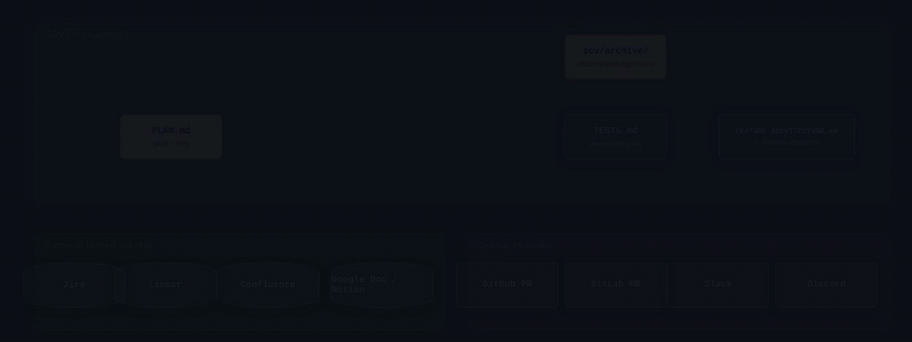
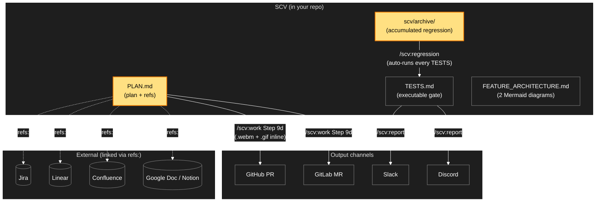

<div align="center">


<h1>SCV</h1>

<p><b>Standard · Cowork · Verify</b></p>

<p><b>A Claude Code plugin for teams.<br>
Every change ships with a plan and tests. The tests run forever — even after you've forgotten about them.</b></p>

<p>
Drop materials → Claude refines them with you → implementation runs the tests → tests stay in your regression suite. Your next change is automatically checked against everything you've ever shipped.
</p>

<p>
<b>SCV is a <i>process-first</i> plugin with an optional codegen variant (<code>/scv:codegen</code>, v0.11.0+).</b> It makes the team work from the same plan and the same tests. Speed comes as a side effect.
</p>


<p>
<a href="https://github.com/wookiya1364/scv-claude-code/releases/latest"></a>


</p>

<p>
<a href="#quick-start">Quick Start</a> ·
<a href="#5-minute-walkthrough">5-min walkthrough</a> ·
<a href="#the-loop">The Loop</a> ·
<a href="#slash-commands">Commands</a> ·
<a href="#why-scv">Why SCV?</a> ·
<a href="#architecture--integrations">Architecture</a> ·
<a href="#philosophy-standard--cowork--verify">Philosophy</a> ·
<a href="https://github.com/wookiya1364/scv-claude-code/releases">Releases</a>
</p>

</div>

---

> **Languages**: English · [한국어](./README.ko.md) · [日本語](./README.ja.md)

> **Team collaboration plugin for Claude Code.**

## Quick Start

> **The only command you need to remember is `/scv:help`.**
> It diagnoses your project's state and tells you what to do next. No flags to memorize, no docs to read first — the plugin walks you through every step.

```bash
# In any Claude Code session:

# 1. Install
/plugin marketplace add https://github.com/wookiya1364/scv-claude-code
/plugin install scv@scv-claude-code

# 2. /scv:help takes over from here.
#    On first run it offers to hydrate this project (one click).
/scv:help
```

That's it. **You only need to remember `/scv:help`** — it diagnoses your project and routes to the right command. Pick a starting line:

| Situation | Command |
|---|---|
| Don't know what to do next | `/scv:help` |
| Have an idea but no materials yet | `/scv:help "I want to add a refund button"` (v0.9.0+) |
| Want to find past work in the archive | `/scv:help "how did we handle refunds last quarter?"` (v0.10.0+) |

> **Platform prerequisites (1-time)**:
> - **macOS**: `brew install bash` once — SCV scripts use bash 4+ features (`declare -A`). Scripts auto-escalate to `/opt/homebrew/bin/bash` after install, so the system bash 3.2 stays untouched.
> - **Linux / WSL**: bash 4+ is the default — nothing to do.
> - **Windows native (PowerShell/cmd)**: unsupported; use WSL or Git Bash.
> - **All platforms**: `curl`, `git`, `jq`, `gh` (or `glab`) are recommended. `/scv:help` flags any missing dependency on its first line.

---

## 5-Minute Walkthrough

**Scenario**: "Add a refund button to the checkout page"

| Min | Step | What happens |
|---|---|---|
| 1 | Drop materials into `scv/raw/` | meeting notes + spec PDF (Jira URL inside) |
| 2 | `/scv:promote` | URL detected · slug + title asked · `PLAN.md + TESTS.md + FEATURE_ARCHITECTURE.md` written |
| 3 | `/scv:work <slug>` | Implements · runs Playwright e2e · captures `.webm` |
| 4 | Auto PR | PR opens with GIF preview · Mermaid diagrams · Jira link — all attached |
| 5 | Review → merge → archive | Reviewer confirms via GIF in 5 sec · merge moves plan to archive · joins `/scv:regression` |

**Stuck at any step?** Run `/scv:help` — it picks up your project's current state and tells you what's next.

---

## The Loop

Drop material → refine into a plan + tests → implement → archive. Every archived plan's tests join the **accumulating regression suite** that runs against every future change.

<p align="center">
  
</p>


```mermaid
%%{init: {'theme':'base', 'themeVariables': {'primaryColor':'#1e1e1e','primaryTextColor':'#fff','primaryBorderColor':'#888','lineColor':'#fff','secondaryColor':'#2d2d2d','tertiaryColor':'#1e1e1e','background':'#0d1117','edgeLabelBackground':'#1e1e1e'}}}%%
flowchart LR
  Raw["scv/raw/<br>(meeting notes,<br>specs, screenshots)"]
  Promote["scv/promote/&lt;slug&gt;/<br>PLAN.md + TESTS.md<br>+ FEATURE_ARCHITECTURE.md"]
  Work["implement<br>+ run TESTS"]
  Archive["scv/archive/<br>(N plans accumulated)"]
  Regression["/scv:regression<br>(runs every archived TESTS)"]

  Raw -->|"/scv:promote<br>(dialog)"| Promote
  Promote -->|"/scv:work &lt;slug&gt;"| Work
  Work -->|"tests pass<br>+ user approval"| Archive
  Archive -->|"each archive<br>joins the suite"| Regression
  Regression -.->|"safety net for<br>the next change"| Promote

  classDef key fill:#FFE082,stroke:#F57C00,stroke-width:2px,color:#000
  class Promote,Regression key
```

**Why the loop matters.** Six months later, someone breaks an old feature they never knew about — and the test from that feature's archived plan catches it automatically. The longer your team works with SCV, the thicker your safety net grows.

---

## Slash Commands

**You don't have to memorize this** — `/scv:help` picks the right command for you at each step. Reference table below:

| Command | What it does |
|---|---|
| **`/scv:help`** | Tells you what to do next. With an argument: conversation (idea) or archive search (retrospective query) — see Quick Start. |
| `/scv:status` | Inspect raw materials · active promotes · epic progress |
| `/scv:promote` | `scv/raw/` → plan folder (`scv/promote/<slug>/`) with PLAN + TESTS + Mermaid diagrams |
| `/scv:work <slug>` | Implement · run tests · archive on pass · open PR with e2e video |
| `/scv:codegen <slug>` | **TDD-first variant** of `/scv:work` (v0.11.0+, *experimental*).<br/>TESTS drives code (Red→Green per case, budget 3).<br/>Uses optional PLAN.md `scope:` / `invariants:` as guards.<br/>Hands archive/PR off to `/scv:work`. |
| `/scv:deck [<md>]` | **Markdown → 기획서 HTML.** Default: a buildless, self-contained **document** (scroll top-to-bottom, prints to PDF); ask for a **slide presentation** to build the DeckUI deck instead.<br/>Deterministic transform: headings→sections, GFM tables, ` ```mermaid ` diagrams (CDN, with offline text fallback), KPI tiles, As-Is/To-Be, quality lint — the raw markdown travels with it.<br/>Composes the big picture (architecture) context-first; never invents. Node + pnpm required (this command only; the document path installs just a slim ~7MB stack). |
| `/scv:update` | **Plugin self-update guide** — show installed vs latest version, walk through `/plugin marketplace update scv-claude-code` + `/reload-plugins`. Read-only. (v0.11.2+) |
| `/scv:regression` | Run every archived TESTS as a regression suite |
| `/scv:report` | Post a phase result to Slack or Discord |
| `/scv:sync` | **Two-step sync** (v0.11.3+).<br/>(1) Template re-sync to standard docs (`merge_policy`).<br/>(2) Drift detection between code and active promote slugs (`scope:` git diff + TESTS run).<br/>Archive immutable. |
| `/scv:install-deps` | Detect & install missing CLIs (`gh` / `glab` / `jq` / `ffmpeg`) |
| `/scv:workspace` | **Multi-repo (nested workspace)** — interactive setup: join an umbrella as a child / create the umbrella (root) / detach. No long flags. |
| `/scv:handoff` | **Multi-repo** — declare another repo needs corresponding dev → writes a handoff (+ decision + conversation) into the umbrella scv repo (push consent-gated; optional team ping). |

---

## Multi-repo (nested workspace) <a id="multi-repo"></a>

SCV is single-repo by default. When your system spans several repos (e.g. FE / BE / AI agent), you can nest them under one **umbrella** scv repo — without changing how a standalone repo behaves.

- **Detachable overlay.** Mode (single / child / umbrella) is recomputed from local files on every command. A repo with no workspace link behaves *byte-identically* to plain SCV; clearing the link detaches it — no migration either way.
- **One command to set up.** `/scv:workspace` — join an umbrella as a child, create the umbrella, or detach. No long flags.
- **Coordinate by declaration, over git.** In a child repo, `/scv:handoff` records "this other repo needs corresponding dev" (the decision + the why) into the umbrella repo. The other repo pulls, and `/scv:status` / `/scv:help` surface the incoming handoff. Adopt it with `/scv:promote` (scaffolds `PLAN.md` + `TESTS.md` from the handoff) → `/scv:codegen`.
- **Lifecycle + ping.** Handoffs carry a status the umbrella tracks (open → claimed → done); a successful push can best-effort ping your Slack/Discord channel.

Cross-repo dependency is **declared explicitly** — never inferred from a diff. Mechanical "FE change → BE test goes red in CI" is out of scope here; that needs a shared contract (OpenAPI/AsyncAPI + contract tests).

**Setup:** in the umbrella repo run `/scv:workspace` → *create umbrella*; in each child repo run `/scv:workspace` → *join*.

**Monorepo (multiple `scv/` in one repo).** Distinct from the cross-repo umbrella above: when a single repo holds a per-module `scv/` (e.g. `FE/scv`, `BE/scv`) plus an optional root `scv/`, every command resolves which `scv/` to use from context (run it from the module dir), or you target one explicitly as a leading arg — `/scv:status FE`, `/scv:work FE <slug>`, `/scv:deck FE`. A standalone single-`scv` repo is unaffected (byte-identical).

---

## Why SCV?

When AI starts writing your team's code, three things break down.

| Problem | SCV's answer |
|---|---|
| AI diffs — you end up running them yourself before reviewing logic. | `/scv:work` attaches an e2e GIF preview to the PR. |
| The same change drifts across ticket · PR · comment. | PLAN.md is the single source. Tickets via `refs:` (link only). |
| Old archives become a graveyard no one searches. | `supersedes:` + `/scv:regression` keep the archive *alive*. |
| 1-maintainer / future-proof concern. | bash + markdown core only — no NPM, no MCP server, no service. Forking is cheap; LLM/IDE evolution has minimal blast radius on the core. |

## When SCV fits

- Claude Code is your team's primary IDE.

- Changes are typically small — single feature / refactor / fix.
  - Not multi-month, deep-spec-driven mega-initiatives.

- You value an accumulating regression net more than deep up-front spec dialog.

- A 1-person operator can run SCV's bash + markdown core.
  - No NPM, no MCP server, no service.

**Composition is allowed**: `PLAN.md` / `TESTS.md` / `archive/` are plain markdown — committable text.

You can use BMAD/GSD for the spec → code phase, and let SCV's archive accumulate the regression net underneath.

**For larger changes**: split a multi-feature change into multiple slugs grouped under one `epic:` (PLAN.md frontmatter). See `scv/PROMOTE.md` §8d for the epic + multi-slug pattern.

### When `/scv:codegen` fits (TDD-first variant, v0.11.0+ · *experimental*)

`/scv:work` writes code from PLAN. `/scv:codegen` flips it: **TESTS drive the code**, one case at a time (Red → Green, budget 3 per case). Use it when:

- You trust the TESTS to define behavior precisely — concrete acceptance criteria, not placeholders.
- The change is **backend / API / data** rather than UI-heavy (TDD for visual changes is awkward).
- You want each commit to map 1:1 to a TESTS case, not to a planned step.

It still hands archive/PR off to `/scv:work`, so the archive structure stays uniform. If TESTS are vague, stay with `/scv:work` — codegen will otherwise let the LLM guess at intent (cowork violation).

`/scv:help` surfaces `/scv:codegen` as a suggestion only when the slug's `TESTS.md` has concrete acceptance criteria, so the default flow is unaffected.

## Architecture & Integrations

Since v0.20.0, shared workflow behavior comes from a checksummed,
version-pinned [`scv-core`](https://github.com/wookiya1364/scv-core) release.
This repository is the Claude Code adapter: it owns slash commands, tool/model
metadata, installation, and update UX. It never downloads core at command
runtime; an automated PR updates the vendored pin and must pass the full suite
before the normal `develop → stage → main` promotion. See
[`docs/design/shared-core-wrapper.md`](docs/design/shared-core-wrapper.md).

Wrapper and Core releases are intentionally independent. This Claude adapter
release is `0.21.0`; the current Core pin is recorded in
`vendor/scv-core/VERSION` and `core.lock`. Core sync updates that checksummed
pin and generated projection, but never rewrites the wrapper `VERSION`, plugin
manifest, or marketplace version.

PLAN.md is the single source of truth. External tools (Jira / Linear / Confluence / Google Doc) are linked via `refs:` — never copied. Outputs (PR / MR / Slack / Discord) are auto-generated from the same source.

<p align="center">
  
</p>


```mermaid
%%{init: {'theme':'base', 'themeVariables': {'primaryColor':'#1e1e1e','primaryTextColor':'#fff','primaryBorderColor':'#888','lineColor':'#fff','secondaryColor':'#2d2d2d','tertiaryColor':'#1e1e1e','background':'#0d1117','edgeLabelBackground':'#1e1e1e'}}}%%
flowchart TB
  subgraph SCV["SCV (in your repo)"]
    PLAN["PLAN.md<br>(plan + refs)"]
    TESTS["TESTS.md<br>(executable gate)"]
    FA["FEATURE_ARCHITECTURE.md<br>(2 Mermaid diagrams)"]
    Archive["scv/archive/<br>(accumulated regression)"]
  end

  subgraph External["External (linked via refs:)"]
    Jira[(Jira)]
    Linear[(Linear)]
    Confluence[(Confluence)]
    Doc[(Google Doc / Notion)]
  end

  subgraph Output["Output channels"]
    GH[GitHub PR]
    GL[GitLab MR]
    Slack[Slack]
    Discord[Discord]
  end

  PLAN -.->|refs:| Jira
  PLAN -.->|refs:| Linear
  PLAN -.->|refs:| Confluence
  PLAN -.->|refs:| Doc

  PLAN -->|"/scv:work Step 9d<br>(.webm + .gif inline)"| GH
  PLAN -->|"/scv:work Step 9d"| GL
  Archive -->|"/scv:regression<br>(auto-runs every TESTS)"| TESTS
  TESTS -->|"/scv:report"| Slack
  TESTS -->|"/scv:report"| Discord

  classDef key fill:#FFE082,stroke:#F57C00,stroke-width:2px,color:#000
  class PLAN,Archive key
```

**Key properties**

- Single source of truth — PLAN.md written once · PR / regression / Slack all read from it.
- External tools stay external — `refs:` link to tickets · no body copy · link resolves when ticket changes.
- Vendor-agnostic backends — `gh` / `glab` first-class via `lib/pr-platform.sh` · adding Bitbucket / Gitea = a new adapter.
- Multi-language by default — PR / Mermaid / commits follow your `SCV_LANG` (English · 한국어 · 日本語).

## Philosophy: Standard · Cowork · Verify

Three failure modes of AI-assisted team development — and what SCV refuses to do about each.

**S — Standard.** Standard docs (DOMAIN, ARCHITECTURE, DESIGN, TESTING, …) seed at `status: N/A` and stay that way until you lift one.

N/A is a steady state, not a backlog.

**C — Cowork.** `/scv:promote` is a dialog, not a generation.

Claude reads `scv/raw/` and proposes a structure; you approve per-candidate.

PLAN.md ends up with what you said, not what the LLM guessed.

**V — Verify.** TESTS.md is executable, not aspirational.

Every archived plan's tests run as regression on the next change.

Failures triage into regression / obsolete / flaky — never silently skipped.

> The plugin's name is the plugin's contract.

<details>
<summary><b>Reference — project layout, external refs, notifier setup</b></summary>

### Your Project Layout (after hydrate)

```
my-project/
├── CLAUDE.md           # (optional, user-owned — SCV never touches it)
├── scv/                # SCV owns everything under here
│   ├── CLAUDE.md       # SCV workflow index
│   ├── INTAKE.md PROMOTE.md DOMAIN.md ARCHITECTURE.md DESIGN.md
│   ├── AGENTS.md TESTING.md REPORTING.md RALPH_PROMPT.md
│   ├── readpath.json   # raw change snapshot (auto-managed)
│   ├── promote/        # Active plans (YYYYMMDD-author-slug folders)
│   ├── archive/        # Completed plans (moved by /scv:work)
│   └── raw/            # Free-input space
├── .env.example.scv    # SCV's notifier env template (your existing .env.example is untouched)
└── .gitignore          # SCV rules appended; existing .gitignore preserved
```

**Non-destructive**: existing root `CLAUDE.md` / `.env.example` stay intact. SCV creates `scv/` + separate `.env.example.scv` + appends to existing `.gitignore`.

**Standard docs are optional**. Adoption mode (default) seeds 7 of 9 docs as `status: N/A` and stays that way until you lift one. N/A is a steady state, not a backlog.

### External Refs (Jira / Linear / PR / Docs) — Auto-Detection

PLAN.md frontmatter has a vendor-agnostic `refs:` array. `/scv:promote` auto-detects URLs from:

- `scv/raw/` files (drop a meeting note with the ticket URL inside)
- `/scv:promote "...URL..."` invocation argument
- Dialog answers (paste URLs while answering — auto-parsed)

In `.env`, set `JIRA_BASE_URL` / `LINEAR_BASE_URL` / `CONFLUENCE_BASE_URL` so PLAN.md stores just `id: PAY-1234` (URL inferred at display). Without these, full URLs stored. See `template/.env.example.scv`.

### Notifier Setup (.env) — Optional

```bash
cp .env.example.scv .env
$EDITOR .env
```

Slack:
```bash
NOTIFIER_PROVIDER=slack
SLACK_BOT_TOKEN=xoxb-...
SLACK_CHANNEL_ID=C0XXXXX0
SLACK_CHANNEL_ID_PHASE_COMPLETE=C0XXXXX1
SLACK_CHANNEL_ID_E2E_FAILURE=C0XXXXX2
```

Discord: `NOTIFIER_PROVIDER=discord` + `DISCORD_BOT_TOKEN` + `DISCORD_CHANNEL_ID_*`.

If you already have `.env`: `cat .env.example.scv >> .env`. Never commit `.env`.

### `demo/` (Repo-only — not part of the plugin)

The `demo/` directory holds Remotion compositions that produce the README's GIFs (`scv-demo.gif`, `the-loop.gif`, `architecture.gif`). It carries its own `pnpm` workspace and is unrelated to plugin behavior — plugin users do not need it.

</details>

## Learn More

- Each command's detail: `/scv:<command> --help`
- Project-specific guide: `/scv:help`

## Contributing

- Run `tests/run-dry.sh` before PRs
- Follow SemVer for `VERSION` bumps


---

**License**: [MIT](./LICENSE) © 2026 wookiya1364
