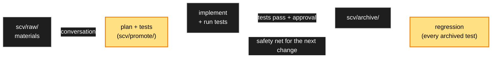

<div align="center">


<h1>SCV</h1>

<p><b>Standard · Cowork · Verify</b></p>

<p><b>A Claude Code plugin for teams.<br>
Every change ships with a plan and tests — and the tests run forever.</b></p>

<p>
<a href="https://github.com/wookiya1364/scv-claude-code/releases/latest"></a>


</p>


</div>

---

> **Languages**: English · [한국어](./README.ko.md) · [日本語](./README.ja.md)

## What is SCV

Talk about a change → SCV refines it into a plan with executable tests →
implements it → attaches the evidence to the PR → archives the plan. Every
archived test joins a regression suite that runs against every future change.
Six months later, a test nobody remembers still catches the break.

## Install

```bash
/plugin marketplace add https://github.com/wookiya1364/scv-claude-code
/plugin install scv@scv-claude-code
```

- **macOS**: `brew install bash` once (SCV scripts need bash 4+; system bash stays untouched).
- **Linux / WSL**: nothing to do. **Windows native**: unsupported — use WSL or Git Bash.
- Recommended CLIs: `git`, `curl`, `jq`, `gh` (or `glab`). SCV tells you if one is missing.

## How you use it

**Just talk.** No command to memorize — SCV joins the conversation by itself:

```text
You:  I want to add a refund button to checkout.
SCV:  (enters conversation mode, asks goal / scope / acceptance,
       then offers to draft the plan and tests)
```

Say what you want to build and SCV refines it into a plan. Ask what to do next
and it diagnoses the project. Ask "how did we handle refunds last year?" and
it searches the archive. `/scv:help` does the same thing explicitly, and
`SCV_ALWAYS_ON=off` in `scv/scv_settings.json` restores command-only behavior.

Behind the conversation, one loop runs everything:


```mermaid
%%{init: {'theme':'base', 'themeVariables': {'primaryColor':'#1e1e1e','primaryTextColor':'#fff','primaryBorderColor':'#888','lineColor':'#fff','secondaryColor':'#2d2d2d','tertiaryColor':'#1e1e1e','background':'#0d1117','edgeLabelBackground':'#1e1e1e'}}}%%
flowchart LR
  Raw["scv/raw/<br>materials"]
  Promote["plan + tests<br>(scv/promote/)"]
  Work["implement<br>+ run tests"]
  Archive["scv/archive/"]
  Regression["regression<br>(every archived test)"]

  Raw -->|conversation| Promote
  Promote --> Work
  Work -->|tests pass + approval| Archive
  Archive --> Regression
  Regression -.->|safety net for the next change| Promote

  classDef key fill:#FFE082,stroke:#F57C00,stroke-width:2px,color:#000
  class Promote,Regression key
```

## What you get

| Team problem | SCV's answer |
|---|---|
| An AI diff you have to run yourself before trusting | The PR arrives with the e2e video/GIF already attached — evidence follows the actual test run, not file names |
| The same change described differently in ticket · PR · chat | `PLAN.md` is the single source; tickets are linked via `refs:`, PR and reports are generated from it |
| Decisions vanish with the session | `scv/DECISIONS.md` — append-only, automatic at plan approval / archive / obsolete |
| Old features silently break | Every archived plan's tests re-run on demand as one regression suite |

## Settings

One file: `scv/scv_settings.json` — created automatically with every key
present and documented (`_doc`), so you can see what's settable by opening it.
Secrets (tokens, channel IDs) go to a separate git-ignored file. Your `.env`
is never read or written.

| Key | Default | What it does |
|---|---|---|
| `SCV_ALWAYS_ON` | `on` | SCV joins free conversation; `off` = commands only |
| `SCV_PLAIN_LANGUAGE` | `on` | plain-first answer shape (+ per-turn reminder); `off` silences |
| `SCV_LANG` | auto | output language: `english` · `korean` · `japanese` |
| `NOTIFIER_PROVIDER` | off | `slack` or `discord` for team reports |

Write through the script — it routes secrets to the right file automatically:

```bash
CORE="$HOME/.claude/plugins/cache/scv-claude-code/scv/<version>/vendor/scv-core/core"
bash "$CORE/scripts/settings-set.sh" NOTIFIER_PROVIDER=slack
bash "$CORE/scripts/settings-set.sh" SLACK_BOT_TOKEN=xoxb-...   # → secret file
```

## Commands

You never need this table — conversation routes for you. For explicit control:

| Command | Does |
|---|---|
| `/scv:help` | Diagnose the project · refine an idea · search the archive |
| `/scv:status` | What's in flight: raw changes, active plans, epics, handoffs |
| `/scv:promote` | Materials → plan folder (`PLAN.md` + `TESTS.md` + diagrams) |
| `/scv:work <slug>` | Implement · run tests · archive · PR with evidence |
| `/scv:codegen <slug>` | TDD-first variant: tests drive the code, Red → Green |
| `/scv:regression` | Run every archived plan's tests as one suite |
| `/scv:deck [<md>]` | Markdown → self-contained planning document (or slides) |
| `/scv:report` | Post a phase result to Slack/Discord with artifacts |
| `/scv:sync` | Refresh SCV templates + detect code↔plan drift |
| `/scv:routine [<name>]` | Run a one-file maintenance routine |
| `/scv:workspace` · `/scv:handoff` | Multi-repo: umbrella setup · cross-repo work declaration |
| `/scv:update` · `/scv:set-models` · `/scv:install-deps` | Plugin update guide · model policy · CLI deps |

## Guardrails

Two layers keep the workflow honest:

- **In-session**: a `PreToolUse` guard refuses hand-created plan files and
  writes outside `scv/` until any SCV action has run in the session
  (`/scv:status` is enough). Fails open on internal errors; inert where SCV
  isn't adopted. Off switch: `SCV_GUARD=off` in the process environment.
- **At merge**: CI gates deny a PR that changes code without an archived plan
  (`[no-plan: <reason>]` declares an exception) and a hand-rewritten vendored
  core (`[manual-vendor: <reason>]`).

Contract: [`vendor/scv-core/core/contracts/guard.md`](vendor/scv-core/core/contracts/guard.md).

## Multi-repo

Single-repo by default. Systems spanning FE/BE/service repos can nest under
one umbrella: `/scv:workspace` joins or creates it, `/scv:handoff` declares
"that repo needs corresponding work" where the other repo will see it.
Detaching restores standalone behavior with zero migration. Monorepos with
per-module `scv/` target a module by leading argument: `/scv:status FE`.

## Philosophy — Standard · Cowork · Verify

- **Standard**: the standard is the workflow, not snapshot docs. Decisions live in an append-only log, not stale documents.
- **Cowork**: plans come from dialog, approved per-section — what you said, not what the model guessed.
- **Verify**: tests are executable, and archived tests keep running forever. Failures triage explicitly — never silently skipped.

<details>
<summary><b>Reference — project layout after adoption</b></summary>

```
my-project/
├── CLAUDE.md              # yours — SCV never touches it
├── scv/                   # everything SCV owns lives here
│   ├── SCV.md PROMOTE.md REPORTING.md
│   ├── DECISIONS.md       # append-only decision log
│   ├── conversations/     # dialogs that became plans (committed)
│   ├── journal/           # every prompt, hook-fed (gitignored by default)
│   ├── promote/  archive/  raw/  routines/
│   ├── scv_settings.json         # settings (auto-created, committed)
│   └── scv_settings.secret.json  # tokens (auto-created, git-ignored)
└── .gitignore             # SCV rules appended
```

Adoption is non-destructive: existing root files stay intact; one `scv/`
directory and two `.gitignore` lines are all SCV adds. The `demo/` directory
in this repository only builds the README GIFs — plugin users never need it.

</details>

## Architecture

Shared behavior comes from a checksummed, version-pinned
[scv-core](https://github.com/wookiya1364/scv-core) release vendored into this
plugin — nothing is fetched at runtime. This repository is the Claude Code
adapter: slash commands, hooks registration, install/update UX. Hook stdout
delivers the always-on routing and plain-language reminders every turn; the
journal hooks capture conversation with redaction before anything hits disk.

## Contributing

Run `tests/run-dry.sh` before PRs. Branch flow `develop → stage → main`;
releases go through `gh workflow run promote.yml` —
see [docs/RELEASING.md](docs/RELEASING.md). History lives in the
[releases](https://github.com/wookiya1364/scv-claude-code/releases).

---

**License**: [MIT](./LICENSE) © 2026 wookiya1364
