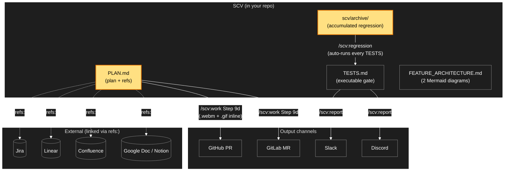
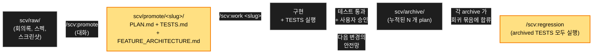
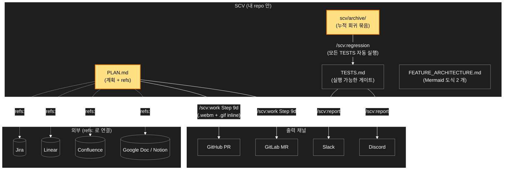
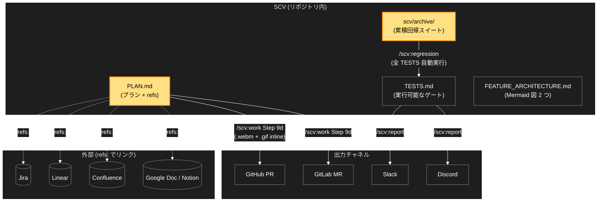

<div align="center">


<h1>SCV</h1>

<p><b>Standard · Cowork · Verify</b></p>

<p><b>A Claude Code plugin for teams.<br>
Every change ships with a plan and tests. The tests run forever — even after you've forgotten about them.</b></p>

<p>
Drop materials → Claude refines them with you → implementation runs the tests → tests stay in your regression suite. Your next change is automatically checked against everything you've ever shipped.
</p>

<p>
<b>SCV is a <i>process</i> plugin — not a code-generation accelerator.</b> It makes the team work from the same plan and the same tests. Speed comes as a side effect.
</p>


<p>
<a href="https://github.com/wookiya1364/scv-claude-code/releases/latest"></a>


</p>

<p>
<a href="#quick-start--four-steps">Quick Start</a> ·
<a href="#5-minute-walkthrough">5-min walkthrough</a> ·
<a href="#the-loop">The Loop</a> ·
<a href="#slash-commands">Commands</a> ·
<a href="#why-scv">Why SCV?</a> ·
<a href="#architecture--integrations">Architecture</a> ·
<a href="#philosophy-standard--cowork--verify">Philosophy</a> ·
<a href="https://github.com/wookiya1364/scv-claude-code/releases">Releases</a>
</p>

</div>

---

> **Team collaboration plugin for Claude Code.**

Click a language below to expand. **English** is open by default.

<details open>
<summary><b>English</b></summary>

## Quick Start

> **The only command you need to remember is `/scv:help`.**
> It diagnoses your project's state and tells you what to do next. No flags to memorize, no docs to read first — the plugin walks you through every step.

```bash
# In any Claude Code session:

# 1. Install
/plugin marketplace add https://github.com/wookiya1364/scv-claude-code
/plugin install scv@scv-claude-code

# 2. /scv:help takes over from here.
#    On first run it offers to hydrate this project (one click).
/scv:help
```

That's it. **You only need to remember `/scv:help`** — it diagnoses your project and routes to the right command. Pick a starting line:

| Situation | Command |
|---|---|
| Don't know what to do next | `/scv:help` |
| Have an idea but no materials yet | `/scv:help "I want to add a refund button"` (v0.9.0+) |
| Want to find past work in the archive | `/scv:help "how did we handle refunds last quarter?"` (v0.10.0+) |

---

## 5-Minute Walkthrough

**Scenario**: "Add a refund button to the checkout page"

| Min | Step | What happens |
|---|---|---|
| 1 | Drop materials into `scv/raw/` | meeting notes + spec PDF (Jira URL inside) |
| 2 | `/scv:promote` | URL detected · slug + title asked · `PLAN.md + TESTS.md + FEATURE_ARCHITECTURE.md` written |
| 3 | `/scv:work <slug>` | Implements · runs Playwright e2e · captures `.webm` |
| 4 | Auto PR | PR opens with GIF preview · Mermaid diagrams · Jira link — all attached |
| 5 | Review → merge → archive | Reviewer confirms via GIF in 5 sec · merge moves plan to archive · joins `/scv:regression` |

**Stuck at any step?** Run `/scv:help` — it picks up your project's current state and tells you what's next.

---

## The Loop

Drop material → refine into a plan + tests → implement → archive. Every archived plan's tests join the **accumulating regression suite** that runs against every future change.

<p align="center">
  
</p>


```mermaid
%%{init: {'theme':'base', 'themeVariables': {'primaryColor':'#1e1e1e','primaryTextColor':'#fff','primaryBorderColor':'#888','lineColor':'#fff','secondaryColor':'#2d2d2d','tertiaryColor':'#1e1e1e','background':'#0d1117','edgeLabelBackground':'#1e1e1e'}}}%%
flowchart LR
  Raw["scv/raw/<br>(meeting notes,<br>specs, screenshots)"]
  Promote["scv/promote/&lt;slug&gt;/<br>PLAN.md + TESTS.md<br>+ FEATURE_ARCHITECTURE.md"]
  Work["implement<br>+ run TESTS"]
  Archive["scv/archive/<br>(N plans accumulated)"]
  Regression["/scv:regression<br>(runs every archived TESTS)"]

  Raw -->|"/scv:promote<br>(dialog)"| Promote
  Promote -->|"/scv:work &lt;slug&gt;"| Work
  Work -->|"tests pass<br>+ user approval"| Archive
  Archive -->|"each archive<br>joins the suite"| Regression
  Regression -.->|"safety net for<br>the next change"| Promote

  classDef key fill:#FFE082,stroke:#F57C00,stroke-width:2px,color:#000
  class Promote,Regression key
```

**Why the loop matters.** Six months later, someone breaks an old feature they never knew about — and the test from that feature's archived plan catches it automatically. The longer your team works with SCV, the thicker your safety net grows.

---

## Slash Commands

**You don't have to memorize this** — `/scv:help` picks the right command for you at each step. Reference table below:

| Command | What it does |
|---|---|
| **`/scv:help`** | Tells you what to do next. With an argument: conversation (idea) or archive search (retrospective query) — see Quick Start. |
| `/scv:status` | Inspect raw materials · active promotes · epic progress |
| `/scv:promote` | `scv/raw/` → plan folder (`scv/promote/<slug>/`) with PLAN + TESTS + Mermaid diagrams |
| `/scv:work <slug>` | Implement · run tests · archive on pass · open PR with e2e video |
| `/scv:codegen <slug>` | **TDD-first variant** of `/scv:work` — TESTS drives code (Red→Green per case, budget 3). Uses optional PLAN.md `scope:` / `invariants:` as guards. Hands archive/PR off to `/scv:work`. (v0.11.0+) |
| `/scv:regression` | Run every archived TESTS as a regression suite |
| `/scv:report` | Post a phase result to Slack or Discord |
| `/scv:sync` | Apply plugin updates to standard docs |
| `/scv:install-deps` | Detect & install missing CLIs (`gh` / `glab` / `jq` / `ffmpeg`) |

---

## Why SCV?

When AI starts writing your team's code, three things break down.

| Problem | SCV's answer |
|---|---|
| AI diffs — you end up running them yourself before reviewing logic. | `/scv:work` attaches an e2e GIF preview to the PR. |
| The same change drifts across ticket · PR · comment. | PLAN.md is the single source. Tickets via `refs:` (link only). |
| Old archives become a graveyard no one searches. | `supersedes:` + `/scv:regression` keep the archive *alive*. |

## Architecture & Integrations

PLAN.md is the single source of truth. External tools (Jira / Linear / Confluence / Google Doc) are linked via `refs:` — never copied. Outputs (PR / MR / Slack / Discord) are auto-generated from the same source.

<p align="center">
  
</p>


```mermaid
%%{init: {'theme':'base', 'themeVariables': {'primaryColor':'#1e1e1e','primaryTextColor':'#fff','primaryBorderColor':'#888','lineColor':'#fff','secondaryColor':'#2d2d2d','tertiaryColor':'#1e1e1e','background':'#0d1117','edgeLabelBackground':'#1e1e1e'}}}%%
flowchart TB
  subgraph SCV["SCV (in your repo)"]
    PLAN["PLAN.md<br>(plan + refs)"]
    TESTS["TESTS.md<br>(executable gate)"]
    FA["FEATURE_ARCHITECTURE.md<br>(2 Mermaid diagrams)"]
    Archive["scv/archive/<br>(accumulated regression)"]
  end

  subgraph External["External (linked via refs:)"]
    Jira[(Jira)]
    Linear[(Linear)]
    Confluence[(Confluence)]
    Doc[(Google Doc / Notion)]
  end

  subgraph Output["Output channels"]
    GH[GitHub PR]
    GL[GitLab MR]
    Slack[Slack]
    Discord[Discord]
  end

  PLAN -.->|refs:| Jira
  PLAN -.->|refs:| Linear
  PLAN -.->|refs:| Confluence
  PLAN -.->|refs:| Doc

  PLAN -->|"/scv:work Step 9d<br>(.webm + .gif inline)"| GH
  PLAN -->|"/scv:work Step 9d"| GL
  Archive -->|"/scv:regression<br>(auto-runs every TESTS)"| TESTS
  TESTS -->|"/scv:report"| Slack
  TESTS -->|"/scv:report"| Discord

  classDef key fill:#FFE082,stroke:#F57C00,stroke-width:2px,color:#000
  class PLAN,Archive key
```

**Key properties**

- Single source of truth — PLAN.md written once · PR / regression / Slack all read from it.
- External tools stay external — `refs:` link to tickets · no body copy · link resolves when ticket changes.
- Vendor-agnostic backends — `gh` / `glab` first-class via `lib/pr-platform.sh` · adding Bitbucket / Gitea = a new adapter.
- Multi-language by default — PR / Mermaid / commits follow your `SCV_LANG` (English · 한국어 · 日本語).

## Philosophy: Standard · Cowork · Verify

Three failure modes of AI-assisted team development — and what SCV refuses to do about each.

**S — Standard.** Standard docs (DOMAIN, ARCHITECTURE, DESIGN, TESTING, …) seed at `status: N/A` and stay that way until you lift one. N/A is a steady state, not a backlog.

**C — Cowork.** `/scv:promote` is a dialog, not a generation. Claude reads `scv/raw/` and proposes a structure; you approve per-candidate. PLAN.md ends up with what you said, not what the LLM guessed.

**V — Verify.** TESTS.md is executable, not aspirational. Every archived plan's tests run as regression on the next change. Failures triage into regression / obsolete / flaky — never silently skipped.

> The plugin's name is the plugin's contract.

<details>
<summary><b>Reference — project layout, external refs, notifier setup</b></summary>

### Your Project Layout (after hydrate)

```
my-project/
├── CLAUDE.md           # (optional, user-owned — SCV never touches it)
├── scv/                # SCV owns everything under here
│   ├── CLAUDE.md       # SCV workflow index
│   ├── INTAKE.md PROMOTE.md DOMAIN.md ARCHITECTURE.md DESIGN.md
│   ├── AGENTS.md TESTING.md REPORTING.md RALPH_PROMPT.md
│   ├── readpath.json   # raw change snapshot (auto-managed)
│   ├── promote/        # Active plans (YYYYMMDD-author-slug folders)
│   ├── archive/        # Completed plans (moved by /scv:work)
│   └── raw/            # Free-input space
├── .env.example.scv    # SCV's notifier env template (your existing .env.example is untouched)
└── .gitignore          # SCV rules appended; existing .gitignore preserved
```

**Non-destructive**: existing root `CLAUDE.md` / `.env.example` stay intact. SCV creates `scv/` + separate `.env.example.scv` + appends to existing `.gitignore`.

**Standard docs are optional**. Adoption mode (default) seeds 7 of 9 docs as `status: N/A` and stays that way until you lift one. N/A is a steady state, not a backlog.

### External Refs (Jira / Linear / PR / Docs) — Auto-Detection

PLAN.md frontmatter has a vendor-agnostic `refs:` array. `/scv:promote` auto-detects URLs from:

- `scv/raw/` files (drop a meeting note with the ticket URL inside)
- `/scv:promote "...URL..."` invocation argument
- Dialog answers (paste URLs while answering — auto-parsed)

In `.env`, set `JIRA_BASE_URL` / `LINEAR_BASE_URL` / `CONFLUENCE_BASE_URL` so PLAN.md stores just `id: PAY-1234` (URL inferred at display). Without these, full URLs stored. See `template/.env.example.scv`.

### Notifier Setup (.env) — Optional

```bash
cp .env.example.scv .env
$EDITOR .env
```

Slack:
```bash
NOTIFIER_PROVIDER=slack
SLACK_BOT_TOKEN=xoxb-...
SLACK_CHANNEL_ID=C0XXXXX0
SLACK_CHANNEL_ID_PHASE_COMPLETE=C0XXXXX1
SLACK_CHANNEL_ID_E2E_FAILURE=C0XXXXX2
```

Discord: `NOTIFIER_PROVIDER=discord` + `DISCORD_BOT_TOKEN` + `DISCORD_CHANNEL_ID_*`.

If you already have `.env`: `cat .env.example.scv >> .env`. Never commit `.env`.

### `demo/` (Repo-only — not part of the plugin)

The `demo/` directory holds Remotion compositions that produce the README's GIFs (`scv-demo.gif`, `the-loop.gif`, `architecture.gif`). It carries its own `pnpm` workspace and is unrelated to plugin behavior — plugin users do not need it.

</details>

## Learn More

- Each command's detail: `/scv:<command> --help`
- Project-specific guide: `/scv:help`
- Changelog: [CHANGELOG.md](./CHANGELOG.md)

## Contributing

- Run `tests/run-dry.sh` before PRs
- Log user-facing changes in `CHANGELOG.md`
- Follow SemVer for `VERSION` bumps

</details>

<details>
<summary><b>한국어</b></summary>

> **SCV 는 *프로세스* 플러그인입니다 — 코드 자동 생성기가 아닙니다.** 팀이 같은 plan 과 같은 테스트로 일하게 만드는 도구입니다. 속도는 부수 효과로 따라옵니다.

## 빠른 시작

> **외울 명령어는 `/scv:help` 하나뿐입니다.**
> 프로젝트 상태를 진단하고 다음에 뭘 해야 할지 알려줍니다. 플래그 외울 필요 없고, 먼저 읽을 문서도 없습니다 — 플러그인이 단계마다 알려줍니다.

```bash
# Claude Code 세션에서:

# 1. 설치
/plugin marketplace add https://github.com/wookiya1364/scv-claude-code
/plugin install scv@scv-claude-code

# 2. /scv:help 가 여기서부터 안내합니다.
#    첫 실행 시 hydrate 도 한 번 묻고 자동 진행합니다.
/scv:help
```

이게 다입니다. **외울 명령은 `/scv:help` 하나** — 프로젝트를 진단하고 다음에 쓸 명령으로 안내합니다. 시작 줄을 고르세요:

| 상황 | 명령 |
|---|---|
| 다음에 뭐 해야 할지 모르겠다 | `/scv:help` |
| 아이디어만 있고 자료는 아직 없다 | `/scv:help "환불 버튼 추가하고 싶어"` (v0.9.0+) |
| 과거 archive 를 찾고 싶다 | `/scv:help "지난 분기 결제 archive 보여줘"` (v0.10.0+) |

---

## 5 분 워크스루

**시나리오**: "결제 페이지에 환불 버튼 추가"

| 분 | 단계 | 결과 |
|---|---|---|
| 1 | `scv/raw/` 에 자료 투입 | 회의록 + 스펙 PDF (Jira URL 포함) |
| 2 | `/scv:promote` | URL 인식 · slug + title 질문 · `PLAN.md + TESTS.md + FEATURE_ARCHITECTURE.md` 생성 |
| 3 | `/scv:work <slug>` | 구현 · Playwright e2e · `.webm` 캡처 |
| 4 | 자동 PR | PR 열림 · GIF 미리보기 · Mermaid 도식 · Jira 링크 모두 자동 첨부 |
| 5 | 리뷰 → 머지 → archive | 리뷰어가 GIF 로 5 초 확인 · 머지 시 archive · `/scv:regression` suite 합류 |

**어느 단계든 막히면** `/scv:help` — 프로젝트의 현재 상태를 보고 다음에 뭐 할지 알려줍니다.

---

## 흐름 한눈에

자료 투입 → 계획 + 테스트로 정제 → 구현 → archive. 모든 archive 의 테스트는 **누적되는 회귀 테스트** 로 합류해 미래의 모든 변경에 대해 자동으로 돕니다.


```mermaid
%%{init: {'theme':'base', 'themeVariables': {'primaryColor':'#1e1e1e','primaryTextColor':'#fff','primaryBorderColor':'#888','lineColor':'#fff','secondaryColor':'#2d2d2d','tertiaryColor':'#1e1e1e','background':'#0d1117','edgeLabelBackground':'#1e1e1e'}}}%%
flowchart LR
  Raw["scv/raw/<br>(회의록, 스펙,<br>스크린샷)"]
  Promote["scv/promote/&lt;slug&gt;/<br>PLAN.md + TESTS.md<br>+ FEATURE_ARCHITECTURE.md"]
  Work["구현<br>+ TESTS 실행"]
  Archive["scv/archive/<br>(누적된 N 개 plan)"]
  Regression["/scv:regression<br>(archived TESTS 모두 실행)"]

  Raw -->|"/scv:promote<br>(대화)"| Promote
  Promote -->|"/scv:work &lt;slug&gt;"| Work
  Work -->|"테스트 통과<br>+ 사용자 승인"| Archive
  Archive -->|"각 archive 가<br>회귀 묶음에 합류"| Regression
  Regression -.->|"다음 변경의<br>안전망"| Promote

  classDef key fill:#FFE082,stroke:#F57C00,stroke-width:2px,color:#000
  class Promote,Regression key
```

**왜 이 흐름이 중요한가**. 6 개월 뒤 누군가 모르고 옛 기능을 깨뜨려도, 그 기능의 archive 된 테스트가 자동으로 발견합니다. 팀이 SCV 와 오래 일할수록 안전망이 두터워집니다.

---

## 슬래시 커맨드

**외울 필요 없습니다** — `/scv:help` 가 매 단계마다 알맞은 명령을 안내합니다. 아래는 참고용 표:

| 커맨드 | 하는 일 |
|---|---|
| **`/scv:help`** | 다음에 뭘 해야 할지 안내. 인자 있으면 분기 — 아이디어는 대화 모드, 회고 질문은 archive 검색. 예시는 빠른 시작 표. |
| `/scv:status` | raw 자료 · 진행 중인 promote · epic 진척도 |
| `/scv:promote` | `scv/raw/` → plan 폴더 (`scv/promote/<slug>/`) — PLAN + TESTS + Mermaid 도식 |
| `/scv:work <slug>` | 구현 · 테스트 실행 · 통과 시 archive · e2e 비디오 첨부한 PR 생성 |
| `/scv:codegen <slug>` | **TDD-first 변형** — TESTS 가 코드를 driver. case 단위 Red→Green (budget 3). PLAN.md `scope:` / `invariants:` 를 가드로 사용. archive/PR 은 `/scv:work` 에 위임. (v0.11.0+) |
| `/scv:regression` | archive 된 모든 TESTS 를 회귀로 실행 |
| `/scv:report` | 단계 결과를 Slack / Discord 에 보고 |
| `/scv:sync` | 플러그인 업데이트를 표준 문서에 반영 |
| `/scv:install-deps` | 누락 CLI 자동 감지 + 설치 안내 (`gh` / `glab` / `jq` / `ffmpeg`) |

---

## 왜 SCV?

AI 가 팀 코드를 짜기 시작하면 세 가지가 어긋납니다.

| 문제 | SCV 의 답 |
|---|---|
| AI diff, 결국 직접 돌려보게 됩니다. | `/scv:work` 가 e2e + GIF 미리보기를 PR 에 자동 첨부. |
| 같은 변경이 티켓 · PR · 주석 3 군데에서 어긋납니다. | PLAN.md 가 단일 source. 티켓은 `refs:` 링크. |
| 옛 archive 가 검색 안 되는 묘지가 됩니다. | `supersedes:` 와 `/scv:regression` 으로 *살아있는* 기록. |


## 아키텍처 & 외부 통합

PLAN.md 가 단일 source of truth. 외부 도구 (Jira / Linear / Confluence / Google Doc) 는 `refs:` 로 *링크* 만 — 복사 안 함. 출력 (PR / MR / Slack / Discord) 은 같은 source 에서 자동 생성.


```mermaid
%%{init: {'theme':'base', 'themeVariables': {'primaryColor':'#1e1e1e','primaryTextColor':'#fff','primaryBorderColor':'#888','lineColor':'#fff','secondaryColor':'#2d2d2d','tertiaryColor':'#1e1e1e','background':'#0d1117','edgeLabelBackground':'#1e1e1e'}}}%%
flowchart TB
  subgraph SCV["SCV (내 repo 안)"]
    PLAN["PLAN.md<br>(계획 + refs)"]
    TESTS["TESTS.md<br>(실행 가능한 게이트)"]
    FA["FEATURE_ARCHITECTURE.md<br>(Mermaid 도식 2 개)"]
    Archive["scv/archive/<br>(누적 회귀 묶음)"]
  end

  subgraph External["외부 (refs: 로 연결)"]
    Jira[(Jira)]
    Linear[(Linear)]
    Confluence[(Confluence)]
    Doc[(Google Doc / Notion)]
  end

  subgraph Output["출력 채널"]
    GH[GitHub PR]
    GL[GitLab MR]
    Slack[Slack]
    Discord[Discord]
  end

  PLAN -.->|refs:| Jira
  PLAN -.->|refs:| Linear
  PLAN -.->|refs:| Confluence
  PLAN -.->|refs:| Doc

  PLAN -->|"/scv:work Step 9d<br>(.webm + .gif inline)"| GH
  PLAN -->|"/scv:work Step 9d"| GL
  Archive -->|"/scv:regression<br>(모든 TESTS 자동 실행)"| TESTS
  TESTS -->|"/scv:report"| Slack
  TESTS -->|"/scv:report"| Discord

  classDef key fill:#FFE082,stroke:#F57C00,stroke-width:2px,color:#000
  class PLAN,Archive key
```

**핵심 속성**

- 단일 source of truth — PLAN.md 한 번만 작성 · PR / regression / Slack 모두 여기서 읽음.
- 외부 도구는 외부에 둠 — `refs:` 로 티켓 링크 · 본문 복사 안 함 · 티켓 갱신돼도 링크는 유효.
- vendor-agnostic 백엔드 — `lib/pr-platform.sh` 통해 `gh` / `glab` first-class · Bitbucket / Gitea 추가 = 새 어댑터.
- 다국어 default — PR / Mermaid / commit 모두 `SCV_LANG` 따라감 (English · 한국어 · 日本語).

## 철학: Standard · Cowork · Verify

AI 협업 팀 개발의 세 가지 실패 모드 — SCV 가 거부하는 것.

**S — Standard (표준).** 표준 문서 (DOMAIN, ARCHITECTURE, DESIGN, TESTING, …) 는 `status: N/A` 로 시드되고 사용자가 lift 할 때까지 그대로. N/A 는 backlog 가 아니라 정상 상태.

**C — Cowork (협업).** `/scv:promote` 는 대화이지 생성이 아닙니다. Claude 가 `scv/raw/` 를 읽고 구조를 제안, 사용자가 건건이 승인. PLAN.md 에 들어가는 건 사용자가 말한 것 — LLM 이 추측한 게 아닙니다.

**V — Verify (검증).** TESTS.md 는 실행 가능한 것이지 희망 사항이 아닙니다. 모든 archived plan 의 테스트가 다음 변경의 회귀로 돕니다. 실패는 regression / obsolete / flaky 로 triage — 조용히 skip 안 됨.

> 플러그인 이름은 플러그인의 계약.

<details>
<summary><b>레퍼런스 — 프로젝트 디렉토리 / 외부 Refs / 협업툴 설정</b></summary>

### 프로젝트 디렉토리 (초기화 후)

```
my-project/
├── CLAUDE.md           # (선택, 사용자 소유 — SCV 가 건드리지 않음)
├── scv/                # SCV 가 소유하는 영역
│   ├── CLAUDE.md       # SCV 워크플로 인덱스
│   ├── INTAKE.md PROMOTE.md DOMAIN.md ARCHITECTURE.md DESIGN.md
│   ├── AGENTS.md TESTING.md REPORTING.md RALPH_PROMPT.md
│   ├── readpath.json   # raw 변경 스냅샷 (자동 관리)
│   ├── promote/        # 활성 계획 (YYYYMMDD-author-slug 폴더)
│   ├── archive/        # 완료 계획 (/scv:work 가 이동)
│   └── raw/            # 자유 투입 공간
├── .env.example.scv    # SCV 전용 Notifier 변수 템플릿
└── .gitignore          # SCV 규칙 append; 기존 보존
```

**Non-destructive**: 루트 `CLAUDE.md` / `.env.example` 그대로 보존. SCV 는 `scv/` 만 만들고, `.env.example.scv` 별도 추가 + 기존 `.gitignore` 에 append.

**표준 문서는 옵션**. adoption 모드 (default) 가 9 문서 중 7 개를 `status: N/A` 로 시드하고 lift 결정할 때까지 그대로. N/A 는 backlog 가 아니라 정상 상태.

### 외부 Refs (Jira / Linear / PR / 문서) — 자동 인식

PLAN.md frontmatter 의 vendor-agnostic `refs:` 배열. `/scv:promote` 가 다음 source 의 URL 자동 인식:

- `scv/raw/` 안 파일 (회의록에 티켓 URL 적어두기)
- `/scv:promote "...URL..."` 호출 인자
- dialog 답변 안의 URL (자동 파싱)

`.env` 에 `JIRA_BASE_URL` / `LINEAR_BASE_URL` / `CONFLUENCE_BASE_URL` 박으면 PLAN.md 가 `id: PAY-1234` 만 저장 (URL 표시 시점에 추론). 미설정 시 full URL 저장. `template/.env.example.scv` 참조.

### 협업툴 설정 (.env) — 선택 사항

```bash
cp .env.example.scv .env
$EDITOR .env
```

Slack:
```bash
NOTIFIER_PROVIDER=slack
SLACK_BOT_TOKEN=xoxb-...
SLACK_CHANNEL_ID=C0XXXXX0
SLACK_CHANNEL_ID_PHASE_COMPLETE=C0XXXXX1
SLACK_CHANNEL_ID_E2E_FAILURE=C0XXXXX2
```

Discord: `NOTIFIER_PROVIDER=discord` + `DISCORD_BOT_TOKEN` + `DISCORD_CHANNEL_ID_*`.

기존 `.env` 있다면: `cat .env.example.scv >> .env`. `.env` 는 절대 git commit 금지.

### `demo/` (저장소 전용 — 플러그인 본체와 별개)

`demo/` 디렉토리는 README 의 GIF (`scv-demo.gif`, `the-loop.gif`, `architecture.gif`) 를 만드는 Remotion 컴포지션을 담고 있습니다. 자체 `pnpm` workspace 로 동작하며 플러그인 동작과 무관합니다 — 사용자는 신경 쓸 필요 없습니다.

</details>

## 더 알아보기

- 각 커맨드 상세: `/scv:<command> --help`
- 현재 프로젝트 맞춤 안내: `/scv:help`
- 변경 이력: [CHANGELOG.md](./CHANGELOG.md)

## 기여

- PR 전에 `tests/run-dry.sh` 통과 확인
- 사용자 영향 변경은 `CHANGELOG.md` 에 기록
- `VERSION` bump 은 SemVer 따름

</details>

<details>
<summary><b>日本語</b></summary>

> **SCV は *プロセス* プラグインです — コード自動生成器ではありません。** チームが同じ plan と同じテストで仕事をするための道具です。スピードは副次効果として付いてきます。

## クイックスタート

> **覚えるべきコマンドは `/scv:help` ひとつだけ。**
> プロジェクトの状態を診断し、次に何をすべきか教えてくれます。覚えるフラグなし、先に読むドキュメントなし — プラグインがステップごとに案内します。

```bash
# Claude Code セッション内で:

# 1. インストール
/plugin marketplace add https://github.com/wookiya1364/scv-claude-code
/plugin install scv@scv-claude-code

# 2. ここから先は /scv:help が引き継ぎます。
#    初回実行時に hydrate も一度確認して自動で進めます。
/scv:help
```

これだけです。**覚えるコマンドは `/scv:help` 一つ** — プロジェクトを診断し、次に使うコマンドへ案内します。開始行を選んでください:

| 状況 | コマンド |
|---|---|
| 次に何をすべきか分からない | `/scv:help` |
| アイデアだけあって資料はまだない | `/scv:help "払い戻しボタンを追加したい"` (v0.9.0+) |
| 過去の archive を探したい | `/scv:help "先四半期の決済関連 archive を見せて"` (v0.10.0+) |

---

## 5 分ウォークスルー

**シナリオ**: "決済ページに払い戻しボタンを追加"

| 分 | ステップ | 結果 |
|---|---|---|
| 1 | `scv/raw/` に資料投入 | 議事録 + 仕様書 PDF (Jira URL 含む) |
| 2 | `/scv:promote` | URL 検出 · slug + title 質問 · `PLAN.md + TESTS.md + FEATURE_ARCHITECTURE.md` を生成 |
| 3 | `/scv:work <slug>` | 実装 · Playwright e2e · `.webm` キャプチャ |
| 4 | 自動 PR | PR が開く · GIF プレビュー · Mermaid 図 · Jira リンクがすべて自動添付 |
| 5 | レビュー → マージ → archive | レビュアーが GIF で 5 秒確認 · マージで archive · `/scv:regression` スイートに合流 |

**どのステップで詰まっても** `/scv:help` — プロジェクトの現在の状態を見て、次に何をすべきか教えてくれます。

---

## ループ

資料投入 → プラン + テストへ精製 → 実装 → archive。すべての archive のテストは**累積する回帰テスト**へ合流し、未来のあらゆる変更に対して自動で回ります。


```mermaid
%%{init: {'theme':'base', 'themeVariables': {'primaryColor':'#1e1e1e','primaryTextColor':'#fff','primaryBorderColor':'#888','lineColor':'#fff','secondaryColor':'#2d2d2d','tertiaryColor':'#1e1e1e','background':'#0d1117','edgeLabelBackground':'#1e1e1e'}}}%%
flowchart LR
  Raw["scv/raw/<br>(議事録、仕様書、<br>スクリーンショット)"]
  Promote["scv/promote/&lt;slug&gt;/<br>PLAN.md + TESTS.md<br>+ FEATURE_ARCHITECTURE.md"]
  Work["実装<br>+ TESTS 実行"]
  Archive["scv/archive/<br>(累積された N 個のプラン)"]
  Regression["/scv:regression<br>(archived TESTS すべて実行)"]

  Raw -->|"/scv:promote<br>(対話)"| Promote
  Promote -->|"/scv:work &lt;slug&gt;"| Work
  Work -->|"テスト合格<br>+ ユーザー承認"| Archive
  Archive -->|"各 archive が<br>回帰スイートに合流"| Regression
  Regression -.->|"次の変更の<br>セーフティネット"| Promote

  classDef key fill:#FFE082,stroke:#F57C00,stroke-width:2px,color:#000
  class Promote,Regression key
```

**なぜこのループが重要か**. 6 か月後、誰かが知らない古い機能を壊しても、その機能の archive されたテストが自動で検出します。チームが SCV と長く使うほど、セーフティネットが厚くなります。

---

## スラッシュコマンド

**覚える必要はありません** — `/scv:help` が各ステップで適切なコマンドを案内します。参考用の表:

| コマンド | やること |
|---|---|
| **`/scv:help`** | 次に何をすべきか教えてくれます。引数あり時は分岐 — アイデアは対話モード、回顧的な質問は archive 検索。例はクイックスタートの表参照。 |
| `/scv:status` | raw 資料 · アクティブな promote · epic 進捗 |
| `/scv:promote` | `scv/raw/` → plan フォルダ (`scv/promote/<slug>/`) — PLAN + TESTS + Mermaid 図 |
| `/scv:work <slug>` | 実装 · テスト実行 · 通過時に archive · e2e 動画添付の PR を自動作成 |
| `/scv:codegen <slug>` | **TDD-first 変形** — TESTS がコードのドライバ。case 単位の Red→Green (budget 3)。PLAN.md `scope:` / `invariants:` をガードとして使用。archive/PR は `/scv:work` に委譲。(v0.11.0+) |
| `/scv:regression` | archive された全 TESTS を回帰として実行 |
| `/scv:report` | フェーズ結果を Slack / Discord に通知 |
| `/scv:sync` | プラグイン更新を標準ドキュメントに反映 |
| `/scv:install-deps` | 不足 CLI 自動検出 + インストール案内 (`gh` / `glab` / `jq` / `ffmpeg`) |

---

## なぜ SCV?

AI がチームのコードを書き始めると、3 つのことが噛み合わなくなります。

| 問題 | SCV の答え |
|---|---|
| AI の diff、結局自分で動かして確かめる羽目に。 | `/scv:work` が e2e + GIF プレビューを PR に自動添付。 |
| 同じ変更が チケット · PR · コメント の 3 か所でずれる。 | PLAN.md が単一 source。チケットは `refs:` でリンクのみ。 |
| 古い archive が誰も検索しない墓場になる。 | `supersedes:` と `/scv:regression` で archive を*生かす*。 |


## アーキテクチャと外部統合

PLAN.md が単一の source of truth。外部ツール (Jira / Linear / Confluence / Google Doc) は `refs:` で*リンク*のみ — 複製しない。出力 (PR / MR / Slack / Discord) は同じ source から自動生成。


```mermaid
%%{init: {'theme':'base', 'themeVariables': {'primaryColor':'#1e1e1e','primaryTextColor':'#fff','primaryBorderColor':'#888','lineColor':'#fff','secondaryColor':'#2d2d2d','tertiaryColor':'#1e1e1e','background':'#0d1117','edgeLabelBackground':'#1e1e1e'}}}%%
flowchart TB
  subgraph SCV["SCV (リポジトリ内)"]
    PLAN["PLAN.md<br>(プラン + refs)"]
    TESTS["TESTS.md<br>(実行可能なゲート)"]
    FA["FEATURE_ARCHITECTURE.md<br>(Mermaid 図 2 つ)"]
    Archive["scv/archive/<br>(累積回帰スイート)"]
  end

  subgraph External["外部 (refs: でリンク)"]
    Jira[(Jira)]
    Linear[(Linear)]
    Confluence[(Confluence)]
    Doc[(Google Doc / Notion)]
  end

  subgraph Output["出力チャネル"]
    GH[GitHub PR]
    GL[GitLab MR]
    Slack[Slack]
    Discord[Discord]
  end

  PLAN -.->|refs:| Jira
  PLAN -.->|refs:| Linear
  PLAN -.->|refs:| Confluence
  PLAN -.->|refs:| Doc

  PLAN -->|"/scv:work Step 9d<br>(.webm + .gif inline)"| GH
  PLAN -->|"/scv:work Step 9d"| GL
  Archive -->|"/scv:regression<br>(全 TESTS 自動実行)"| TESTS
  TESTS -->|"/scv:report"| Slack
  TESTS -->|"/scv:report"| Discord

  classDef key fill:#FFE082,stroke:#F57C00,stroke-width:2px,color:#000
  class PLAN,Archive key
```

**重要な性質**

- 単一の source of truth — PLAN.md は一度だけ書く · PR / regression / Slack すべてここから読む。
- 外部ツールは外部に — `refs:` でチケットへリンク · 本文の複製なし · チケット更新時もリンクは有効。
- vendor-agnostic バックエンド — `lib/pr-platform.sh` 経由で `gh` / `glab` first-class · Bitbucket / Gitea 追加 = 新アダプター。
- 多言語デフォルト — PR / Mermaid / commit すべて `SCV_LANG` に従う (English · 한국어 · 日本語)。

## 哲学: Standard · Cowork · Verify

AI 協業チーム開発の 3 つの失敗モード — SCV が拒否するもの。

**S — Standard (標準).** 標準ドキュメント (DOMAIN, ARCHITECTURE, DESIGN, TESTING, …) は `status: N/A` でシードされ、ユーザーが lift するまでそのまま。N/A は backlog ではなく定常状態。

**C — Cowork (協業).** `/scv:promote` は対話であって生成ではありません。Claude が `scv/raw/` を読み構造を提案、ユーザーが個別に承認。PLAN.md に入るのはユーザーが言ったこと — LLM が推測したものではありません。

**V — Verify (検証).** TESTS.md は実行可能なものであって願望ではありません。archived plan のテストは次の変更の回帰として回ります。失敗は regression / obsolete / flaky にトリアージ — 黙ってスキップされません。

> プラグインの名前はプラグインの契約。

<details>
<summary><b>リファレンス — プロジェクトディレクトリ / 外部 Refs / 通知設定</b></summary>

### プロジェクトディレクトリ (hydrate 後)

```
my-project/
├── CLAUDE.md           # (任意 · ユーザー所有 — SCV は触らない)
├── scv/                # SCV が所有する領域
│   ├── CLAUDE.md       # SCV ワークフローのインデックス
│   ├── INTAKE.md PROMOTE.md DOMAIN.md ARCHITECTURE.md DESIGN.md
│   ├── AGENTS.md TESTING.md REPORTING.md RALPH_PROMPT.md
│   ├── readpath.json   # raw 変更スナップショット (自動管理)
│   ├── promote/        # アクティブな計画 (YYYYMMDD-author-slug フォルダ)
│   ├── archive/        # 完了した計画 (/scv:work が移動)
│   └── raw/            # 自由投入スペース
├── .env.example.scv    # SCV 専用 Notifier 変数テンプレート
└── .gitignore          # SCV ルール append; 既存保持
```

**Non-destructive**: ルート `CLAUDE.md` / `.env.example` はそのまま保持。SCV は `scv/` のみ作成、`.env.example.scv` を別途追加 + 既存 `.gitignore` に append。

**標準ドキュメントは任意**。adoption モード (default) は 9 ドキュメントのうち 7 つを `status: N/A` で seed し lift を決めるまでそのまま。N/A は backlog ではなく定常状態。

### 外部 Refs (Jira / Linear / PR / ドキュメント) — 自動検出

PLAN.md frontmatter の vendor-agnostic な `refs:` 配列。`/scv:promote` が以下の source の URL を自動検出:

- `scv/raw/` 内ファイル (議事録にチケット URL を含める)
- `/scv:promote "...URL..."` 呼び出し引数
- dialog 回答中の URL (自動 parse)

`.env` に `JIRA_BASE_URL` / `LINEAR_BASE_URL` / `CONFLUENCE_BASE_URL` を設定すると PLAN.md は `id: PAY-1234` のみ保存 (URL 表示時に推論)。未設定なら full URL 保存。`template/.env.example.scv` 参照。

### 通知ツール設定 (.env) — 任意

```bash
cp .env.example.scv .env
$EDITOR .env
```

Slack:
```bash
NOTIFIER_PROVIDER=slack
SLACK_BOT_TOKEN=xoxb-...
SLACK_CHANNEL_ID=C0XXXXX0
SLACK_CHANNEL_ID_PHASE_COMPLETE=C0XXXXX1
SLACK_CHANNEL_ID_E2E_FAILURE=C0XXXXX2
```

Discord: `NOTIFIER_PROVIDER=discord` + `DISCORD_BOT_TOKEN` + `DISCORD_CHANNEL_ID_*`。

既存 `.env` がある場合: `cat .env.example.scv >> .env`。`.env` は絶対に git にコミット禁止。

### `demo/` (リポジトリ専用 — プラグイン本体とは別)

`demo/` ディレクトリは README の GIF (`scv-demo.gif`、`the-loop.gif`、`architecture.gif`) を生成する Remotion コンポジションを含みます。独自の `pnpm` workspace として動き、プラグインの動作とは無関係です — 利用者が触る必要はありません。

</details>

## さらに詳しく

- 各コマンドの詳細: `/scv:<command> --help`
- プロジェクト固有の案内: `/scv:help`
- 変更履歴: [CHANGELOG.md](./CHANGELOG.md)

## コントリビューション

- PR の前に `tests/run-dry.sh` を通す
- ユーザー影響のある変更は `CHANGELOG.md` に記録
- `VERSION` は SemVer に従う

</details>

---

**License**: [MIT](./LICENSE) © 2026 wookiya1364
