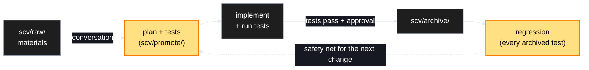
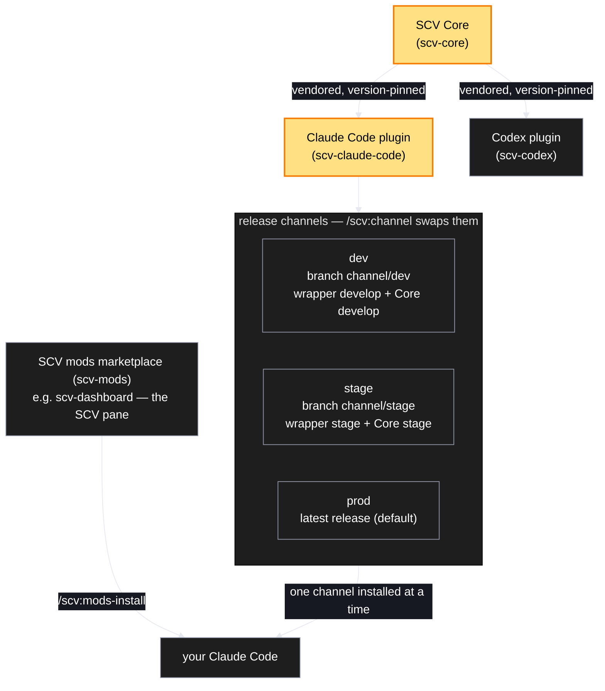

<div align="center">


<h1>SCV</h1>

<p><b>Standard · Cowork · Verify</b></p>

<p><b>A Claude Code plugin for teams.<br>
Every change ships with a plan and tests — and the tests run forever.</b></p>

<p>
<a href="https://github.com/wookiya1364/scv-claude-code/releases/latest"></a>


</p>


</div>

---

> **Languages**: English · [한국어](./README.ko.md) · [日本語](./README.ja.md)

## What is SCV

Talk about a change → SCV refines it into a plan with executable tests →
implements it → attaches the evidence to the PR → archives the plan. Every
archived test joins a regression suite that runs against every future change.
Six months later, a test nobody remembers still catches the break.

## Install

```bash
/plugin marketplace add https://github.com/wookiya1364/scv-claude-code
/plugin install scv@scv-claude-code
```

- **macOS**: `brew install bash` once (SCV scripts need bash 4+; system bash stays untouched).
- **Linux / WSL**: nothing to do. **Windows native**: unsupported — use WSL or Git Bash.
- Recommended CLIs: `git`, `curl`, `jq`, `gh` (or `glab`). SCV tells you if one is missing.

**Update** to the latest release from inside Claude Code — no restart needed:

```bash
/plugin marketplace update scv-claude-code
/reload-plugins
```

`/scv:update` tells you whether you are behind. After an update, each project
refreshes its SCV files on the first action — and says so.

SCV mods (e.g. `scv-dashboard`, the SCV pane in the desktop app): `/scv:mods` updates them and lists them,
`/scv:mods-install` and `/scv:mods-remove` let you pick one. No arguments.
`scv-hello` was renamed `scv-dashboard`: install `scv-dashboard` with `/scv:mods-install`; if `scv-hello`
is still listed, remove it with `/scv:mods-remove`.

## How you use it

**Just talk.** No command to memorize — SCV joins the conversation by itself:

```text
You:  I want to add a refund button to checkout.
SCV:  (enters conversation mode, asks goal / scope / acceptance,
       then offers to draft the plan and tests)
```

Say what you want to build and SCV refines it into a plan. Ask what to do next
and it diagnoses the project. Ask "how did we handle refunds last year?" and
it searches past work — plan bodies, tests, decisions, and conversations, not
only titles. `/scv:help` does the same thing explicitly, and
`SCV_ALWAYS_ON=off` in `scv/scv_settings.json` restores command-only behavior.

Every turn, SCV also:

- **answers in plain language** — a one- or two-sentence conclusion first,
  then one example, code values only when you ask (`SCV_PLAIN_LANGUAGE`);
- **prompts your model the way its vendor recommends** — SCV ships the
  official prompting guide for the model you run, compares each request with
  that guide's checklist item by item, and quotes the rewritten request right
  after the conclusion. File writes wait until the turn is registered
  (`SCV_MODEL_PROMPTING`);
- **picks up where you left off** — after `/clear`, compaction, or a resume,
  it re-injects active plans, recent decisions, open items, and the active
  conversation (`SCV_RESUME_RECAP`);
- **shows the real thing** — when a turn changes the deliverable, at the first
  moment it runs SCV runs the smallest real thing, shows its actual output
  (command output, screen, function result), and asks continue / fix with the
  choice tool; when nothing changes it writes "no change to the deliverable" and
  asks nothing (`SCV_SHOW_REAL`).

Behind the conversation, one loop runs everything:


```mermaid
%%{init: {'theme':'base', 'themeVariables': {'primaryColor':'#1e1e1e','primaryTextColor':'#fff','primaryBorderColor':'#9096a8','lineColor':'#e7e9f0','secondaryColor':'#2d2d2d','tertiaryColor':'#1e1e1e','background':'#171922','edgeLabelBackground':'#171922'}}}%%
flowchart LR
  Raw["scv/raw/<br>materials"]
  Promote["plan + tests<br>(scv/promote/)"]
  Work["implement<br>+ run tests"]
  Archive["scv/archive/"]
  Regression["regression<br>(every archived test)"]

  Raw -->|"conversation"| Promote
  Promote --> Work
  Work -->|"tests pass + approval"| Archive
  Archive --> Regression
  Regression -.->|"safety net for the next change"| Promote

  classDef key fill:#FFE082,stroke:#F57C00,stroke-width:2px,color:#000
  class Promote,Regression key
```


## What you get

| Team problem | What SCV does | Where |
|---|---|---|
| You run an AI diff before trusting it | The PR arrives with a test video | `/scv:work` |
| Ticket · PR · chat tell it differently | One plan feeds the PR and reports | `PLAN.md` |
| Decisions vanish with the session | They land in a decision log | `scv/DECISIONS.md` |
| Old features silently break | Past plans' tests run again | `/scv:regression` |
| Plans read as a wall of text | One numbered picture per plan | `/scv:deck` · `FEATURE_ARCHITECTURE.md` |
| Unclear what a change will touch | Shows files that change together | `SCV_GRAPH` · `SCV_GRAFT` |
| "Did we already try this?" | Searches past plans and talks | [archive search](vendor/scv-core/core/protocols/help/archive-search.md) |
| The same helper gets rewritten | Checks the function catalog first | [pure-function catalog](vendor/scv-core/core/contracts/purity.md) |
| No idea if the process works | Turns records into numbers | `metrics.sh` |

## Settings

One file: `scv/scv_settings.json` — created automatically with every key
present and documented (`_doc`), so you can see what's settable by opening it.
Secrets (tokens, channel IDs) go to a separate git-ignored file. Your `.env`
is never read or written.

| Key | Default | What it does |
|---|---|---|
| `SCV_ALWAYS_ON` | `on` | SCV joins free conversation; `off` = commands only |
| `SCV_PLAIN_LANGUAGE` | `on` | plain-first answer shape (+ per-turn reminder); `off` silences |
| `SCV_MODEL_PROMPTING` | `on` | per-model guide; compare and register every request |
| `SCV_RESUME_RECAP` | `on` | re-inject progress after `/clear`, compaction, or resume |
| `SCV_SHOW_REAL` | `on` | show a real run when the deliverable changes; `off` silences |
| `SCV_DELEGATE_EFFORT` | `off` | deep questions → background investigator; report in `scv/raw/` |
| `SCV_LANG` | auto | output language: `english` · `korean` · `japanese` |
| `NOTIFIER_PROVIDER` | off | `slack` or `discord` for team reports |

Every other key and its default:
[`scv_settings.example.json`](vendor/scv-core/core/template/scv/scv_settings.example.json).
Write through the script — it routes secrets to the right file automatically:

```bash
CORE="$HOME/.claude/plugins/cache/scv-claude-code/scv/<version>/vendor/scv-core/core"
bash "$CORE/scripts/settings-set.sh" NOTIFIER_PROVIDER=slack
bash "$CORE/scripts/settings-set.sh" SLACK_BOT_TOKEN=xoxb-...   # → secret file
bash "$CORE/scripts/metrics.sh"                                 # process numbers
```

## Commands

You never need this table — conversation routes for you. For explicit control:

| Command | Does |
|---|---|
| `/scv:help` | Diagnose the project · refine an idea · search past work |
| `/scv:status` | What's in flight: raw changes, active plans, epics, handoffs |
| `/scv:promote` | Materials → plan folder (`PLAN.md` + `TESTS.md` + diagrams) |
| `/scv:work <slug>` | Implement · run tests · archive · PR with evidence |
| `/scv:codegen <slug>` | TDD-first variant: tests drive the code, Red → Green |
| `/scv:regression` | Run every archived plan's tests as one suite |
| `/scv:deck [<md>]` | Plan → numbered screen spec; any md → planning doc · slides |
| `/scv:report` | Post a phase result to Slack/Discord with artifacts |
| `/scv:sync` | Refresh SCV templates + detect code↔plan drift |
| `/scv:routine [<name>]` | Run a one-file maintenance routine |
| `/scv:dreams` | Look back at past sessions · coach better prompts |
| `/scv:workspace` · `/scv:handoff` | Multi-repo: umbrella setup · cross-repo work declaration |
| `/scv:update` · `/scv:set-models` · `/scv:install-deps` | Plugin update guide · model policy · CLI deps |
| `/scv:mods` · `/scv:mods-install` · `/scv:mods-remove` | Update + list SCV mods · install one · remove one |
| `/scv:channel` | Switch SCV dev · stage · prod — try new work pre-release |

## Guardrails

Three layers keep the workflow honest:

- **In-session**: a `PreToolUse` guard refuses hand-created plan files and
  writes outside `scv/` until any SCV action has run in the session
  (`/scv:status` is enough). Fails open on internal errors; inert where SCV
  isn't adopted. Off switch: `SCV_GUARD=off` in the process environment.
- **Every turn**: file writes wait until the turn's request is registered
  against the model's checklist, and a turn that ends without the rewritten
  request is stopped once so it can be added (`SCV_MODEL_PROMPTING=off`
  turns both off).
- **At merge**: CI gates deny a PR that changes code without an archived plan
  (`[no-plan: <reason>]` declares an exception) and a hand-rewritten vendored
  core (`[manual-vendor: <reason>]`).

Contract: [`vendor/scv-core/core/contracts/guard.md`](vendor/scv-core/core/contracts/guard.md).

## Multi-repo

Single-repo by default. Systems spanning FE/BE/service repos can nest under
one umbrella: `/scv:workspace` joins or creates it, `/scv:handoff` declares
"that repo needs corresponding work" where the other repo will see it.
Detaching restores standalone behavior with zero migration. Monorepos with
per-module `scv/` target a module by leading argument: `/scv:status FE`.

## Philosophy — Standard · Cowork · Verify

- **Standard**: the standard is the workflow, not snapshot docs. Decisions live in an append-only log, not stale documents.
- **Cowork**: plans come from dialog, approved per-section — what you said, not what the model guessed.
- **Verify**: tests are executable, and archived tests keep running forever. Failures triage explicitly — never silently skipped.

<details>
<summary><b>Reference — project layout after adoption</b></summary>

```
my-project/
├── CLAUDE.md              # yours — SCV never touches it
├── scv/                   # everything SCV owns lives here
│   ├── SCV.md PROMOTE.md REPORTING.md
│   ├── DECISIONS.md       # append-only decision log
│   ├── conversations/     # dialogs that became plans (committed)
│   ├── journal/           # every prompt, hook-fed (gitignored by default)
│   ├── promote/  archive/  raw/  routines/
│   ├── scv_settings.json         # settings (auto-created, committed)
│   └── scv_settings.secret.json  # tokens (auto-created, git-ignored)
└── .gitignore             # SCV rules appended
```

Adoption is non-destructive: existing root files stay intact; one `scv/`
directory and two `.gitignore` lines are all SCV adds. The `demo/` directory
in this repository only builds the README GIFs — plugin users never need it.

</details>

## Architecture

Shared behavior comes from a checksummed, version-pinned
[scv-core](https://github.com/wookiya1364/scv-core) release vendored into this
plugin — nothing is fetched at runtime.

This repository is the Claude Code adapter:

- slash commands, hooks registration, install/update UX
- the background investigator agent
- the model prompting guides under `prompting/` — verbatim copies of the
  official guides; CI checks that every checklist quote appears in them word
  for word

What the hooks do:

- Hook stdout delivers the per-turn routing, the project diagnosis, the
  prompting block, and the plain-language reminder.
- The session-start hook re-injects the recap.
- The stop hook checks the answer's shape and the turn's registration.
- The journal hooks capture conversation with redaction before anything hits
  disk.

How the pieces fit — Core is vendored into each host's plugin, the channel
picks which build you install, and mods come from their own marketplace:


```mermaid
%%{init: {'theme':'base', 'themeVariables': {'primaryColor':'#1e1e1e','primaryTextColor':'#fff','primaryBorderColor':'#9096a8','lineColor':'#e7e9f0','secondaryColor':'#2d2d2d','tertiaryColor':'#1e1e1e','background':'#171922','edgeLabelBackground':'#171922'}}}%%
flowchart TB
  Core["SCV Core<br>(scv-core)"]
  Claude["Claude Code plugin<br>(scv-claude-code)"]
  Codex["Codex plugin<br>(scv-codex)"]
  Core -->|"vendored, version-pinned"| Claude
  Core -->|"vendored, version-pinned"| Codex
  subgraph Channels["release channels — /scv:channel swaps them"]
    Dev["dev<br>branch channel/dev<br>wrapper develop + Core develop"]
    Stage["stage<br>branch channel/stage<br>wrapper stage + Core stage"]
    Prod["prod<br>latest release (default)"]
  end
  Claude --> Channels
  Channels -->|"one channel installed at a time"| You["your Claude Code"]
  Mods["SCV mods marketplace (scv-mods)<br>e.g. scv-dashboard — the SCV pane"]
  Mods -->|"/scv:mods-install"| You

  classDef key fill:#FFE082,stroke:#F57C00,stroke-width:2px,color:#000
  class Core,Claude key
```


## Contributing

Run `tests/run-dry.sh` before PRs. Branch flow `develop → stage → main`;
releases go through `gh workflow run promote.yml` —
see [docs/RELEASING.md](docs/RELEASING.md). History lives in the
[releases](https://github.com/wookiya1364/scv-claude-code/releases).

---

**License**: [MIT](./LICENSE) © 2026 wookiya1364
