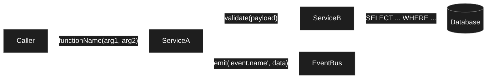
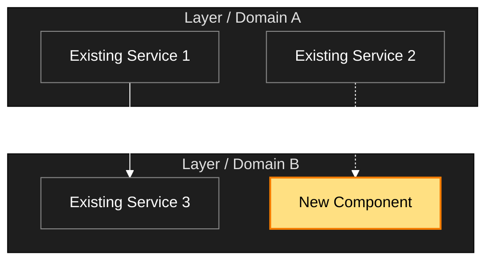

# /scv:promote

You — Claude — will help the user refine material from `scv/raw/` into a structured promote folder at `scv/promote/<YYYYMMDD>-<author>-<slug>/` with `PLAN.md` + `TESTS.md`. See the full convention in `scv/PROMOTE.md`.

## Language preference

Resolve the user's preferred language with this priority, then use it for ALL user-facing output (AskUserQuestion text, status messages, summaries):

1. `~/.claude/settings.json` (or project `.claude/settings.json` / `.claude/settings.local.json`) — `language` key (Claude Code official).
2. Project `.env` — `SCV_LANG` (set by `/scv:help`'s first-time setup).
3. Auto-detect from the user's most recent message language.
4. Default to English.

Technical identifiers stay as-is: file paths, slash command names, frontmatter keys (`status`, `kind`, `epic`, `supersedes`), env var names, SCV terms (`promote`, `archive`, `orphan branch`, `epic`). If both `settings.json language` and `.env SCV_LANG` are unset, suggest `/scv:help` once to lock the preference (don't block — fall back to auto-detect / English for now).

**Non-negotiable rules:**
- Never create / move / delete files without the user's explicit per-candidate approval.
- Raw originals under `scv/raw/` are **never** deleted or moved.
- `status: active` is never set by you — leave every new scaffold as `planned` so the user reviews first.

First, gather context:

```!
"${CLAUDE_PLUGIN_ROOT}/scripts/promote-helper.sh" $ARGUMENTS
```

Parse the helper output — the lines `MODE:`, `TODAY:`, `AUTHOR:`, `STANDARD_VERSION:`, `GRAPHIFY_SKILL:`, `GRAPH_STATUS:`, `RAW_FILE_COUNT:`, `RAW_TOPIC_CLUSTERS:`, `SUGGEST_SPLIT:`, `SPLIT_REASON:` are the primary signals; section blocks (`=== scv/raw inventory ===` etc.) give you the content to work with.

## Protocol

### Step 0 — Language alignment (v0.7.3+, run before dialog)

This promote's PLAN.md / TESTS.md / FEATURE_ARCHITECTURE.md content + Mermaid labels + commit message + PR title/body are **all written in one resolved language**. The resolver has 5 cases:

| Settings.json `language` | `.env SCV_LANG` | `.env SCV_PROMOTE_LANG` (cache) | Action |
|---|---|---|---|
| Unset | Unset | (any) | Auto-detect from user's last message; fall back to English. **No dialog.** |
| Set OR Set (only one) | (only one set) | (any) | Use the set value. **No dialog.** |
| Set, same value | Set, same value | (any) | Use that value. **No dialog.** |
| Set, **different** value | Set, **different** value | Cached value matches one of the two | Use cached. **No dialog.** Print one-line inline notice (below). |
| Set, **different** value | Set, **different** value | Unset OR cached value matches neither | **Fire `AskUserQuestion`** (below). Save user's choice to `.env SCV_PROMOTE_LANG`. |

**Inline notice (mismatch + cached choice found):**

```
🌐 Promote language: 한국어 (cached: SCV_PROMOTE_LANG=korean in .env).
   Settings mismatch: settings.json language=korean, .env SCV_LANG=english.
   To change: edit .env or run:
     sed -i 's/^SCV_PROMOTE_LANG=.*/SCV_PROMOTE_LANG=english/' .env
   To clear cache and be asked again:
     sed -i '/^SCV_PROMOTE_LANG=/d' .env
```

(Localize the prose in the user's preferred language; keep the `sed` commands verbatim — they are copy-paste safe.)

**`AskUserQuestion` (mismatch, no cache or stale cache):**

```
Question: "Settings mismatch — settings.json language=<value> and .env SCV_LANG=<value>
differ. Which language should I use for this promote's PLAN.md / TESTS.md /
FEATURE_ARCHITECTURE.md content + Mermaid labels + commit + PR text? Your choice
will be saved to .env SCV_PROMOTE_LANG so I don't ask again."

[1] English (`.env` value)
    description: "Saves SCV_PROMOTE_LANG=english to .env. Pick when your team's
    PRs are mainly English-readable. Sticks for all future promotes; clear with
    sed -i '/^SCV_PROMOTE_LANG=/d' .env to be asked again."

[2] 한국어 (settings.json value)
    description: "Saves SCV_PROMOTE_LANG=korean. Pick when your team's PRs are
    mainly Korean-readable."

[3] 日本語
    description: "Saves SCV_PROMOTE_LANG=japanese. Pick when your team's PRs are
    mainly Japanese-readable."

[4] (free-form) "Other — type your direction"
    description: "Examples: 'Spanish for this one only, no cache' / 'Mixed: code in
    English, narrative in Korean'. Free-form answers are NOT cached — you'll be
    asked again next promote."
```

After choice [1]/[2]/[3], write the value to `.env`:

```bash
# If .env doesn't exist, create it. If SCV_PROMOTE_LANG line exists, update; else append.
if grep -q '^SCV_PROMOTE_LANG=' .env 2>/dev/null; then
  sed -i 's/^SCV_PROMOTE_LANG=.*/SCV_PROMOTE_LANG=<chosen>/' .env
else
  echo 'SCV_PROMOTE_LANG=<chosen>' >> .env
fi
```

Replace `<chosen>` with `english` / `korean` / `japanese`. For [4] free-form, do NOT write to `.env` — use the value for this promote only.

**Resolved value** = `LANG_RESOLVED`. Use it for **all** of:
- PLAN.md `lang:` frontmatter (Step 5)
- TESTS.md content (narrative paragraphs, not template labels which stay English in TESTS.md template)
- FEATURE_ARCHITECTURE.md Mermaid node labels / edge labels / subgraph names (Step 6)
- Commit message + PR title + PR body narrative (handled by `/scv:work` Step 9d, which reads `lang:` from the archived PLAN.md frontmatter)

**Technical identifiers stay as-is in every language**: file paths, slash command names, frontmatter keys (`status`, `kind`, `epic`, `supersedes`, `lang`), env var names (`SCV_LANG`, `SCV_PROMOTE_LANG`), SCV terms (`promote`, `archive`, `orphan branch`, `epic`).

### Step 1 — Graph freshness (run before dialog)

Based on the helper header:

| GRAPHIFY_SKILL | GRAPH_STATUS | Action |
|---|---|---|
| `available` | `stale` or `missing` | Invoke the `graphify` skill to build / refresh the docs graph **before** proceeding with dialog. Tool: `Skill` with `skill: "graphify"` and args: `scope=docs`, `src=scv/raw`, `update=true` (or equivalent the skill expects). Then move the output into `.graphify/docs/` if the skill wrote `graphify-out/` at cwd. |
| `available` | `built` | Skip graph update. |
| `missing` | anything | Print a **short one-line warning**: "graphify skill not found — proceeding without token-efficient graph queries. Install guide: https://github.com/safishamsi/graphify (place SKILL.md at ~/.claude/skills/graphify/)". Continue. |

If `MODE: graph-only`: after handling the graph (or warning if skill missing), **stop here**. Do not proceed to dialog or file creation. Print a one-line summary of what you did.

### Step 2 — Plan summary (before dialog)

Summarize to the user:
- How many raws changed (from `added=N modified=N removed=N`).
- Whether the graph was updated.
- What existing promote folders / archive folders already exist.

#### Step 2.1 — Reference scan (deliberate sources only)

Scan the **two deliberate sources** for URLs to pre-populate `refs:` in the PLAN.md scaffold (Step 5). LLM applies the URL pattern table at §Step 3.1.5 to determine `type` and `id`/`url`.

| Source | Scan? | Why |
|---|---|---|
| `scv/raw/` files (changed window per `readpath.json`) | ✅ | User deliberately dropped artifacts here |
| The current `/scv:promote` invocation argument text | ✅ | User typed it explicitly for this promote |
| Earlier user messages / prior `/scv:*` invocations in this conversation | ⚠️ See below |
| Unrelated earlier conversation | ❌ | Out of scope — would violate SCV's "deliberate clarification" purpose |

For **earlier conversation** (e.g., user did `/scv:help "...URL..."` before this `/scv:promote`):

- Do **NOT auto-populate** `refs:` from these mentions — that would short-circuit the clarification dialog SCV is built around.
- DO surface them as **suggestions** in the Plan summary so the user can deliberately re-mention them in dialog answers if they want them included. Use LLM judgment to filter only URLs whose topic matches the current promote.

Display the scan result to the user with **source attribution**. Example output:

```
Plan summary:
  - 3 raws changed (added=1, modified=2, removed=0)
  - graph: built
  - Detected refs (will auto-populate to PLAN.md):
      [jira] PAY-1234        from scv/raw/meeting-notes.md
      [confluence] design-v2 from /scv:promote argument
  - 💡 Earlier you mentioned in /scv:help: linear ENG-567
      (not auto-added — paste into your dialog answers if you want it in refs)
```

If no URLs found in either deliberate source, omit the "Detected refs" line entirely. If no earlier-conversation suggestion either, omit the 💡 line.

### Step 3 — Dialog (for each candidate promote folder)

#### Step 3.0 — Split suggestion (epic grouping)

Heuristic decision tree:

| Helper signal | LLM judgment | Action |
|---|---|---|
| `SUGGEST_SPLIT: yes` (raw files > 7 or topic clusters ≥ 3) | Raw content also looks multi-responsibility (auth + payment + UI etc.) | **Strongly recommend split** |
| `SUGGEST_SPLIT: yes` | LLM sees it as a single topic in practice (e.g., one large meeting log) | Suggest split but offer "single is fine" as an option |
| `SUGGEST_SPLIT: no` | LLM sees 5+ topics mixed in the body | Suggest split (LLM judgment wins) |
| `SUGGEST_SPLIT: no` | LLM also sees a single topic | Don't suggest split. Flow to Step 3.1 single-folder dialog |

If split is recommended, fire `AskUserQuestion`:

```
Question: "Looking at the raw material, this seems sized for multiple features (current raw spans N topic clusters). How would you like to proceed?"
options:
[1] "Split into multiple features (recommended) — group as an epic"
    description:
    "Group the raw material by topic into an appropriate number of promote folders, all
     sharing the same epic: <epic-slug>. **The number of splits is content-driven** —
     small material may need 2–3, larger material more. Claude proposes a candidate split
     (each folder's slug + which raw goes where), and you can adjust.

     Benefits: each feature is small and well-scoped, narrowing test scope and easing
     review. After all features are archived, SCV auto-suggests an integration refactor
     PLAN (see PROMOTE.md §8d, §8e).

     **Example (the count is illustrative, not prescriptive)**: 'Payment v2 overhaul' →
       roughly 7 features
       - 20260424-sspark-pay-overhaul-auth-v2
       - 20260424-sspark-pay-overhaul-charge-flow
       - 20260424-sspark-pay-overhaul-refund-flow
       - ... (all sharing epic: 20260424-pay-overhaul)
       - 20260430-sspark-pay-overhaul-refactor (kind: refactor, last)

     Real count varies with your domain and raw volume."

[2] "Proceed as a single promote"
    description:
    "Take it as one folder. Recommended only when the scope is small or genuinely
     single-topic. With a single folder, you lose epic grouping benefits (branch strategy,
     auto-suggested refactor)."
```

After user picks:

- **[1] Split**: One more `AskUserQuestion` — "What epic slug should we use? (e.g., `20260424-pay-overhaul`)". Then propose slugs per topic cluster from the raw → user approves → create N folders, all with the same `epic` frontmatter.
- **[2] Single**: proceed to Step 3.1 below.

#### Step 3.1 — Single-folder dialog (no split)

**Preamble (conditional — emit ONCE before the question batch, not via `AskUserQuestion`).**

Show this preamble (one short text line, in the user's preferred language) only when **both** of the following hold:

- Step 2.1's "Detected refs" came up empty (no URLs in raw or `/scv:promote` argument).
- The project's `.env` has at least one of `JIRA_BASE_URL` / `LINEAR_BASE_URL` / `CONFLUENCE_BASE_URL` / etc. set (signal: this team uses external trackers).

Suggested wording (English):

> 💡 Tip: I didn't find any related ticket / doc URLs in your raw materials or invocation. If this plan has any (Jira / Linear / Confluence / GitHub PR / Google Doc / Notion / etc.), include them in any of your answers below — I'll auto-detect and add them to `refs:`.

If neither condition holds (URLs already extracted, or team doesn't use external trackers), skip the preamble entirely — keep the dialog clean.

Then use `AskUserQuestion` for the batch (questions stay clean — do NOT mix the URL ask into the question text or option descriptions):

1. **Scope**: "Do you want a single promote folder covering all N changed raws, or separate folders per topic?"
2. **Slug(s)**: For each folder, ask: "Slug for this promote folder? (kebab-case, 3~5 words)". Combine with `TODAY` and `AUTHOR` from the helper to produce `<YYYYMMDD>-<AUTHOR>-<slug>/`.
3. **Title**: "One-line title for `<folder>`?" (will go in PLAN.md frontmatter `title`).
4. **Raw sources**: For each folder, confirm which raw file paths belong to it (default: all changed raws; user may split).

#### Step 3.1.5 — Parse URLs from dialog answers (URL pattern → ref type)

After collecting answers, scan **all** of the user's free-text responses for URLs. For each match, derive a `refs:` entry using this table. Strip the URL from the text field (e.g., title) so only the plain text remains.

| URL pattern | `type` | `id` (when extractable) |
|---|---|---|
| `*.atlassian.net/browse/<KEY>-<N>` | `jira` | `<KEY>-<N>` |
| `linear.app/<workspace>/issue/<ID>` | `linear` | `<ID>` |
| `github.com/<org>/<repo>/pull/<N>` | `pr` | (use full URL) |
| `gitlab.com/<group>/<project>/-/merge_requests/<N>` | `pr` | (use full URL) |
| `*.atlassian.net/wiki/*` or `*confluence*` | `confluence` | (use full URL) |
| `docs.google.com/document/d/<ID>` | `google-doc` | (use full URL) |
| `*.notion.so/*` | `notion` | (use full URL) |
| any other URL | `link` | (use full URL) |

**`.env` BASE_URL inference**: if the project's `.env` defines `<TYPE>_BASE_URL` and the URL matches that base, prefer storing only `id:` (the URL is inferred at display time). Otherwise store `url:` directly. Both `id` and `url` together is also valid.

Merge these dialog-extracted refs with Step 2.1's deliberate-source refs. Dedupe by URL/id.

### Step 4 — Collision check

For each proposed folder name, check the helper's `=== existing promote folders ===` and `=== existing archive folders ===` output. If the full name (`<YYYYMMDD>-<AUTHOR>-<slug>`) exists:

- Suggest `<slug>-v2` (or `-v3`, `-v4` as needed) and re-confirm with user via AskUserQuestion.
- Never silently overwrite.

### Step 5 — Write scaffolds (only after user approval per folder)

For each approved folder, create the directory and write **two files**:

**`scv/promote/<folder>/PLAN.md`**:

```markdown
---
title: <TITLE>
slug: <FOLDER_NAME>
author: <AUTHOR>
created_at: <TODAY>
status: planned
kind: feature                          # feature | refactor | retirement (default feature; specify when splitting)
lang: <LANG_RESOLVED>                  # english | korean | japanese | <other>. Source: Step 0. Read by /scv:work Step 9d for commit/PR language.
# epic: <EPIC_SLUG>                    # Same value across all folders of a split. Omit for single-folder.
tags: []
raw_sources:
  - <RAW_SOURCE_1>
  - <RAW_SOURCE_2>
refs: []
# Add vendor-agnostic external refs as needed (Jira/Linear/Confluence/PR etc.):
# refs:
#   - type: jira
#     id: <TICKET_ID>
#   - type: confluence
#     url: https://...
# (Same type may repeat. See scv/PROMOTE.md §4 for full spec.)
---

# <TITLE>

## Summary

<TODO: 1–3 sentences — what & why>

## Goals / Non-Goals

- **Goals**
  - <TODO>
- **Non-Goals**
  - <TODO>

## Approach Overview

<TODO: 5–15 lines. If this grows beyond ~50 lines, `/scv:work` will suggest splitting into ARCH.md.>

## Steps

1. <TODO>
2. <TODO>

## Related Documents

<!-- If the plan grows, link supporting files here.
     /scv:work only loads Related-Documents entries on demand (token guard). -->

## Risks / Open Questions

- <TODO>

## Links

- Raw originals: (listed in frontmatter)
- Related PRs:
```

**`scv/promote/<folder>/TESTS.md`**:

```markdown
# Test Plan — <TITLE>

## Overview

<TODO: one paragraph — what you're verifying and why>

## Test scenarios

### T1. <Scenario name>

- **Setup**: <TODO>
- **Run**: <TODO>
- **Expected**: <TODO>
- **Pass criterion**: <observable condition>

## How to run

<!-- concrete command(s) like `npm run test:auth` or `pnpm test -- --grep X` -->
```bash
<TODO>
```

## Pass criteria

- <TODO: DONE criteria — when do we declare the whole plan done?>

## Related Documents

<!-- e.g.:
- [`tests/e2e-scenarios.md`](./tests/e2e-scenarios.md)
-->
```

**Populating `refs:`**: replace the `refs: []` placeholder with the merged set from Step 2.1 (deliberate-source extraction) + Step 3.1.5 (dialog-answer extraction). Use the canonical YAML form:

```yaml
refs:
  - type: jira
    id: PAY-1234
  - type: pr
    url: https://github.com/org/repo/pull/567
```

**Source attribution after writing**: print a one-line summary so the user sees what landed in `refs:`. Example:

```
✓ Created scv/promote/<folder>/
  refs: 3 auto-detected (2 from raw, 1 from dialog answer)
  edit PLAN.md frontmatter to add more.
```

If `refs:` is empty, omit the count line; just confirm the folder was created.

### Step 6 — Architecture diagrams (per approved folder, optional)

For each folder created in Step 5, fire `AskUserQuestion` to decide whether to also generate `FEATURE_ARCHITECTURE.md` (two Mermaid diagrams) alongside `PLAN.md` / `TESTS.md`. The default flow asks every time — there is no `--skip-architecture` flag. When the change is trivial enough that diagrams add no value, the user picks [2] "skip" once.

```
Question: "Add architecture diagrams to <folder> (FEATURE_ARCHITECTURE.md)?"

[1] "Yes — generate two Mermaid diagrams"
    description:
    "Creates scv/promote/<folder>/FEATURE_ARCHITECTURE.md with:
     (1) Component data flow — how this feature's components interact,
         with function names / parameters / data on edges. Helps the
         implementer understand the design before running /scv:work.
     (2) Position in whole architecture — which subsystem this feature
         touches. Helps stakeholders see the change scope at a glance.
     Mermaid renders inline on GitHub / GitLab / Bitbucket. Recommended
     for non-trivial changes (anything beyond a typo / null-guard / dep bump)."

[2] "No — skip diagrams for this folder"
    description:
    "For trivial changes (single-line guard, typo fix, patch-version dep
     bump) PLAN.md alone is enough. You can write FEATURE_ARCHITECTURE.md
     by hand later if needed — the file is conventional, not enforced."

[3] (free-form) "Other — type your direction"
    description:
    "Examples: 'only the first diagram, second has no value here' /
     'data flow perspective only' / 'wait, I'll write by hand'."
```

If [2]: skip the rest of Step 6 for this folder, continue with Step 7.

If [1] or [3]: generate the file via Step 6.1 + Step 6.2 + Step 6.3 below.

#### Step 6.1 — First diagram (Component data flow)

Build a `flowchart LR` (or `TB` if vertical layout fits better) showing the components identified in PLAN.md's `Approach Overview` / `Steps`.

**Mapping rules (must follow):**

1. **Every component named in `Approach Overview` or `Steps` must appear as a node** — do not omit. If a step says "OrderService validates the cart", `OrderService` is a node.
2. **Every external system named in PLAN.md** (DB / cache / queue / 3rd-party API / blob store / email / SMS / push) → cylinder node `[(Name)]`. Internal services use square node `[Name]`.
3. **Every edge needs a label** — the function call / event name / SQL / HTTP verb that flows between the two nodes. No bare arrows. If you cannot label the edge concretely, the edge is suspicious — re-read PLAN.md before drawing it.
4. **No invented components** — if a node is not in PLAN.md, do not draw it. Better an incomplete diagram (which the user can extend) than a hallucinated one (which misleads).
5. **Labels follow `LANG_RESOLVED` (Step 0)** — Mermaid node labels (the bracketed text inside `[Name]` / `[(Name)]`), edge labels (text between `|"..."|`), and subgraph names use the resolved language. Component identifiers (the Mermaid node IDs before the bracket, e.g., `OrderService` in `OrderService[주문 서비스]`) stay as code-style English to keep the Mermaid syntax stable. Function names / SQL / HTTP verbs in edge labels stay verbatim (`getOrder(orderId)` is identical in any language); only narrative descriptions translate.
6. **Always start the mermaid block with the standard dark-theme directive** (v0.7.9+) — first line inside the ` ```mermaid ` fence (one line, no wrapping):
   ```
   %%{init: {'theme':'base', 'themeVariables': {'primaryColor':'#1e1e1e','primaryTextColor':'#fff','primaryBorderColor':'#888','lineColor':'#fff','secondaryColor':'#2d2d2d','tertiaryColor':'#1e1e1e','background':'#0d1117','edgeLabelBackground':'#1e1e1e'}}}%%
   ```
   Forces dark backgrounds + white text + **white edge arrows**. Yellow-highlighted nodes (`classDef key fill:#FFE082,...,color:#000`) keep black text on yellow for strong visual emphasis. The user explicitly chose strong contrast over context-aware palettes ("큰 배경은 검은색, 화살표는 흰색"). This palette is consistent across GitHub light-mode page, GitHub dark-mode page, and GitHub's fullscreen modal popup.

**Anti-patterns to avoid:**

- ❌ Copying the skeleton verbatim (`Caller`, `ServiceA`, `ServiceB`) — those names exist only in this prompt as syntax illustration. Use the actual component names from PLAN.md.
- ❌ Bare `A --> B` edges with no label.
- ❌ Wrapping every node in `[(...)]` cylinder notation — use cylinder ONLY for external systems (DB, queue, 3rd-party). Internal services use plain `[Name]`.
- ❌ Arbitrary "Data" / "Request" generic node names — use the actual data type / endpoint / event name.
- ❌ More than ~12 nodes in one diagram — if the feature has more, group related ones into subgraphs or split into multiple diagrams.

**Skeleton (illustrative only — replace ALL names with PLAN.md content):**

````markdown

````

#### Step 6.2 — Second diagram (Position in whole — data source branching)

Determine the source for the system-level layout:

| `scv/ARCHITECTURE.md` `status` | `GRAPHIFY_SKILL` | `GRAPH_STATUS` | Action |
|---|---|---|---|
| `active` or `draft` | (any) | (any) | Use `scv/ARCHITECTURE.md` content as the layout reference |
| `N/A` (or file missing) | `available` | `built` | Use `.graphify/docs/graphify-out/graph.json` |
| `N/A` | `available` | `stale` or `missing` | Fire 3-way `AskUserQuestion` (below) |
| `N/A` | `missing` | (any) | Fire 2-way `AskUserQuestion` (below) |

**3-way question** (graphify available + stale/missing graph):

```
Question: "scv/ARCHITECTURE.md is N/A and the graphify graph is <stale|missing>. How should I source diagram 2?"

[1] "Run graphify update (or full build) now"
    description:
    "Builds / refreshes the knowledge graph from the codebase.
     Token cost: code-only changes use 0 LLM tokens (AST is deterministic).
     Doc / image changes use chunked extraction. No changes since last run
     means 0 tokens. Then I build diagram 2 from the graph."

[2] "Skip diagram 2"
    description:
    "FEATURE_ARCHITECTURE.md will contain only diagram 1 (component data
     flow). Diagram 2 needs a system-level reference that does not exist
     right now. Pick this when you do not want to spend time on graph build
     or this promote is exploratory."

[3] (free-form) "Other — type your direction"
    description:
    "Examples: 'use stale graph as-is, note the date' / 'I will lift
     ARCHITECTURE.md manually first' / 'guess from code structure'."
```

**2-way question** (graphify not installed):

```
Question: "scv/ARCHITECTURE.md is N/A and graphify is not installed. How should I source diagram 2?"

[1] "Skip diagram 2"
    description:
    "Only diagram 1 (component data flow) will be generated. The system-
     level layout needs a reference (ARCHITECTURE.md or graphify) that
     is not available."

[2] (free-form) "Other — type your direction"
    description:
    "Examples: 'guess from code top-level directory layout' / 'I will install
     graphify first (see /scv:install-deps)' / 'lift ARCHITECTURE.md to
     draft and try again'."
```

After the source decision, build a `flowchart TB` with subgraphs for each layer / domain.

**Mapping rules by data source:**

**Source = `scv/ARCHITECTURE.md`** (`active` or `draft`):

1. Read the doc's `## Logical view` (or equivalent service-boundaries section).
2. Each named service / domain there → a `subgraph` (use the exact name).
3. Each component listed under that service → a node inside the subgraph.
4. Map this feature's new components (from PLAN.md) into the most relevant subgraph.

**Source = graphify `graph.json`** (`.graphify/docs/graphify-out/graph.json` exists):

```bash
# Read graph.json + GRAPH_REPORT.md (graphify outputs)
# graph.json structure: { nodes: [{id, label, community, ...}], links: [{source, target, ...}] }
# GRAPH_REPORT.md sections: "Community labels", "God nodes", "Surprising connections"
```

Mapping algorithm:

1. **Subgraphs from communities.** Each community in `graph.json` (with the label graphify generated, e.g., "Auth Module" / "Payment Gateway") → one `subgraph "<community-label>"`. Do **not** invent your own community names — graphify already labeled them in plain language. Use those verbatim.
2. **Nodes from god_nodes only.** A typical graph has hundreds of nodes; do not draw all of them. Use only the `god_nodes` list (high-degree central nodes graphify identified). Each god node → a node inside its community's subgraph.
3. **Edges from top-weight links.** Among `graph.json` `links`, take only edges where both endpoints are god nodes. Drop the rest. If still too many, take top 8-12 by `weight`.
4. **New components from PLAN.md.** This feature's new components (the ones in diagram 1 that don't exist as god nodes) → add as `:::new`-classed nodes in the most relevant community subgraph.
5. **Edges from new components to existing.** For each new component, draw an edge to each existing god node it interacts with (per PLAN.md `Approach Overview`). Use a dashed edge `-.->` to distinguish "new connection" from "existing structure".

**Source = none (skipped)**: this section is omitted entirely (Step 6.3 file template handles the omission).

**Highlight new components with the `new` class** in all sources:

````markdown

````

**Anti-patterns to avoid (diagram 2):**

- ❌ Drawing every node from `graph.json` — use god_nodes only.
- ❌ Inventing community names instead of using graphify's labels.
- ❌ Putting the new feature in a brand-new subgraph far from the rest — place it inside an existing community based on PLAN.md's interaction with that community.
- ❌ Skipping the `Source:` line in §2 of FEATURE_ARCHITECTURE.md (Step 6.3) — every diagram 2 must declare its basis.
- ❌ Using solid `-->` for new-component edges — use dashed `-.->` to make new connections visually distinct.

#### Step 6.3 — Write FEATURE_ARCHITECTURE.md

````markdown
---
title: <TITLE>
slug: <FOLDER_NAME>
created_at: <TODAY>
status: planned
---

# Architecture — <TITLE>

> Two-diagram view of this feature. **Review and edit before `/scv:work`** —
> diagrams are LLM-generated and may have inaccuracies.

## 1. Component data flow

How this feature's components interact.

```mermaid
%%{init: {'theme':'base', 'themeVariables': {'primaryColor':'#1e1e1e','primaryTextColor':'#fff','primaryBorderColor':'#888','lineColor':'#fff','secondaryColor':'#2d2d2d','tertiaryColor':'#1e1e1e','background':'#0d1117','edgeLabelBackground':'#1e1e1e'}}}%%
<Step 6.1 output>
```

## 2. Position in whole architecture

Where this feature sits in the system. New components highlighted in yellow.

> Source: <one of: `scv/ARCHITECTURE.md` | graphify graph (built <YYYY-MM-DD>) | omitted — first diagram only>

```mermaid
%%{init: {'theme':'base', 'themeVariables': {'primaryColor':'#1e1e1e','primaryTextColor':'#fff','primaryBorderColor':'#888','lineColor':'#fff','secondaryColor':'#2d2d2d','tertiaryColor':'#1e1e1e','background':'#0d1117','edgeLabelBackground':'#1e1e1e'}}}%%
<Step 6.2 output>
```
````

If diagram 2 was skipped, replace the entire `## 2.` section with:

```markdown
## 2. Position in whole architecture

> Skipped — `scv/ARCHITECTURE.md` is `N/A` and no graphify graph available.
> Lift ARCHITECTURE.md to `draft` (or run `/graphify`) and re-run `/scv:promote`
> on this folder to generate diagram 2.
```

Print one-line confirmation:

```
✓ Created scv/promote/<folder>/FEATURE_ARCHITECTURE.md
  Diagram 2 source: <ARCHITECTURE.md | graphify | skipped>
  ⚠ Review Mermaid syntax + node labels — LLM-generated.
```

#### Step 6.4 — Self-review (before moving on)

Before continuing to Step 7, silently re-read the FEATURE_ARCHITECTURE.md you just wrote and verify it against PLAN.md. Do **not** print this checklist to the user — fix problems silently and only mention if a fix changed something material.

Checklist (apply once per generated file):

1. **Coverage**: every component named in PLAN.md's `Approach Overview` / `Steps` appears as a node in diagram 1. If any is missing, add it.
2. **No inventions**: every node in diagram 1 traces back to PLAN.md. If any node has no PLAN.md basis, remove it.
3. **Edge labels**: every edge in diagram 1 has a non-empty label (function call / event / SQL / HTTP verb). Bare `-->` arrows get a label or get removed.
4. **External-vs-internal notation**: cylinder `[(...)]` only for external systems (DB / queue / 3rd-party API), plain `[...]` for internal services. Fix any miscategorized nodes.
5. **Diagram 2 Source line** (when present): the `> Source:` line in §2 names exactly one of `scv/ARCHITECTURE.md` / `graphify graph (built YYYY-MM-DD)` / `skipped`. If it says "ARCHITECTURE.md or graphify" / vague text, pick the actual source.
6. **`:::new` class** (diagram 2): every node introduced by this feature has `:::new`. Existing nodes do not.
7. **Dashed edges** (diagram 2 with graphify source): edges from new components use `-.->` (dashed). Existing-to-existing edges use `-->`.
8. **Mermaid fence**: the diagram is inside a ` ```mermaid ` ... ` ``` ` fence (not ` ```markdown ` or unfenced).

If a fix changed something user-visible (added a missing component / removed an invented one), mention it in the confirmation:

```
✓ Created scv/promote/<folder>/FEATURE_ARCHITECTURE.md
  Diagram 2 source: <ARCHITECTURE.md | graphify | skipped>
  Self-review: added 1 missing component (RefundEventHandler from Steps).
  ⚠ Review Mermaid syntax + node labels — LLM-generated.
```

If self-review fixed nothing material, omit the "Self-review:" line.

### Step 7 — Update readpath baseline

After all approved folders are created (and any FEATURE_ARCHITECTURE.md is written), run:

```
!${CLAUDE_PLUGIN_ROOT}/scripts/readpath.sh update
```

This marks the current raw state as the new baseline so future `/scv:help` / `/scv:status` won't keep flagging the consumed files.

### Step 8 — Report to user

Summarize:
- Created folders (list paths to PLAN.md + TESTS.md, and FEATURE_ARCHITECTURE.md if generated)
- Graph update status
- Baseline updated? (yes)
- Next suggested command: `/scv:work <slug>` for the first new plan.
- Reminder: PLAN.md, TESTS.md, and FEATURE_ARCHITECTURE.md (when present) are **starting skeletons** — fill in the `<TODO>` spots and review the diagrams. Run `/scv:status` any time to see pending changes.

## Flag semantics

- `--dry-run` — Emit inventory + diff + plan without calling the graphify skill, writing scaffolds, or updating readpath.json. Safe "what would happen" preview.
- `--graph-only` — Only refresh the docs graph (if possible); skip dialog, scaffolds, and readpath update.
- `--topic SLUG` — Pre-fills the slug suggestion for a single-folder scenario (still requires user confirmation).

## Never

- Delete / move / rename files under `scv/raw/`
- Promote without per-folder approval
- Overwrite an existing promote or archive folder
- Set `status: active` — leave scaffolds as `planned`
- Commit or push — leave version control to the user
