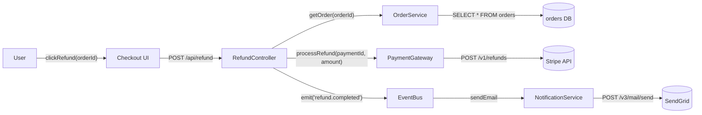
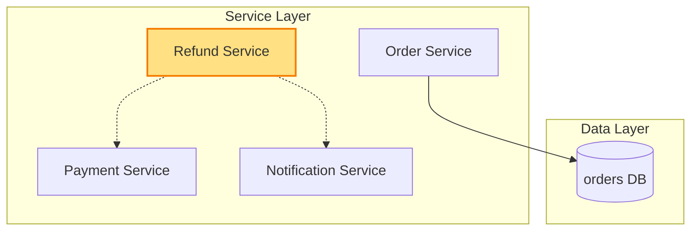

# Architecture — Add refund button to checkout page

> Two-diagram view of this feature.

## 1. Component data flow

How this feature's components interact.

## 2. Position in whole architecture

> Source: scv/ARCHITECTURE.md (illustrative for v0.7.3 verification)

