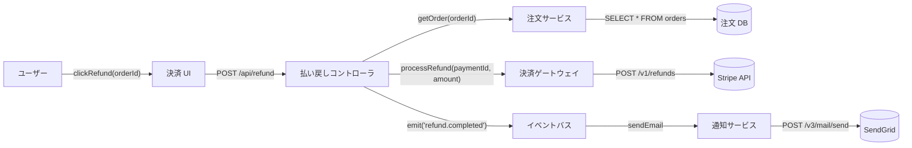
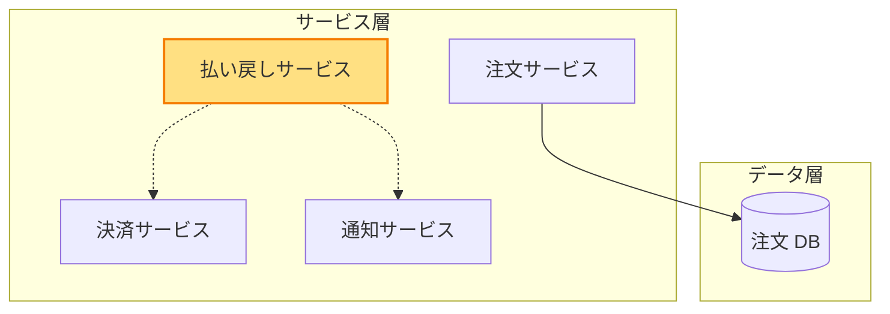

# アーキテクチャ — 決済ページに払い戻しボタンを追加

> この機能の二図ビュー。

## 1. コンポーネントデータフロー

この機能のコンポーネントがどのように相互作用するか。

```mermaid
flowchart LR
  User[ユーザー] -->|"clickRefund(orderId)"| ReactUI[決済 UI]
  ReactUI -->|"POST /api/refund"| RefundController[払い戻しコントローラ]
  RefundController -->|"getOrder(orderId)"| OrderService[注文サービス]
  OrderService -->|"SELECT * FROM orders"| OrdersDB[(注文 DB)]
  RefundController -->|"processRefund(paymentId, amount)"| PaymentGateway[決済ゲートウェイ]
  PaymentGateway -->|"POST /v1/refunds"| StripeAPI[(Stripe API)]
  RefundController -->|"emit('refund.completed')"| EventBus[イベントバス]
  EventBus -->|"sendEmail"| NotificationService[通知サービス]
  NotificationService -->|"POST /v3/mail/send"| SendGrid[(SendGrid)]
```

## 2. 全体アーキテクチャでの位置

> Source: scv/ARCHITECTURE.md (v0.7.3 検証用の例)

```mermaid
flowchart TB
  subgraph "サービス層"
    Order[注文サービス]
    Payment[決済サービス]
    Refund[払い戻しサービス]:::new
    Notification[通知サービス]
  end
  subgraph "データ層"
    OrdersDB[(注文 DB)]
  end
  Order --> OrdersDB
  Refund -.-> Payment
  Refund -.-> Notification
  classDef new fill:#FFE082,stroke:#F57C00,stroke-width:2px
```
