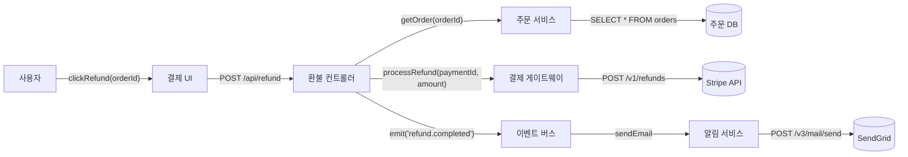
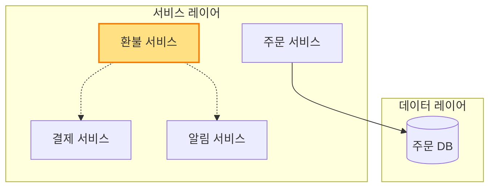

# 아키텍처 — 결제 페이지에 환불 버튼 추가

> 이 기능의 두 도식 뷰.

## 1. 컴포넌트 데이터 흐름

이 기능의 컴포넌트들이 어떻게 상호작용하는가.

```mermaid
flowchart LR
  User[사용자] -->|"clickRefund(orderId)"| ReactUI[결제 UI]
  ReactUI -->|"POST /api/refund"| RefundController[환불 컨트롤러]
  RefundController -->|"getOrder(orderId)"| OrderService[주문 서비스]
  OrderService -->|"SELECT * FROM orders"| OrdersDB[(주문 DB)]
  RefundController -->|"processRefund(paymentId, amount)"| PaymentGateway[결제 게이트웨이]
  PaymentGateway -->|"POST /v1/refunds"| StripeAPI[(Stripe API)]
  RefundController -->|"emit('refund.completed')"| EventBus[이벤트 버스]
  EventBus -->|"sendEmail"| NotificationService[알림 서비스]
  NotificationService -->|"POST /v3/mail/send"| SendGrid[(SendGrid)]
```

## 2. 전체 아키텍처에서의 위치

> Source: scv/ARCHITECTURE.md (v0.7.3 검증용 예시)

```mermaid
flowchart TB
  subgraph "서비스 레이어"
    Order[주문 서비스]
    Payment[결제 서비스]
    Refund[환불 서비스]:::new
    Notification[알림 서비스]
  end
  subgraph "데이터 레이어"
    OrdersDB[(주문 DB)]
  end
  Order --> OrdersDB
  Refund -.-> Payment
  Refund -.-> Notification
  classDef new fill:#FFE082,stroke:#F57C00,stroke-width:2px
```
