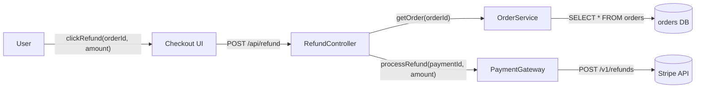
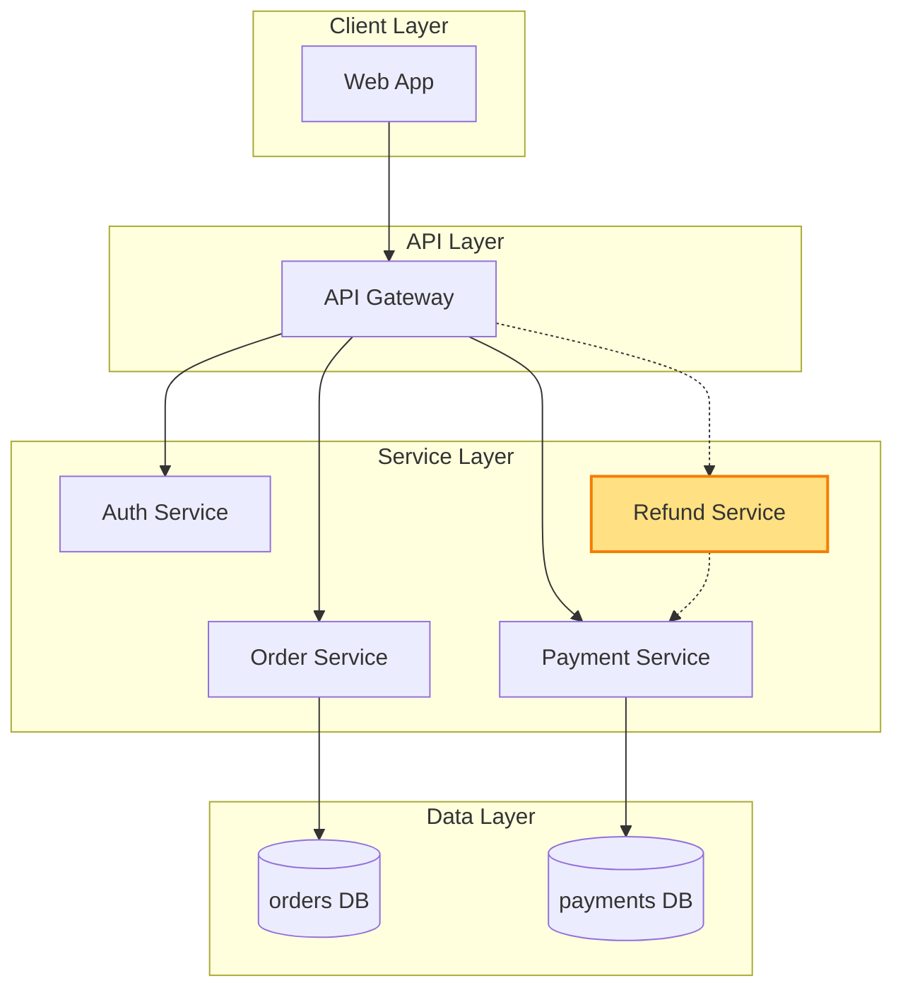

# Architecture — Test FEATURE_ARCHITECTURE.md mermaid rendering

> Internal verification — two diagrams test pr-helper.sh inline + GitHub renderer.

## 1. Component data flow

How the test components interact.

## 2. Position in whole architecture

Where the new RefundService sits in the system. New components highlighted in yellow.

> Source: scv/ARCHITECTURE.md (illustrative for v0.7.2 verification only)

