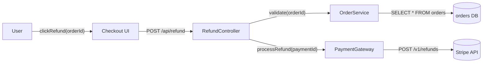
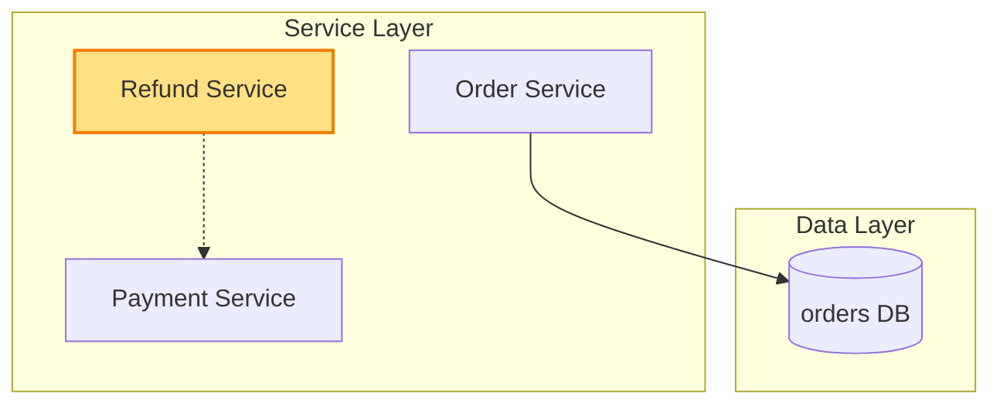

# Architecture — Test video + architecture inline rendering

> Internal verification — both diagrams and video must render together.

## 1. Component data flow

## 2. Position in whole architecture

> Source: scv/ARCHITECTURE.md (illustrative for v0.7.2 verification)

