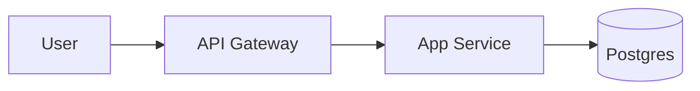

# ARCHITECTURE — System architecture

> **DOMAIN.md must be `status: active` first**, so service boundaries can be expressed in domain language.
>
> Architecture **needs more than one perspective**. Beyond software, it can include network, security, compliance, and DR; and the perspectives required differ by project nature (large-enterprise legacy / financial / startup MVP). Claude first agrees on a **perspective checklist** with the user, then asks questions only for checked perspectives.

## 1. Perspective checklist (mark applicable)

Decide first which perspectives are relevant. **Required** perspectives are always recorded; for **optional** ones, only check what's needed (or split into `scv/architecture/<perspective>.md` if the section grows).

### Required (every project)

- [ ] **Logical** — components, service boundaries, dependencies
- [ ] **Deployment** — environment configuration, server/container layout, regions

### Optional (proceed only if checked)

- [ ] **Data** — stores, schemas, ETL, data flows
- [ ] **Network** — internet connectivity (full / closed / hybrid), DMZ / VPC / network segregation
- [ ] **Security** — encryption (in transit / at rest), authn/authz, key management (KMS / HSM), access control
- [ ] **Compliance** — regulatory mapping (finance: domestic financial-supervision regulations / ISMS-P / privacy / credit-info / GDPR, etc.)
- [ ] **DR/BCP** — DR site, RTO / RPO, backup & restore procedures
- [ ] **AI/ML** — LLM/STT/TTS/classifier architecture, model serving, inference latency
- [ ] **Hardware** — special HW (GPU / HSM / IoT devices / dedicated servers)
- [ ] **Observability** — logs / metrics / traces / alerting pipeline

> **Checking principle**: only check perspectives that **need a decision or have a constraint** in the current project. Don't check "maybe later".

## 2. How to elicit (order of questions)

Claude proceeds **only with checked perspectives**. After each perspective, confirm "shall I record it like this?" before moving on.

### 2.1 Logical (required)

1. "Who interacts with this system from outside (users, external systems), and what protocols do they use?"
2. "How many **deployment units** would you split the system into? What's each one's responsibility?" (single → record as "monolithic")
3. "Are each service's language and framework **already chosen**, or do we pick in this project?" (if chosen, also why)

### 2.2 Deployment (required)

1. "How many environments — dev / staging / prod — and where is each deployed?" (cloud region / on-prem DC / hybrid)
2. "Containerization? (Docker / K8s / Serverless / direct VM)"
3. "Is the CI/CD pipeline tool decided?"

### 2.3 Data (if checked)

1. "Do we need persistent state? What kind — transactional / log / session cache / analytical / search?"
2. "Storage candidates already chosen? (RDBMS / NoSQL / object storage / message queue)"
3. "Is the complexity such that a data flow diagram is needed?" → if yes, suggest a separate `scv/architecture/data-flow.md`

### 2.4 Network (if checked) — critical for finance / large enterprise

1. **"Internet connectivity?"**
   - (a) Full connectivity (public cloud)
   - (b) Partial blocking (only specific ports/endpoints whitelisted)
   - (c) **Closed network** (intranet only, internet blocked)
   - (d) **Hybrid** (dev = internet, prod = closed, etc.)
2. "Network segregation policy? (intranet / extranet / DMZ structure)"
3. "External communication channels? (API Gateway / VPN / leased line / SFTP / MQ, etc.)"
4. "Do you have a firewall / L4-L7 LB topology diagram?" → if yes, attach to `scv/architecture/assets/network-topology.{png,svg,drawio}`

### 2.5 Security (if checked)

1. "Encryption scope? (in transit / at rest / both)"
2. "Key management: in-app / KMS / HSM / hybrid?"
3. "Access control model: RBAC / ABAC / policy-based / custom?"
4. "Authentication: OAuth / OIDC / SAML / proprietary / mTLS?"
5. "Audit-log retention period and location?"

### 2.6 Compliance (if checked)

1. "Applicable regulations: domestic financial-supervision regs / ISMS-P / privacy law / credit-info law / GDPR / HIPAA / other?"
2. "Audit / certification schedule? (e.g., ISMS-P annual cycle)"
3. "Need a clause-to-feature mapping?" → if yes, split into `scv/architecture/compliance.md`
4. "Cross-border data transfer restrictions?"

### 2.7 DR/BCP (if checked)

1. "RTO (recovery time objective) · RPO (recovery point objective) targets?"
2. "DR site setup: Active-Active / Active-Passive / Backup-Restore?"
3. "Periodic DR drill cadence?"

### 2.8 AI/ML (if checked)

1. "AI components? (LLM / STT / TTS / classifier / embedding / other)"
2. "Model hosting: external API (OpenAI/Anthropic/OpenRouter) / self-inference / hybrid?"
3. "Inference latency requirements? (real-time / batch)"
4. **Cross-link with AGENTS.md required** — probabilistic-behavior spec lives in AGENTS.md

### 2.9 Hardware (if checked)

1. "Special hardware: GPU / HSM / IoT / dedicated appliance?"
2. "Procurement / licensing / maintenance contract status?"

### 2.10 Observability (if checked)

1. "Where do logs / metrics / traces go?"
2. "Alert / incident channel? (Slack / Discord / PagerDuty)" — overlaps with REPORTING.md

## 3. Diagrams and image input

Architecture is **often impossible to express in text alone**. All of the following are supported:

### Inline Mermaid (simple diagrams · GitHub auto-rendered)

```

```

### Image / drawing source files

Save under `scv/architecture/assets/` and link from this document:

```
scv/
└── architecture/
    └── assets/
        ├── network-topology.drawio    # draw.io source
        ├── network-topology.png        # export
        ├── deployment-diagram.svg
        └── security-zones.excalidraw
```

Reference:

```markdown


Source: [network-topology.drawio](./architecture/assets/network-topology.drawio)
```

### ASCII (when simple enough)

```
[User] → [API GW] → [App] → [DB]
                    ↓
                  [Cache]
```

> **When asking the user**: for complex parts, first check "do you have a diagram?". If yes, ask them to drop the file in `scv/architecture/assets/` and reference it here. If not, suggest Mermaid or ASCII as substitutes.

## 4. Completion criteria

- [ ] **Perspective checklist** agreed (2 required + N optional)
- [ ] Required perspectives (Logical + Deployment) recorded
- [ ] Every checked optional perspective recorded in this doc or in a split file
- [ ] Diagrams stored under `scv/architecture/assets/` with links from this doc
- [ ] At least 3 non-functional requirements (latency / throughput / availability — pick 3) recorded
- [ ] User confirms "this architecture is good to proceed with"

## 5. Related Architecture Documents

<!-- If perspectives are many or sizable, split into separate files and link them here.
     Path convention: scv/architecture/<perspective>.md
     Examples:
- [`architecture/network.md`](./architecture/network.md) — detailed network setup + per-segment role
- [`architecture/security.md`](./architecture/security.md) — encryption / access control / audit log
- [`architecture/compliance.md`](./architecture/compliance.md) — regulation clause ↔ feature mapping
- [`architecture/dr-bcp.md`](./architecture/dr-bcp.md) — DR site / RTO/RPO / recovery procedures
- [`architecture/ai.md`](./architecture/ai.md) — AI pipeline (cross-linked with AGENTS.md)
- [`architecture/assets/`](./architecture/assets/) — diagrams / images / drawing sources
-->

## 6. Structure (slots to fill)

### 6.1 Logical view

<TODO: C4 Level 1–2. Mermaid flowchart recommended. If complex, image under assets/ + link.>

### 6.2 Service boundaries

| Service | Responsibility | Tech stack | Owner | Deployment unit |
|---|---|---|---|---|
| <TODO> | ... | ... | ... | ... |

### 6.3 Deployment view

| Environment | Internet | Purpose | Notes |
|---|---|---|---|
| dev  | <TODO> | development / unit tests | ... |
| prod | <TODO> | production | ... |

### 6.4 Data (if checked)

| Store | Use | Schema location | Retention policy |
|---|---|---|---|
| <TODO> | ... | ... | ... |

### 6.5 Network (if checked)

<TODO: internet connectivity classification, segregation, DMZ / internal / external. If diagram is large, store under assets/ and link only.>

### 6.6 Security (if checked)

<TODO: encryption / key management / access control / authentication. If sensitivity is high, split into `architecture/security.md`.>

### 6.7 Compliance (if checked)

<TODO: list of applicable regulations + regulation-clause ↔ feature mapping table. Usually split into `architecture/compliance.md`.>

### 6.8 DR/BCP (if checked)

<TODO: RTO/RPO targets, DR setup, drill cadence.>

### 6.9 AI/ML (if checked)

<TODO: model / hosting / latency requirements. Detail belongs in AGENTS.md (cross-reference).>

### 6.10 Observability (if checked)

<TODO: log / metric / trace pipeline. Alert channels cross-linked with REPORTING.md.>

### 6.11 External dependencies

<TODO: outbound services + fallback on failure. "n/a" if none.>

### 6.12 Non-functional requirements

| Item | Target | Measurement |
|---|---|---|
| <TODO> | ... | ... |

## Related modules

<!-- MODULES:AUTO START applies_to=architecture -->
<!-- MODULES:AUTO END -->
