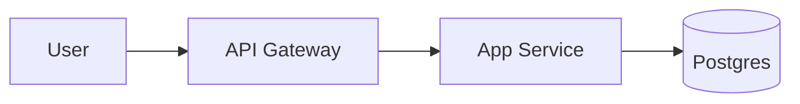

# ARCHITECTURE — 시스템 구조

> **DOMAIN.md 가 먼저 `status: active` 여야 합니다.** 도메인 언어로 서비스 경계를 기술하기 위함입니다.
>
> 아키텍처는 **한 시각만으로 부족**합니다. 소프트웨어뿐 아니라 네트워크·보안·컴플라이언스·DR 까지 포함될 수 있고, 프로젝트 성격(대기업 legacy · 금융권 · 스타트업 MVP)에 따라 필요한 관점이 다릅니다. Claude 는 아래 **관점 체크리스트** 부터 사용자와 합의한 뒤, 체크된 관점만 질문합니다.

## 1. 관점 체크리스트 (적용 대상에 ✓ 표시)

프로젝트에 해당하는 관점을 먼저 정합니다. **필수** 외에는 체크된 것만 본 문서에 기록하거나, 규모가 크면 `scv/architecture/<perspective>.md` 로 분리.

### 필수 (모든 프로젝트)

- [ ] **Logical** — 컴포넌트·서비스 경계·의존 관계
- [ ] **Deployment** — 환경 구성, 서버/컨테이너 배치, 리전

### 선택 (체크된 것만 진행)

- [ ] **Data** — 저장소·스키마·ETL·데이터 플로우
- [ ] **Network** — 인터넷 연결성(완전 연결 / 폐쇄망 / 하이브리드), DMZ·VPC·망분리
- [ ] **Security** — 암호화(전송/저장), 인증/인가, 키 관리(KMS/HSM), 접근 통제
- [ ] **Compliance** — 규제 매핑 (금융: 전자금융감독규정·ISMS-P / 개인정보보호법 / 신용정보법 / GDPR 등)
- [ ] **DR/BCP** — 재해복구 사이트, RTO·RPO, 백업·복구 절차
- [ ] **AI/ML** — LLM·STT·TTS·분류기 아키텍처, 모델 서빙, 추론 지연
- [ ] **Hardware** — 특수 HW (GPU·HSM·IoT 디바이스·전용 서버)
- [ ] **Observability** — 로그·메트릭·트레이스·알람 파이프라인

> **체크 원칙**: 현재 프로젝트에서 **의사결정이 필요하거나 제약이 있는** 관점만 체크. "아마 나중에 필요할지도" 는 체크하지 말 것.

## 2. How to elicit (Claude 가 물어볼 순서)

Claude 는 **체크된 관점만** 아래 질문을 진행합니다. 관점별로 "이대로 기록해도 될까요?" 확인 후 다음으로.

### 2.1 Logical (필수)

1. "외부에서 이 시스템과 상호작용하는 주체(사용자·외부 시스템)는 무엇이고, 각각 어떤 프로토콜로 연결되나요?"
2. "시스템을 **배포 단위**로 나눈다면 몇 개인가요? 각각의 책임은?" (단일이면 "모놀리식" 기록)
3. "각 서비스의 언어·프레임워크가 **이미 정해졌나요**, 아니면 이 프로젝트에서 선택해야 하나요?" (정해졌으면 이유까지)

### 2.2 Deployment (필수)

1. "개발·스테이징·운영 환경은 몇 개이고, 각각 어디에 배포되나요?" (클라우드 리전 · 온프렘 DC · 하이브리드)
2. "컨테이너화 여부? (Docker / K8s / Serverless / VM 직접)"
3. "CI/CD 파이프라인 툴은 정해져 있나요?"

### 2.3 Data (체크된 경우)

1. "영속 상태가 필요한가요? 어떤 특성 — 트랜잭션 / 로그 / 세션 캐시 / 분석용 / 검색용?"
2. "저장소 후보가 이미 정해졌나요? (RDBMS / NoSQL / 객체 스토리지 / 메시지 큐)"
3. "데이터 흐름도가 필요할 정도의 복잡도인가요?" → 있으면 별도 `scv/architecture/data-flow.md` 제안

### 2.4 Network (체크된 경우) — 금융권·대기업 핵심

1. **"인터넷 연결성은?"**
   - (a) 완전 연결 (퍼블릭 클라우드)
   - (b) 부분 차단 (특정 포트·엔드포인트만 화이트리스트)
   - (c) **폐쇄망** (내부망만, 인터넷 차단)
   - (d) **하이브리드** (개발망=인터넷, 운영망=폐쇄 식)
2. "망 분리 정책이 있나요? (내부망·외부망·DMZ 구조)"
3. "외부 통신 채널은? (API Gateway / VPN / 전용선 / SFTP / MQ 등)"
4. "방화벽·L4/L7 로드밸런서 계층 도면이 있나요?" → 있으면 `scv/architecture/assets/network-topology.{png,svg,drawio}` 로 첨부

### 2.5 Security (체크된 경우)

1. "암호화 범위는? (전송 중 / 저장 중 / 양쪽)"
2. "키 관리: 애플리케이션 내장 / KMS / HSM / 하이브리드?"
3. "접근 통제 모델: RBAC / ABAC / 정책 기반 / 커스텀?"
4. "인증 방식: OAuth / OIDC / SAML / 자체 / MTLS?"
5. "감사 로그 보존 기간·위치?"

### 2.6 Compliance (체크된 경우)

1. "적용 규제: 전자금융감독규정 / ISMS-P / PIPA / 신용정보법 / GDPR / HIPAA / 기타?"
2. "감사·인증 일정이 있나요? (ISMS-P 1년 주기 등)"
3. "규제 조항과 시스템 기능 매핑이 필요한가요?" → 있으면 `scv/architecture/compliance.md` 로 분리
4. "데이터 국외 이전 제한 여부?"

### 2.7 DR/BCP (체크된 경우)

1. "RTO (복구 목표 시간) · RPO (복구 목표 시점) 목표?"
2. "DR 사이트 구성: Active-Active / Active-Passive / Backup-Restore?"
3. "정기 DR 훈련 주기?"

### 2.8 AI/ML (체크된 경우)

1. "AI 구성 요소는? (LLM / STT / TTS / 분류기 / 임베딩 / 기타)"
2. "모델 호스팅: 외부 API (OpenAI/Anthropic/OpenRouter) / 자체 추론 / 하이브리드?"
3. "추론 지연 요구사항? (실시간 / 배치)"
4. **AGENTS.md 와 연동 필수** — 확률적 동작 명세는 AGENTS.md 에서 담당

### 2.9 Hardware (체크된 경우)

1. "특수 하드웨어: GPU / HSM / IoT / 전용 어플라이언스?"
2. "조달·라이선스·보수 계약 상태?"

### 2.10 Observability (체크된 경우)

1. "로그·메트릭·트레이스 각각 어디로 보내나요?"
2. "알람·인시던트 채널? (Slack / Discord / PagerDuty)" — REPORTING.md 와 연관

## 3. 다이어그램 · 이미지 입력 방식

아키텍처는 **텍스트만으로 부족할 때가 많습니다**. 다음 방식 모두 지원:

### 인라인 Mermaid (간단한 도식·GitHub 자동 렌더)

```

```

### 이미지 · 드로잉 소스 파일

`scv/architecture/assets/` 디렉토리에 저장하고 본 문서에서 링크:

```
scv/
└── architecture/
    └── assets/
        ├── network-topology.drawio    # draw.io 원본
        ├── network-topology.png        # export
        ├── deployment-diagram.svg
        └── security-zones.excalidraw
```

참조:

```markdown


소스: [network-topology.drawio](./architecture/assets/network-topology.drawio)
```

### ASCII (간단할 때)

```
[User] → [API GW] → [App] → [DB]
                    ↓
                  [Cache]
```

> **Claude 가 물어볼 때**: 복잡한 부분은 "그림이 있나요?" 로 먼저 확인. 있으면 파일을 `scv/architecture/assets/` 에 두라고 요청하고, 본 문서에서 링크로 참조. 없으면 Mermaid 또는 ASCII 로 대체 제안.

## 4. Completion criteria

- [ ] **관점 체크리스트** 합의 (필수 2 + 선택 N)
- [ ] 필수 관점 (Logical + Deployment) 기록 완료
- [ ] 체크된 선택 관점 모두 본 문서 또는 별도 파일에 기록 완료
- [ ] 다이어그램이 필요한 부분은 `scv/architecture/assets/` 에 저장되고 본 문서에서 링크
- [ ] 비기능 요구사항 최소 3개 (지연·처리량·가용성 중) 기록
- [ ] 사용자가 "이 아키텍처로 진행해도 좋음" 확인

## 5. Related Architecture Documents

<!-- 관점이 많거나 특정 관점이 규모 있으면 별도 파일로 분리하고 여기에 링크하세요.
     경로 규약: scv/architecture/<perspective>.md
     예:
- [`architecture/network.md`](./architecture/network.md) — 상세 망 구성 + 세그먼트별 역할
- [`architecture/security.md`](./architecture/security.md) — 암호화·접근 통제·감사 로그
- [`architecture/compliance.md`](./architecture/compliance.md) — 규제 조항 ↔ 시스템 매핑
- [`architecture/dr-bcp.md`](./architecture/dr-bcp.md) — DR 사이트·RTO/RPO·복구 절차
- [`architecture/ai.md`](./architecture/ai.md) — AI 파이프라인 (AGENTS.md 와 연동)
- [`architecture/assets/`](./architecture/assets/) — 다이어그램·이미지·드로잉 소스
-->

## 6. Structure (채우는 자리)

### 6.1 Logical view

<TODO: C4 Level 1~2. Mermaid flowchart 권장. 복잡하면 assets/ 에 이미지 + 링크.>

### 6.2 Service boundaries

| 서비스 | 책임 | 기술 스택 | 소유자 | 배포 단위 |
|---|---|---|---|---|
| <TODO> | ... | ... | ... | ... |

### 6.3 Deployment view

| 환경 | 인터넷 | 용도 | 비고 |
|---|---|---|---|
| dev  | <TODO> | 개발·단위테스트 | ... |
| prod | <TODO> | 운영 | ... |

### 6.4 Data (체크된 경우)

| 저장소 | 용도 | 스키마 위치 | 보존 정책 |
|---|---|---|---|
| <TODO> | ... | ... | ... |

### 6.5 Network (체크된 경우)

<TODO: 인터넷 연결성 분류, 망분리, DMZ/내부/외부. 도면이 크면 assets/ 에 두고 여기서 링크만.>

### 6.6 Security (체크된 경우)

<TODO: 암호화·키 관리·접근 통제·인증. 민감도가 높으면 `architecture/security.md` 로 분리.>

### 6.7 Compliance (체크된 경우)

<TODO: 적용 규제 목록 + 규제 조항 ↔ 시스템 기능 매핑 표. 대부분 `architecture/compliance.md` 로 분리 권장.>

### 6.8 DR/BCP (체크된 경우)

<TODO: RTO/RPO 목표, DR 구성, 훈련 주기.>

### 6.9 AI/ML (체크된 경우)

<TODO: 모델·호스팅·지연 요구. 상세는 AGENTS.md 에 교차 참조.>

### 6.10 Observability (체크된 경우)

<TODO: 로그·메트릭·트레이스 파이프라인. 알람 채널은 REPORTING.md 연동.>

### 6.11 External dependencies

<TODO: 호출하는 외부 서비스 + 실패 시 폴백. 없으면 "해당 없음".>

### 6.12 Non-functional requirements

| 항목 | 목표 | 측정 방법 |
|---|---|---|
| <TODO> | ... | ... |

## 관련 모듈

<!-- MODULES:AUTO START applies_to=architecture -->
<!-- MODULES:AUTO END -->
